# جلسه اول - اقتصاد خرد
**تاریخ:** ۱۸ فروردین

علم اقتصاد، علم کمیابی منابع هست و خواسته‌ها نامحدود و باید منابع کمیاب را به خواسته‌های نامحدود اختصاص دهیم.
اقتصاد خرد: خانوار در مقابل بنگاه (چرخه‌ی چرخشی)

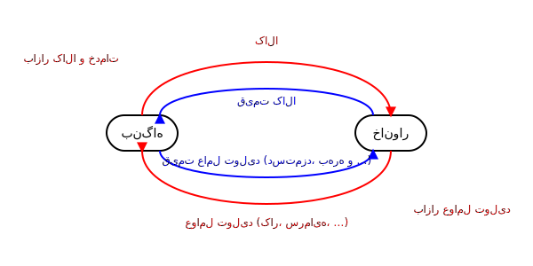

**بازار کالا و خدمات:**
۱- بازار رقابت کامل (حدی)
۲- بازار رقابت انحصاری
۳- بازار انحصار چند جانبه
۴- بازار انحصار کامل (حدی)

**بازار رقابت کامل:** بازاری است که در آن شمار تولید کننده و مصرف کننده بسیار زیاد است (شبیه این بازار می‌تواند وجود داشته باشد). قیمت‌ها در این بازار ثابت است (منحنی تقاضای بنگاه افقی است). اطلاعات در این بازار شفاف است. $P = D$ (افقی).
**بازار انحصار کامل:** بازاری است شامل یک تولید کننده و این یک تولید کننده تعیین کننده شرایط بازار است و قیمت در این بازار ثابت نیست.

> **نکته علمی افزوده:**
> در بازار رقابت کامل، به دلیل تعداد زیاد تولیدکنندگان و همگن بودن کالاها، هیچ بنگاهی قدرت تعیین قیمت را ندارد و همه اصطلاحاً «قیمت‌پذیر» (Price Taker) هستند. به همین دلیل منحنی تقاضا برای یک بنگاه افقی ($P=D=MR$) است. در انحصار کامل، تنها یک بنگاه وجود دارد که «قیمت‌گذار» (Price Maker) است و با منحنی تقاضای نزولی کل بازار روبرو است.

صفحه: 1

---

# درآمد و رفتار خانوار و بنگاه

**خانوار:** مصرف کننده کالا، متقاضی کالا
$$Q_x^d = f(P_x, I, P_y, A, \dots)$$
* $I$: درآمد
* $A$: تبلیغات

تابع تقاضا نزولی است (مگر در مواقع خاص).

$$Q_x^d = a - bP_x \leadsto P_x = \frac{a}{b} - \frac{1}{b}Q_x^d$$
*(در جزوه فرمول به صورت $P = a - bQ^d$ نوشته شده که از نظر ریاضیاتی اگر ضرایب را متمایز در نظر نگیریم دقیق نیست. فرم صحیح تابع تقاضای معکوس $P_x = \frac{a}{b} - \frac{1}{b}Q_x^d$ است که نشانگر رابطه خطی قیمت و مقدار تقاضا است).*

*رابطه قیمت خود کالا با تقاضا $\leftarrow$ قانون تقاضا*
* $a$: عرض از مبدأ
* $b$: شیب منفی

---

**بنگاه:** تولید کننده، عرضه کالا
$$Q_x^s = f(P_x, C, T, W, \dots)$$
* $S$: یارانه تولید
* $T$: تکنولوژی
* $E$: انتظارات

$$Q_x^s = f(P_x) \uparrow$$
$P_x = a + bQ_x \implies Q_x^s = -\frac{a}{b} + \frac{1}{b}P_x$ *(در جزوه نوشته شده $Q_x^s = a + bP_x$ که به عنوان یک فرم کلی تابع خطی با ضرایب مثبت قابل قبول است).*

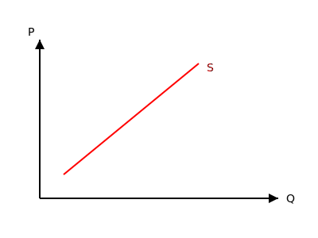
* $a$: عرض از مبدأ
* $b$: شیب مثبت

---

**تعادل بازار:**
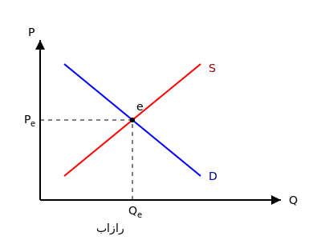
* $e$: نقطه وضعیت تعادلی
* عرضه کننده (بنگاه) و متقاضی (مصرف کننده) بازار را تشکیل می‌دهند.

صفحه: 2

---

# رفتار مصرف کننده

**مصرف کننده**
* **هدف:** رسیدن به حداکثر خواسته‌ها (حداکثرسازی مطلوبیت)
* **محدودیت:** درآمد $\implies I = xP_x + yP_y$

در فضای دو کالا / دو قیمت، در سبد مصرفی، منحنی‌های بی‌تفاوتی، ارتباط بین دو کالا را در فضای محدودیت به ما می‌دهد.

$$U = (x, y, z, \dots)$$
$$U = (x, y)$$

**ویژگی‌های منحنی بی‌تفاوتی:**
۱. نسبت به مبدأ مختصات **محدب** است.
۲. هر چه منحنی بالاتر باشد، یعنی میزان مطلوبیت فرد افزایش می‌یابد.
۳. در هر نقطه در فضای کالا می‌توان یک منحنی بی‌تفاوتی رسم کرد. یعنی بالاخره یک نقطه در فضای دو کالا وجود دارد که نیازهای ما را رفع کند از مصرف دو کالا.
۴. این منحنی‌ها هیچ‌گاه همدیگر را قطع نمی‌کنند.
۵. دارای شیب نزولی هستند. روی منحنی بی‌تفاوتی مطلوبیت ثابت است.

**شیب منحنی بی‌تفاوتی = نرخ نهایی جانشینی (MRS):**
$$MRS_{xy} = -\frac{\Delta y}{\Delta x}$$

**مفهوم $MRS_{xy}$:**
اگر بخواهیم یک واحد به کالای $x$ اضافه کنیم، چه میزان از کالای $y$ کم کنیم تا مطلوبیت ما ثابت باقی بماند (یعنی روی نقاط منحنی $U$ مطلوبیت یکسان است). روی $U'$ هم همینطور روی تمام نقاط منحنی $U'$ مطلوبیت ثابت است.

$$U' > U$$
مطلوبیت $U'$ بالاتر است چون بالاتر قرار دارد.
مصرف کننده کورکورانه انتخاب نمی‌کند (عقلانیت مصرف‌کننده).

صفحه: 3

---

# تعادل مصرف‌کننده

شیب منحنی بی‌تفاوتی:
$$MRS_{xy} = -\frac{\Delta y}{\Delta x}$$

**خط بودجه:**
$$I = xP_x + yP_y \implies \text{شیب خط بودجه} = -\frac{P_x}{P_y}$$

* نقاط بالای خط بودجه، نقاط دست‌نیافتنی هستند.
* نقاط زیر خط بودجه را اصلاً کاری نداریم چون پس‌انداز نداریم (فرض بر مصرف کامل درآمد است).
* نقاطی که برای مصرف‌کننده مهم است دقیقاً نقاط روی خط بودجه است.

$$\text{شیب خط بودجه} = \tan \alpha = -\frac{P_x}{P_y}$$

چون هدف رسیدن به حداکثر است، دو تا شیب‌ها را کنار هم قرار می‌دهیم. یعنی هدف ما ماکزیمم کردن مطلوبیت است با محدودیت درآمد ثابت.
$$\max U \leadsto L = U(x,y) + \lambda(I - xP_x - yP_y)$$
$$\text{s.t.: } I$$

یک خط بودجه داریم و بی‌شمار منحنی بی‌تفاوتی. چون نقاط روی خط بودجه قابل دسترس است، پس منحنی بی‌تفاوتی که مماس بر خط بودجه است را انتخاب می‌کنیم.

**تعادل مصرف کننده = شیب منحنی بی‌تفاوتی = شیب خط بودجه**

$$-\frac{\Delta y}{\Delta x} = -\frac{P_x}{P_y}$$

به عبارتی در نقطه تعادل $e$:
$$\frac{MU_x}{MU_y} = \frac{P_x}{P_y}$$
یعنی نسبت مطلوبیت نهایی دو کالا برابر است با نسبت قیمت‌ها.

> **بررسی و تأیید علمی:**
> روابط استخراج شده کاملاً با اصول اقتصاد خرد همخوانی دارد. در نقطه تعادل (بهینه مصرف‌کننده)، شرط مماس شدن منحنی بی‌تفاوتی با خط بودجه برقرار است که به لحاظ ریاضی یعنی برابری نرخ نهایی جانشینی (MRS) با نسبت قیمت‌ها. همچنین از آنجا که $MRS_{xy} = \frac{MU_x}{MU_y}$، نتیجه‌گیری نهایی مبنی بر $\frac{MU_x}{MU_y} = \frac{P_x}{P_y}$ کاملاً صحیح است.

صفحه: 4

---

$U: (x, y)$
$I = P_x \cdot x + P_y \cdot y$

$L = U(x, y) + \lambda (I - x P_x - y P_y)$
این معادله ۳ تا مجهول دارد هر بار از تابع $L$ نسبت به یک مجهول مشتق می‌گیریم
۳ مجهول / ۳ مشتق ($x$ و $y$ و $\lambda$)

$\frac{\partial L}{\partial x} = 0 \Rightarrow MU_x - \lambda P_x = 0$
$\frac{\partial L}{\partial y} = 0 \Rightarrow MU_y - \lambda P_y = 0$

از تقسیم دو رابطه اول دوباره به شرط تعادل می‌رسیم $\leftarrow \frac{MU_x}{MU_y} = \frac{P_x}{P_y}$

$\frac{\partial L}{\partial \lambda} = 0 \Rightarrow I - x P_x - y P_y = 0$

حالت‌های تغییر خط بودجه
$I = x P_x + y P_y$
۱- قیمت کالای $x$ تغییر کند ($P_x$) : شیب خط بودجه تغییر می‌کند $\leftarrow$ P.C.C منحنی قیمت مصرف
۲- قیمت کالای $y$ تغییر کند ($P_y$) : شیب خط بودجه تغییر می‌کند $\leftarrow$ P.C.C منحنی قیمت مصرف
۳- تغییر درآمد $\leftarrow$ خط بودجه جابجا می‌شود به صورت موازی (درآمد زیاد شود به سمت بالا موازی منتقل می‌شود [به سمت پایین ، درآمد کم شود]) $\leftarrow$ منحنی درآمد مصرف I.C.C

صفحه: 5

---

حالت اول : $P_x \uparrow \rightarrow \frac{I}{P_x} \downarrow \leftarrow$ انتقال منحنی به سمت چپ (داخل)
$P_x \downarrow \rightarrow \frac{I}{P_x} \uparrow \rightarrow$ منحنی به سمت بیرون منتقل می‌شود.

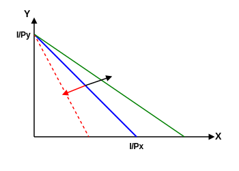

تغییر $P_x$ ( $I$ ثابت $P_x$ متغیر )

$P_x \downarrow \rightarrow X \uparrow \rightarrow X_1 \leftarrow X_2$ قانون تقاضا
از وصل کردن $e_1$ به $e_2$ ، منحنی تقاضا بدست می‌آید در واقع یکی از کاربردهای منحنی‌های قیمت - مصرف رسیدن به همان تابع و منحنی تقاضای اولیه است.

حالت سوم $I \uparrow \rightarrow$
خط بودجه موازی به سمت راست جابجا می‌شود

منحنی درآمد مصرف $\leftarrow$ I.C.C
- نرمال $\leftarrow$ ضروری ، لوکس
- پست

صفحه: 6

---

منحنی درآمد مصرف : اگر درآمد مصرف‌کننده تغییر کند، خط بودجه به موازات خودش منتقل شده و مصرف‌کننده با تغییر درآمد، مخارج خود را تغییر می‌دهد و یک نقطه تعادل جدید از تماس خط بودجه و منحنی‌های بی‌تفاوتی جدید ایجاد می‌شود که از وصل کردن این نقاط تعادلی، به هم منحنی درآمد مصرف شکل می‌گیرد (منحنی I.C.C).

منحنی قیمت مصرف : اگر فقط قیمت یک کالا تغییر کند در اینصورت شیب خط بودجه چرخیده و تعادل‌های جدیدی به وجود می‌آید که با وصل نقاط تعادلی جدید، منحنی قیمت - مصرف به دست می‌آید. منحنی P.C.C.

تولیدکننده / بنگاه
هدف تولیدکننده به دو صورت مطرح می‌شود یا می‌خواهد تولید را حداکثر کند با محدودیت هزینه ($C$) یا هدف دیگر تولیدکننده حداقل کردن هزینه با توجه به تولید مشخص که به بالاترین یا حداکثر سود دست پیدا کند
$Max\ \pi$

$\begin{cases} Max\ Q \\ S.t: \overline{C} \end{cases} \rightarrow Max\ \pi$
$\begin{cases} Min\ C \\ S.t: \overline{Q} \end{cases} \rightarrow Max\ \pi$

تابع تولید $Q = f(L, K, ...)$
$C = P_L \cdot L + P_K \cdot K + ...$
$P_L \cdot L$ : نیروی کار
$P_K \cdot K$ : سرمایه

صفحه: 7

---

تابع تولید کوتاه مدت در حدود ۲ ماه
در کوتاه مدت، تمامی عوامل ثابت است و فقط نیروی کار تغییر می‌کند یا فقط سرمایه تغییر می‌کند.
تولید کل
$Q = f(L, \overline{K}, \overline{...}, ...)$
$C = P_L \cdot L + P_K \cdot \overline{K}$

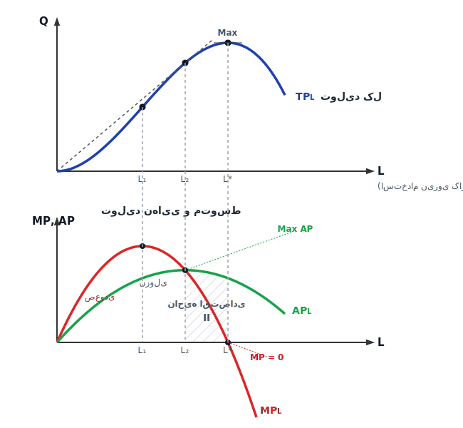

$0 \rightarrow L_1 \rightarrow TP_L \uparrow$ با نرخ فزاینده $\rightarrow MP_L^+$
$L_1 \rightarrow L^* \rightarrow TP_L \uparrow$ با نرخ کاهنده $\rightarrow MP_L^+$
$L^* \rightarrow L_{...} \rightarrow TP_L \downarrow \rightarrow MP_L^-$

Max $TP_L \Rightarrow MP_L = 0$
Max $AP_L \Rightarrow MP_L = AP_L$

تولید نهایی و متوسط
$MP_L = \frac{\Delta TP}{\Delta L} = \frac{\Delta Q}{\Delta L}$
$TP_L \rightarrow Max \Rightarrow MP_L = 0$
$MP_L$ : اگر نیروی کار یک واحد تغییر کند، چه میزان تغییر در تولید کل ایجاد می‌شود؟
$AP_L = \frac{Q}{L} \rightarrow$ نشان می‌دهد هر واحد نیروی کار بنگاه به طور میانگین چه میزان تولید داشته است.

صفحه: 8

---

تابع تولید بلند مدت
همه عوامل می‌توانند تغییر کنند و هیچ عاملی ثابت نیست.
$Q = f(L, K, ...)$
$C = P_L \cdot L + P_K \cdot K$

تابع تولید در بلند مدت شبیه منحنی بی‌تفاوتی است.
نسبت به مبدأ مختصات محدب است.
هر چه تولید زیادتر شود منحنی تولید بالاتری رود و برعکس $Q' > Q$
روی منحنی تولید، مقدار تولید ثابت است فقط میزان استفاده از عوامل متفاوت است.

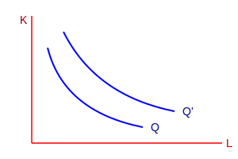

نکته مهم و تفاوت منحنی تولید و بی‌تفاوتی است. همان بحث شمارشی و غیر شمارشی بودن است. تولید قابل شمارش است اما مطلوبیت را نمی‌توان شمرد.

شیب منحنی تولید $MRTS_{L,K}$
$MRTS_{L,K} = - \frac{\Delta K}{\Delta L}$

حالت اول : ۳ مجهول $\leftarrow$ ۳ مشتق
$\begin{cases} Max\ Q \\ \overline{C} \end{cases} \Rightarrow L = Q(L, K) + \lambda(C - P_L L - P_K K)$

حالت دوم : ۳ مجهول و ۳ مشتق
$\begin{cases} Min\ C \\ \overline{Q} \end{cases} \Rightarrow Z = P_L L + P_K K + \lambda(Q - Q(L, K))$

صفحه: 9

---

نقطه تعادل تولید و هزینه در بلند مدت جائی است که خط هزینه مماس شود بر منحنی تولید. جایی که شیب تولید و شیب خط هزینه به هم مماس شود یعنی جایی که نسبت تولید نهایی نیروی کار به تولید نهایی سرمایه برابر باشد با نسبت کار به قیمت سرمایه.

شیب خط هزینه $\frac{P_L}{P_K} = \frac{MP_L}{MP_K}$ شیب منحنی تولید $MRTS_{L,K}$

$MRTS_{L,K} = \frac{MP_L}{MP_K} = - \frac{\Delta K}{\Delta L}$
$\frac{MP_K}{MP_L} = \frac{P_K}{P_L}$

تولید کننده امکان تصمیم‌گیری دارد $Min\ C$ یا $Max\ Q$
مصرف کننده فقط یک حالت دارد که خواسته‌اش را بدست بیاورد با توجه به خط بودجه (مطلوبیت) (حداکثر مطلوبیت)
$\begin{cases} Max\ U \\ I = P_x \cdot x + P_y \cdot y \end{cases}$

صفحه: 10

---

هزینه :
هزینه کل $TC = TFC + TVC$
هزینه‌های ثابت :
هزینه‌های متغیر :

$AC = AFC + AVC$
هزینه نهایی $MC = \frac{\Delta TC}{\Delta Q}$

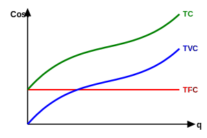

$AC$ ، $AVC$ ، $MC \leftarrow$ منحنی‌های U شکل
$AP$ ، $MP \leftarrow$ تپه‌ای شکل

به سمت بلند مدت که می‌رویم $AFC$ وجود ندارد $AC$ به $AVC$ منطبق می‌شود.

هزینه نهایی ($MC$) از Min $AC$ و $AVC$ عبور می‌کند.
هزینه و تولید نقطه‌ی مقابل همدیگر هستند یعنی جائیکه هزینه نهایی $MC$ در Min است جایی است که تولید نهایی $MP_L$ در حداکثر است.
$Max\ MP_L = Min\ MC$
و جائیکه هزینه متوسط به حداقل می‌رسد دقیقاً جائی است که تولید متوسط به حداکثر می‌رسد.
$Max\ AP_L = Min\ AC$

صفحه: 11

---

معرفی کتاب
کتاب اقتصاد خرد ، تقرب ریاضی
نویسنده هندرسون - کوانت
ترجمه دکتر پژویان

کتاب حل مسئله : تحلیل مسائل اقتصاد خرد
دکتر تفضلی و دکتر کاتوزیان فقط مسئله و حل آن کارشناسی و ارشد

جلسه‌ی دوم ۲۵ مهر ۴۰۵
اصول حاکم بر رفتار مصرف‌کننده
مصرف‌کننده برای آنکه بخواهد در یک فضای دو کالایی به نقطه تعادل برسد و این نقطه تعادل شکل بگیرد و مصرف‌کننده بتواند از کالاها با توجه به درآمد و قیمت‌ها خریداری کند، مستلزم یک سری فروض است [ مصرف‌کننده دارای رفتار عقلایی است ]
این فروض ثابت هستند.

۱- اصل انعکاس پذیری : مصرف‌کننده در انتخاب بین دو سبد $A$ یا $B$ که از هر نظر یکسان هستند بی‌تفاوت است.
$A I B$
$I \leftarrow indifference$ بی‌تفاوت

۲- اصل کامل بودن : مصرف‌کننده می‌تواند بین دو سبد انتخاب داشته باشد
$A P B \quad \text{or} \quad B P A \quad \text{or} \quad A I B$
$P \leftarrow prefer$ ترجیح

صفحه: 12

---

$A$ را به $B$ ترجیح دهد یا $B$ را به $A$ ترجیح دهد یا بین انتخاب دو سبد $B$ و $A$ بی‌تفاوت است.

۳- اصل انتقال پذیری : Transperency Principle
$\frac{A P B}{B P C} \Rightarrow A P C$
مصرف‌کننده سبد $A$ را به $B$ ترجیح می‌دهد و سبد $B$ را به $C$ ترجیح می‌دهد پس حتماً سبد $A$ را به $C$ ترجیح می‌دهد.
$A I B$
$B I C \Rightarrow A I C$
(بی‌تفاوتی هم شامل می‌شود)

۴- اصل قانع نشدن : مصرف‌کننده همیشه بیشتر را به کمتر ترجیح می‌دهد (سبد بیشتر)
[ فرض عاقلانه ]
اگر رفتار مصرف‌کننده عاقلانه نباشد به هیچ عنوان در مورد نقطه تعادل مصرف‌کننده ($e$) نمی‌توانیم اظهار نظر کنیم.

شیب خط بودجه $\frac{P_x}{P_y} = \frac{MU_x}{MU_y}$ شیب منحنی بی‌تفاوتی

۵- اصل پیوستگی : روی منحنی بی‌تفاوتی بی‌نهایت سبد کالا وجود دارد که مصرف‌کننده می‌تواند آن‌ها را انتخاب کند و بین آن‌ها بی‌تفاوت باشد.

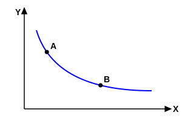

مصرف‌کننده از تمام این فروض استفاده می‌کند برای رسیدن به بحث تعادل.

صفحه: 13

---

# تابع تقاضای نرمال (مارشالی) Normal Demand

خط بودجه به ۲ دلیل می‌تواند تغییر کند:
۱- به دلیل تغییر قیمت کالاها ($X$ یا $Y$)
۲- به دلیل تغییر درآمد

اگر خط بودجه تغییر کند، با خط بودجه‌ی جدید، نقطه‌ی تعادل جدید و مقداری از کالاها خواهیم داشت.

تغییر قیمت کالای $X$ $\leftarrow$ $P_x \downarrow$ $\leftarrow$ انتقال خط بودجه به صورت غیر موازی و مطابق شکل به سمت راست $\uparrow \frac{I}{P_x}$ ، تقاضا از $x_1$ به $x_2$ زیاد شده $\leftarrow$ تقاضای مارشالی یا نرمال $\leftarrow$ یعنی با کاهش قیمت کالای $X$ میزان تقاضا برای کالای $X$ زیاد شد $\leftarrow$ رابطه‌ی تقاضا برقرار است.

از وصل کردن نقاط $e_1$ و $e_2$ در فضای قیمت و کالا $\leftarrow$ همان تابع تقاضا به دست آمد. (حالت عادی)

**سوال:** اگر منحنی بی تفاوتی، حالت خاصی داشته باشد [ غیر از مبدا محدب ] یا از بالا اگر نگاه کنیم مقعر است $\leftarrow$ منحنی $L$ یا ترجیح خطی یا مقعر به مبدا، منحنی تقاضای عمومی را رسم کنید.

صفحه: 14

---

۱- حالت عادی (کالای نرمال)
منحنی بی تفاوتی : محدب نسبت به مبدا
منحنی تقاضا : نزولی با شیب منفی
با کاهش قیمت کالا ، مقدار تقاضا افزایش می یابد (تقاضای نرمال)

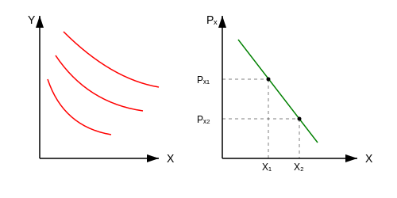

۲- حالت دوم: کالاها جانشین کامل باشند.
منحنی بی تفاوتی : خطوط مستقیم و موازی با شیب ثابت
منحنی تقاضا :
$P_x > P^*$ $\leftarrow$ تقاضا صفر است [ قیمت کالای $X$ از حد منحنی بیشتر است ]
$P_x = P^*$ $\leftarrow$ مصرف کننده بی تفاوت است . هر مقدار تقاضا ممکن است.
$P_x < P^*$ $\leftarrow$ تمام درآمد صرف خرید این کالا می شود و مقدار تقاضا به شدت افزایش می یابد پس تقاضا شکسته (راه حل گوشه ای) است . [ مصرف کننده کالای ارزان تر را انتخاب می کند ]

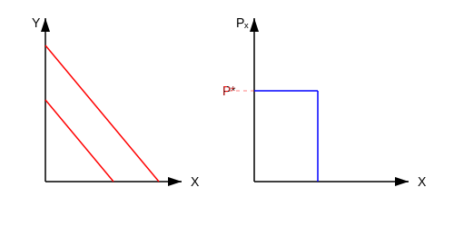

۳- حالت سوم : کالاها مکمل های کامل باشند.
منحنی بی تفاوتی : به شکل $L$ یا زاویه ۹۰
منحنی تقاضا : شیب منفی دارد اما از حالت عادی پر شیب تر است چون کالا ها باید با نسبت ثابت مصرف شوند و جانشینی بین آن ها وجود ندارد.
با کاهش قیمت ، مقدار تقاضای هر دو کالا به یک نسبت ثابت افزایش می یابد و جانشین وجود ندارد.

صفحه: 15

---

**مثال:** حداکثر مطلوبیت از مصرف دو کالا $q_1$ و $q_2$ را حساب کنید.

$U = q_1 q_2$
$P_1 = 2$
$P_2 = 5$
$I = 100$

$I = P_1 q_1 + P_2 q_2 \Rightarrow 2 q_1 + 5 q_2 = 100$

$\mathcal{L} = q_1 q_2 + \lambda ( 100 - 2 q_1 - 5 q_2 )$

$\frac{\partial \mathcal{L}}{\partial q_1} = q_2 - 2 \lambda = 0 \Rightarrow q_2 = 2 \lambda$
$\frac{\partial \mathcal{L}}{\partial q_2} = q_1 - 5 \lambda = 0 \Rightarrow q_1 = 5 \lambda$

$\frac{q_2}{q_1} = \frac{2 \lambda}{5 \lambda} \Rightarrow \frac{q_2}{q_1} = \frac{2}{5} \Rightarrow 5 q_2 = 2 q_1 \Rightarrow q_2 = \frac{2 q_1}{5}$
همچنین:
$\frac{U_1}{U_2} = \frac{P_1}{P_2} \Rightarrow \frac{q_2}{q_1} = \frac{2}{5}$

$\frac{\partial \mathcal{L}}{\partial \lambda} = 100 - 2 q_1 - 5 q_2 = 0 \Rightarrow 100 - 2 q_1 - 5 \left( \frac{2 q_1}{5} \right) = 0$
$100 - 2 q_1 - 2 q_1 = 0 \Rightarrow 4 q_1 = 100 \Rightarrow q_1 = 25$

$q_1 = 25$
$q_2 = 10$
$\lambda = \frac{10}{2} = 5$

خط بودجه ترکیباتی از $q_1$ و $q_2$ را نشان می دهد که مصرف کننده قادر به خرید آن است.

شیب خط بودجه $= \frac{\Delta q_2}{\Delta q_1} = -\frac{P_1}{P_2} = -\frac{20}{50} = -\frac{2}{5}$

شیب منحنی $= -\frac{q_2}{q_1} = -\frac{10}{25} = -\frac{2}{5}$

صفحه: 16

---

**هدف:** $Max~U : U(q_1, q_2)$
**محدودیت:** $I = P_1 q_1 + P_2 q_2$

ابتدا تابع لاگرانژ تشکیل می دهم . مطلوبیت با ضریبی بنام لاگرانژ ارتباط پیدا می کند با خط بودجه.
تابع لاگرانژ:
$\mathcal{L} = U(q_1, q_2) + \lambda [I - P_1 q_1 - P_2 q_2]$

۳ تا مجهول داریم $[q_1, q_2 \text{ و } \lambda]$ $\leftarrow$ ۳ تا مشتق نسبت به مجهول ها جداگانه می گیرم و برابر صفر قرار می دهم.
$\frac{\partial U}{\partial q_1} = U_1 =$ مطلوبیت نهایی کالای اول $= MU_1$
پس: $MU_2 =$ مطلوبیت نهایی کالای دوم $= U_2 = \frac{\partial U}{\partial q_2}$

① $\frac{\partial \mathcal{L}}{\partial q_1} = 0 \Rightarrow \frac{\partial U}{\partial q_1} - \lambda P_1 = 0$
② $\frac{\partial \mathcal{L}}{\partial q_2} = 0 \Rightarrow \frac{\partial U}{\partial q_2} - \lambda P_2 = 0$
$\frac{\partial \mathcal{L}}{\partial \lambda} = 0 \Rightarrow I - P_1 q_1 - P_2 q_2 = 0$

از تقسیم رابطه ۱ بر ۲:
$\frac{\text{①}}{\text{②}} \Rightarrow \frac{U_1}{U_2} = \frac{P_1}{P_2}$  (رابطه ③ - شرط تعادل)

$\lambda = \frac{U_1}{P_1} = \frac{U_2}{P_2}$

از رابطه ی ۳ مقادیر را محاسبه کرده و در رابطه ی ۴ قرار می دهیم $\leftarrow$ تابع تقاضای نرمال به دست می آید.

صفحه: 17

---

$\lambda = \frac{MU_1}{P_1} = \frac{MU_2}{P_2}$

$\lambda$ : مطلوبیت نهایی پول یا درآمد است (چون به $P$ تقسیم شده است)
یعنی هر ۱ ریال ، واحد پول اضافی مطلوبیت مصرف کننده را چه قدر تغییر می دهد.

از حل معادله ی ۳ و ۴ ، توابع تقاضای کالا را به دست می آوریم (دو تابع / دو کالا)
$q_1^{ND} = q_1 (P_1, P_2, I)$
$q_2^{ND} = q_2 (P_1, P_2, I)$
(تقاضای نرمال)

یعنی تقاضا تابعی است هم از قیمت کالای اول و قیمت کالای دوم و درآمد ثابت.

در ریاضیات برای بدست آوردن Max و Min دو شرط لازم است. اول اینکه از تابع مشتق بگیریم و مساوی صفر قرار دهیم تا نقاط اکسترمم پیدا شود (شرط لازم)
شرط دوم اینست که اگر تابع Max است، مشتق دوم باید منفی شود و اگر مشتق دوم تابع مثبت شد قطعاً تابع Min است (شرط کافی)

در اینجا از شرط Max سازی تابع مطلوبیت با درآمد ثابت ، تابع تقاضا را به دست آوردیم. شرط دوم مستلزم اینست که مشتق دوم این توابع گرفته شده.
برای گرفتن مشتق دوم نسبت به تک تک متغیرها مشتق گرفته می شود از تابع اول و تابع دوم و تابع سوم ... یعنی ۹ تا مشتق دوم.

این ۹ تا مشتق در دترمینان قرار می گیرد که دترمینان هشین مرزی نامیده می شود.

صفحه: 18

---

زمانی که از تابع لاگرانژ استفاده می کنیم یعنی محدودیت و مرز داریم $\leftarrow$ مشتق دوم در چارچوب هشین مرزی قرار می گیرد [ مرز قیمت ها ].
زمانیکه تابعی مثل سود را می خواهیم مشتق دومش را بررسی کنیم هشین معمولی است.

دترمینان هشین مرزی باید بزرگتر از صفر باشد تا مطمئن شویم که تابعی را که به دست آورده ایم در Max تابع مطلوبیت باشد و به حداکثر مطلوبیت دست پیدا کردیم.

$$|\bar{H}| = \begin{vmatrix} f_{11} & f_{12} & -P_1 \\ f_{21} & f_{22} & -P_2 \\ -P_1 & -P_2 & 0 \end{vmatrix} > 0$$
$\Rightarrow$ فقط مشتق های مرتبه دوم را لازم داریم.
(در ماتریس بالا: $f_{11}$ از مشتق اولی نسبت به $q_1$، $f_{12}$ از مشتق اولی نسبت به $q_2$، $f_{21}$ از مشتق دومی نسبت به $q_1$ و $f_{22}$ مشتق دوم نسبت به $q_2$ است.)

$f_{12} = f_{21}$

با بسط دترمینان:
$|\bar{H}| = 2 f_{12} P_1 P_2 - f_{11} P_2^2 - f_{22} P_1^2 > 0$

با جایگذاری $P_1 = \frac{f_1}{\lambda}$ و $P_2 = \frac{f_2}{\lambda}$:
$|\bar{H}| = 2 f_{12} \left(\frac{f_1}{\lambda}\right) \left(\frac{f_2}{\lambda}\right) - f_{11} \left(\frac{f_2}{\lambda}\right)^2 - f_{22} \left(\frac{f_1}{\lambda}\right)^2 > 0$

$|\bar{H}| = \frac{1}{\lambda^2} \left( 2 f_{12} f_1 f_2 - f_{11} f_2^2 - f_{22} f_1^2 \right) > 0$

$\Rightarrow 2 f_{12} f_1 f_2 - f_{11} f_2^2 - f_{22} f_1^2 > 0$

این رابطه شرط کافی است برای Max شدن تابع مطلوبیت است که همان شبه مقعر بودن تابع مطلوبیت می باشد (دید از بالا).

صفحه: 19

---

# ویژگی های تابع تقاضای نرمال

$q_1^{ND} = q_1 (P_1, P_2, I)$

۱. تابع تقاضا همگن از درجه صفر نسبت به قیمت کالاها و درآمد است.
یعنی اگر قیمت ها و درآمد ها با یک نسبت تغییر پیدا کنند، تابع تقاضا تغییر نمی کند (یعنی اگر درآمد مصرف کننده افزایش یابد و در مقابل قیمت ها نیز افزایش یابند ($P$ و $I$ همگی دوبرابر شود، تابع تقاضا تغییر نمی کند) مصرف کننده ثروتمند نشده است.

۲. تابع تقاضا یک تابع تک مقداری از سطح قیمت ها و درآمد است یعنی رابطه ی یک به یک بین آنها برقرار است.

۳. تابع تقاضا همواره نزولی است به استثناء در مورد:
- ۱. کالای پست گیفن باشد.
- ۲. مصرف از روی تقلید باشد.

۴. در تابع تقاضای نرمال ، درآمد (پول) ثابت در نظر گرفته می شود.

---
- اگر درآمد زیاد شود و ما از کالایی بیشتر خریداری کنیم کالا $\leftarrow$ **نرمال** است.
- اگر درآمد زیاد شود و از کالایی کمتر خرید کنیم کالا $\leftarrow$ **پست** است.

کالاها را از نظر درآمدی و قیمتی بررسی می کنیم $\leftarrow$ ① قیمت کالا $\uparrow$ $\leftarrow$ تقاضا $\downarrow$

در تابع تقاضای نرمال درآمد (پول) باید ثابت در نظر گرفته شود.

صفحه: 20

---

**سوال:** فرض کنیم می خواهیم حداکثر کنیم مطلوبیت را با توجه به محدودیت درآمدی. تابع تقاضای نرمال را پیدا کنید.

$Max~U = q_1 q_2$
$s.t: I = P_1 q_1 + P_2 q_2$

از تابع لاگرانژ استفاده می کنیم. تابع مطلوبیت را با محدودیت ارتباط می دهیم.
$\mathcal{L} = q_1 q_2 + \lambda (I - P_1 q_1 - P_2 q_2)$

۳ تا مشتق می گیریم = صفر قرار می دهیم:
$\frac{\partial \mathcal{L}}{\partial q_1} = 0 \Rightarrow q_2 - \lambda P_1 = 0 \Rightarrow \lambda = \frac{q_2}{P_1}$
$\frac{\partial \mathcal{L}}{\partial q_2} = 0 \Rightarrow q_1 - \lambda P_2 = 0 \Rightarrow \lambda = \frac{q_1}{P_2}$

از تساوی این دو: 
$\frac{q_2}{P_1} = \frac{q_1}{P_2} \Rightarrow q_2 = \frac{P_1}{P_2} q_1$ (شرط تعادل)

$\frac{\partial \mathcal{L}}{\partial \lambda} = 0 \Rightarrow I - P_1 q_1 - P_2 q_2 = 0$

در رابطه زیر قرار می دهیم:
$I - P_1 q_1 - P_2 \left(\frac{P_1}{P_2} q_1\right) = 0$
$\Rightarrow I - 2 P_1 q_1 = 0 \Rightarrow q_1^{ND} = \frac{I}{2 P_1}$
$q_2^{ND} = \frac{I}{2 P_2}$

---

| تقاضای مارشالی | تقاضای هیکسی |
| :--- | :--- |
| درآمد ثابت | مطلوبیت ثابت |
| اثر درآمدی + جانشینی | فقط اثر جانشینی |
| تابعی از درآمد | تابعی از مطلوبیت |
| $Max$ مطلوبیت - هدف | حداقل سازی هزینه - هدف |
| $Q = f(P, I)$ | $H = f(P, \bar{U})$ |

صفحه: 21

---

# تابع تقاضای جبرانی (تابع تقاضای هیکسی) (Compensated Demand)

**اثر جانشینی:** میزان تغییر مصرف کننده برای یک کالا صرفا به دلیل تغییر قیمت آن نسبت به قیمت کالاهای دیگر به شرط ثابت بودن سطح درآمد واقعی یا مطلوبیت او است. بر اساس اثر جانشینی ، مصرف کننده همیشه کالای ارزان تر را جانشین کالای گران تر می کند / زمانیکه قیمت یک کالا کاهش می یابد ، مصرف کننده این کالا را جانشین سایر کالاهایی می کند که قیمتشان ثابت مانده است و تغییر نکرده است.
اثر جانشینی در اینجا موجب افزایش تقاضا برای کالایی می گردد که قیمتش کاهش یافته.

اثر جانشینی همیشه منفی است:
$P_x \uparrow \leftarrow$ تقاضا برای کالای $X \downarrow$ $\leftarrow$ کالای دیگر جایگزین میشوند
$P_x \downarrow \leftarrow$ تقاضای کالای $X \uparrow$

طبق اثر جانشینی در هر نوع کالایی (نرمال - پست - مستقل از درآمد) همیشه مصرف کننده کالای ارزان تر را بیشتر مصرف می کند.

**اثر درآمدی:** تغییر قیمت کالا می تواند روی درآمد واقعی افراد تأثیر بگذارد نه درآمد اسمی.
$P_x \downarrow \leftarrow$ افزایش درآمد واقعی مصرف کننده [ افزایش قدرت خرید ] ($\frac{I}{P}$)
در واقع اثر درآمدی بیانگر تغییر در مقدار مورد تقاضا ، در نتیجه تغییر در درآمد حقیقی فرد است.

**اثر کل = اثر جانشینی + اثر درآمدی** [اثر کل وضعیت منحنی تقاضا را مشخص می کند]

- اگر اثر جانشینی بر اثر درآمدی غلبه کند [ جمع دو مقدار ] $\leftarrow$ همیشه رابطه ی منفی وجود داشته باشد $\leftarrow$ تقاضا منفی.
- اگر اثر درآمدی بر جانشینی غلبه کند میزان آن اثر مهم است یعنی جمع این دو را به اثر درآمدی برمی گرداند.

صفحه: 22

---

**حالت اول: کالای نرمال**
کالایی که با افزایش درآمد مصرف کننده ، تقاضا برای آن افزایش می یابد پس ملاحظه می شود در کالاهای نرمال اگر قیمت کالا کاهش یابد هم بر اساس اثر جانشینی و هم درآمدی ، هر دو سبب افزایش تقاضای محصول شده در نهایت بر اساس اثر کل [ مجموع اثر درآمدی و جانشینی ] مقدار تقاضا افزایش می یابد.
در کالای نرمال ، قانون تقاضا نقض نمی شود - منحنی تقاضا نزولی است و اثر جانشینی و درآمدی همدیگر را تقویت می کنند.
$P_x \downarrow \rightarrow \left( \frac{I}{P_x} \uparrow \text{ درآمد واقعی} \right) \xrightarrow{\text{اثر درآمدی}} Q_x^d \uparrow$
$P_x \downarrow \xrightarrow{\text{اثر جانشینی}} Q_x^d \uparrow$

**حالت دوم: کالای پست معمولی**
کالایی که با افزایش درآمد مصرف کننده ، تقاضا برای آن کاهش می یابد. در اینجا با کاهش قیمت کالای $X$ بر اساس اثر جانشینی کالای $X$ نسبت به $Y$ ارزان تر شده مصرف کننده از کالای $X$ بیشتر مصرف می کند اما طبق اثر درآمدی با کاهش قیمت کالای $X$ درآمد حقیقی مصرف کننده ($\frac{I}{P_x}$) افزایش یافته اما از آنجا که کالا پست عادی می باشد ، مقدار تقاضا کاهش می یابد.
در نهایت بر اساس اثر کل می توان گفت در کالای پست معمولی اثر جانشینی از اثر درآمدی بزرگتر بوده و در نهایت با کاهش $P_x$ مقدار تقاضا افزایش یافته و قانون تقاضا نقض نخواهد شد.
$P_x \downarrow \xrightarrow{\text{اثر جانشینی}} \frac{P_x}{P_y} \downarrow \rightarrow Q_x^d \uparrow$
$P_x \downarrow \xrightarrow{\text{اثر درآمدی}} \frac{I}{P_x} \uparrow \xrightarrow{\text{پست معمولی}} Q_x^d \downarrow$

$Q_x^d (\uparrow) = \text{اثر جانشینی } (+) + \text{اثر درآمدی } (-)$

صفحه: 23

---

**حالت سوم: اگر کالا پست گیفن باشد** [ کالایی که اگر قیمت آن افزایش یابد مصرف کننده از آن کالا بیشتر مصرف می کند ]
در این حالت با کاهش $P_x$ ، کالای $X$ نسبت به کالای $Y$ ارزان تر شده و طبق اثر جانشینی ، مصرف کالای $X$ افزایش می یابد. اما طبق اثر درآمدی با کاهش $P_x$ درآمد حقیقی افزایش یافته و چون کالای گیفن نیز نوعی کالای پست است پس تقاضا یا مصرف کالا کاهش می یابد.
برای بررسی اثر کل باید گفت در کالای گیفن اثر درآمدی از جانشینی بزرگتر بوده در نهایت با کاهش $P_x$ ، مقدار تقاضا کاهش یافته ، قانون تقاضا نقض می شود و منحنی تقاضا صعودی می شود.

$P_x \downarrow \xrightarrow{\text{اثر جانشینی}} \frac{P_x}{P_y} \downarrow \rightarrow Q_x^d \uparrow$
$P_x \downarrow \xrightarrow{\text{اثر درآمدی}} \frac{I}{P_x} \uparrow \xrightarrow{\text{گیفن}} Q_x^d \downarrow$

اثر جانشینی ($\uparrow$) < اثر درآمدی ($\downarrow$) $\rightarrow Q_x^d \downarrow$

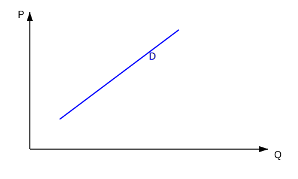

**نکته ی مهم:** تقاضا در اثر جانشینی همیشه با کاهش قیمت افزایش می یابد اما در اثر درآمدی بستگی به نوع کالا دارد.
اگر اثر جانشینی و درآمدی کاملا با هم برابر باشند و عکس هم ، منحنی تقاضا عمودی است - کالای حیاتی $\leftarrow$ انسولین برای بیماران دیابتی.

صفحه: 24

---

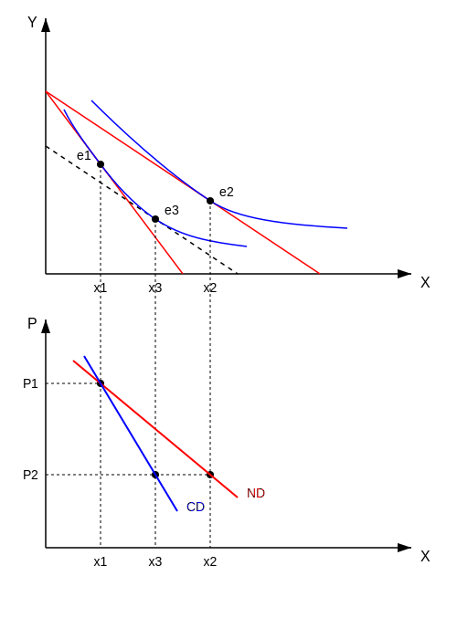

موقعیتی را در نظر بگیرید که پس از تغییر در قیمت ، مقامات دولتی با برقراری مالیات یا سوبسید به مصرف کننده ای ، مطلوبیت او را بدون تغییر باقی گذارند.
در این صورت تابع تقاضای جبرانی مصرف کننده ، مقدار خرید کالاها را به صورت تابعی از قیمت آن نشان می دهد. در این حالت تابع تقاضای جبرانی از طریق به حداقل رساندن مخارج مصرف کننده با توجه به این محدودیت که مطلوبیت در سطح $\bar{U}$ ثابت باشد. (CD جبرانی هیکسی)

حرکت از $e_1$ به $e_2$ $\leftarrow$ اثر کل تغییر قیمت کالا که دو اثر جانشینی و اثر درآمدی را در خود دارد.
$x_1 \rightarrow x_2 \leftarrow$ اثر کل

اثر اول $P_x \downarrow$ و $\uparrow$ درآمد واقعی $\leftarrow$ در این حالت اثر درآمدی را حذف می کنیم [مثلاً با گرفتن مالیات] اثر درآمدی را خنثی می کنیم. خط بودجه به موازات خود کاهش یافته و به سمت چپ منتقل می شود تا جائیکه که مماس شود بر منحنی بی تفاوتی اولیه [$e_3$] $\leftarrow$ در این حالت اثر درآمدی را از بین بردیم.

- حرکت $e_1 \rightarrow e_3 \leftarrow$ اثر جانشینی
- حرکت $e_3 \rightarrow e_2 \leftarrow$ اثر درآمدی
جمع اثر کل = $e_1 \rightarrow e_2$
مطلوبیت ثابت $\bar{U}$

در ازای نقطه $e_3 \leftarrow$ میزان $x_3$ به دست می آید.
اگر $e_1$ را به $e_3$ وصل کنیم ، منحنی تقاضای جدید با حذف اثر درآمدی و فقط و فقط با اثر جانشینی به دست می آید $\leftarrow$ منحنی جبرانی یا هیکسی نامیده می شود.

صفحه: 25

---

# ویژگی های تقاضای جبرانی

مقدار کالایی که مصرف کننده با قیمت های داده شده خریداری می کند به شرطی که مطلوبیت ثابتی را حفظ کند و هزینه اش حداقل باشد.
۱. منحنی تقاضای جبرانی همیشه شیب منفی دارد چون فقط اثر جانشینی را نشان می دهد.
۲. مطلوبیت مصرف کننده ثابت است [ یعنی درآمد واقعی آن ثابت است ].
۳. تابع تقاضای جبرانی ، همگن از درجه صفر نسبت به قیمت کالا و مطلوبیت است.
۴. شیب آن همواره از شیب تقاضای نرمال بیشتر است. [مهم] (چون فقط یک اثر را نشان می دهد).

**هدف:** کاهش مخارج (حداقل هزینه) یا حداقل مخارج
**محدودیت:** مطلوبیت $\leftarrow$ مطلوبیت ثابت [ روی تابع مطلوبیت قبلی هستیم ]

شرط (مطلوبیت ثابت):
تابع هدف : $Min~I = P_1 q_1 + P_2 q_2$
$S.t: \bar{U} = U(q_1, q_2)$

تابع لاگرانژ:
$\mathcal{L} = P_1 q_1 + P_2 q_2 + \mu [\bar{U} - U(q_1, q_2)]$

① $\frac{\partial \mathcal{L}}{\partial q_1} = 0 \Rightarrow P_1 - \mu \frac{\partial U}{\partial q_1} = 0 \Rightarrow P_1 = \mu U_1$
② $\frac{\partial \mathcal{L}}{\partial q_2} = 0 \Rightarrow P_2 - \mu \frac{\partial U}{\partial q_2} = 0 \Rightarrow P_2 = \mu U_2$
④ $\frac{\partial \mathcal{L}}{\partial \mu} = 0 \Rightarrow \bar{U} - U(q_1, q_2) = 0$

از تقسیم رابطه ۱ بر ۲:
$\frac{\text{①}}{\text{②}} \Rightarrow \frac{P_1}{P_2} = \frac{U_1}{U_2} = MRS$ (رابطه ③ - مطلوبیت نهایی برای کالای نرمال)

شیب خط هزینه = شیب منحنی بی تفاوتی

صفحه: 26

---

اگر مطلوبیت $M$ واحد تغییر کند، حداقل هزینه چه قدر تغییر می‌کند
افزایش / کاهش
مطلوبیت نهایی کالای اول
$$ \mu = \frac{P_1}{U_1} = \frac{P_2}{U_2} \quad \rightarrow \quad \text{ضریب لاگرانژ} $$
هر یک از مقادیر را محاسبه و در رابطه $\bar{E}$ قرار می‌دهیم که در نهایت به تابع جبران به شکل زیر می‌رسیم.
$$ q_1^{CD} = q_1^{CD} (P_1, P_2, \bar{U}) $$
$$ q_2^{CD} = q_2^{CD} (P_1, P_2, \bar{U}) $$
تابع تقاضای یک کالا، تابعی است از قیمت کالاها و مطلوبیت ثابت
$$ (x,y) $$
$$ 1, 2 $$
شرط دوم SOC باید دترمینان هسین مرزی کوچکتر از صفر باشد ($Min$)
$$ \begin{pmatrix} -\mu f_{11} & -\mu f_{12} & -U_1 \\ -\mu f_{21} & -\mu f_{22} & -U_2 \\ -U_1 & -U_2 & 0 \end{pmatrix} < 0 $$
تقاضای جبرانی فقط اثر جانشینی را نشان می‌دهد و اثر جانشینی نیز همیشه منفی است
بنابراین منحنی تقاضای جبرانی همگی همیشه شیب منفی دارد و شیب آن بیشتر از شیب منحنی تقاضای نرمال می‌باشد

صفحه: 27

---

مثال: (۱)

$$ Min: P_1 q_1 + P_2 q_2 $$
$$ S.t: \bar{U} - q_1 q_2 = 0 $$
$$ \leadsto \mathcal{L} = P_1 q_1 + P_2 q_2 + \mu (\bar{U} - q_1 q_2) $$

$$ \frac{\partial \mathcal{L}}{\partial q_1} = 0 \leadsto P_1 - \mu q_2 = 0 \Rightarrow \frac{P_1}{P_2} = \frac{q_2}{q_1} \leadsto q_2 = \frac{P_1}{P_2} q_1 $$
$$ \frac{\partial \mathcal{L}}{\partial q_2} = 0 \leadsto P_2 - \mu q_1 = 0 $$
$$ \frac{\partial \mathcal{L}}{\partial \mu} = 0 \leadsto \bar{U} - q_1 q_2 = 0 \Rightarrow \bar{U} = q_1 \left( \frac{P_1}{P_2} q_1 \right) \Rightarrow $$

$$ \bar{U} = \frac{P_1}{P_2} q_1^2 \leadsto q_1^{CD} = \sqrt{\frac{\bar{U} P_2}{P_1}} $$
$$ q_2^{CD} = \sqrt{\frac{\bar{U} P_1}{P_2}} $$

این توابع همگن درجه صفر از قیمت ها هستند.

یکی از سوال های امتحانی اینست که محاسبه تقاضای جبرانی را یا نرمال را محاسبه کنیم

نکات اسلاتسکی:
بررسی و تجزیه و تحلیل متغیرهای برونزا (قیمت و درآمد) و تاثیر آن روی متغیرهای درون زا (مثل مقدار) $\leftarrow$ قیمت و درآمد به روی هزینه های مصرف کننده اثری ندارد
$X_i$ : مقدار کالای $i$
$P_i$ : قیمت کالای $i$
$I$ : درآمد

$\lambda$ ضریب لاگرانژ : نشان می‌دهد اگر درآمد ۱ واحد زیاد شود مطلوبیت تقریباً $\lambda$ واحد زیاد می‌شود
$\lambda$ = مطلوبیت نهایی درآمد

صفحه: 28

---

جلسه ی سوم اردیبهشت ۴ و ۵
معادلات اسلاتسکی: می‌خواهیم تحت عنوان معادلات اسلاتسکی، اثر جانشینی و اثر درآمدی را از طریق ریاضی به دست آوریم و ارتباط آن را با کشش های تقاضا به دست بیاوریم و در نتیجه ویژگی های تقاضا را بررسی کنیم که چگونه نشان دهیم.
تابع مطلوبیت ما از $n$ کالا تشکیل شده و خط بودجه هم از $1$ تا $n$ کالا درست کرده ایم

$$ Max U = U(x_1, x_2, \ldots, x_n) $$
$$ S.t \quad I = \sum_{i=1}^n P_i x_i \Rightarrow I = P_1 x_1 + P_2 x_2 + \ldots + P_n x_n $$
$$ \mathcal{L} = U(x_1, x_2, \ldots, x_n) + \lambda \left[ I - \sum_{i=1}^n P_i x_i \right] $$

تابع لاگرانژ را می‌نویسیم و همان مراحل قبل انجام می‌دهیم (n معادله و n مجهول) و n تا تابع تقاضای نرمال به دست می‌آید (از نسبت به n کالا... مشتق می‌گیریم)

F.O.C:
$$ \frac{\partial \mathcal{L}}{\partial x_i} = 0 \Rightarrow \frac{\partial U}{\partial x_i} - \lambda P_i = 0 \Rightarrow U_i - \lambda P_i = 0 $$
$$ U_i = \lambda P_i $$

معادلات تقاضا برای کالاهای $1$ تا $n$ ($n$ کالا):
$$ \begin{cases} U_1 - \lambda P_1 = 0 \\ U_2 - \lambda P_2 = 0 \\ \vdots \\ U_n - \lambda P_n = 0 \end{cases} $$

$$ \begin{bmatrix} 1 \\ \vdots \\ n \end{bmatrix} \rightarrow \frac{\partial \mathcal{L}}{\partial \lambda} = 0 \Rightarrow I - \sum_{i=1}^n P_i x_i = 0 $$

تابع تقاضای نرمال - مارشالی ها ما $x_i^{ND} = x_i^{ND}(P_1, P_2, \ldots, P_n, I)$
$n+1$ مشتق = $n+1$ معادله و $n$ تا تابع تقاضا بدست می‌آوریم
$n+1$ مجهول

مجهول های ما:
$$ \begin{cases} n \text{ معادله مطلوبیت } \\ \text{یک معادله خط بودجه } \end{cases} \Rightarrow n+1 \text{ معادله و مجهول} $$

هدف این صفحه پیدا کردن تابع تقاضای مارشالی

صفحه: 29

---

فرض می‌کنیم قیمت ها یا درآمد تغییر کنند. می‌خواهیم ببینیم مصرف کننده چگونه تغییر می‌کند.
حالا باید خصوصیات تقاضا را با استفاده از شرط مرتبه دوم بررسی کنیم. یعنی از این معادلات ($n$ معادله) دیفرانسیل کامل بگیریم. ($n$ تا $U$ و $\lambda$)
از تابع $U$ نسبت به $x$ها و بقیه تغییرات را حساب می‌کنیم. $U_i - \lambda P_i = 0$

کالای اول:
$$ U_{11} dx_1 + U_{12} dx_2 + \ldots + U_{1n} dx_n - P_1 d\lambda - \lambda dP_1 = 0 $$
کالای دوم:
$$ U_{21} dx_1 + U_{22} dx_2 + \ldots + U_{2n} dx_n - P_2 d\lambda - \lambda dP_2 = 0 $$
$$ \vdots $$
$$ U_{n1} dx_1 + U_{n2} dx_2 + \ldots + U_{nn} dx_n - P_n d\lambda - \lambda dP_n = 0 $$

$$ dI - \sum_{i=1}^n P_i dx_i - \sum_{i=1}^n x_i dP_i = 0 $$

$n+1$ معادله و $n+1$ مجهول $\leftarrow$ فرم ماتریسی

بردار متغیرهای $I$ و $P$ معلوم
بردار مجهول ها
ماتریس ضرایب مجهول

$$ \begin{bmatrix} U_{11} & U_{12} & \ldots & U_{1n} & -P_1 \\ U_{21} & U_{22} & \ldots & U_{2n} & -P_2 \\ \vdots & \vdots & \ddots & \vdots & \vdots \\ U_{n1} & U_{n2} & \ldots & U_{nn} & -P_n \\ -P_1 & -P_2 & \ldots & -P_n & 0 \end{bmatrix} \begin{bmatrix} dx_1 \\ dx_2 \\ \vdots \\ dx_n \\ d\lambda \end{bmatrix} = \begin{bmatrix} \lambda dP_1 \\ \lambda dP_2 \\ \vdots \\ \lambda dP_n \\ -dI + \sum x_i dP_i \end{bmatrix} $$

$$ AX = B $$
$$ X = A^{-1} B $$

صفحه: 30

---

می‌خواهیم ببینیم تغییر قیمت کالاها و درآمد تقاضای ما را چگونه تغییر می‌دهد آیا فقط تغییر خود قیمت کالا است که سبب تغییر تقاضا می‌شود یا اگر قیمت سایر کالاها هم تغییر کند، باعث تغییر تقاضا می‌شود.
معادلات اسلاتسکی تغییرات را به صورت کلی و به سمت واقعیت بررسی کند.
برای این کار یک سری فروض در نظر می‌گیرد.

$$ \begin{bmatrix} dx_1 \\ dx_2 \\ \vdots \\ dx_j \\ \vdots \\ dx_n \\ d\lambda \end{bmatrix} = \begin{bmatrix} C_{11} & C_{12} & \ldots & C_{1n} & C_{(1)(n+1)} \\ C_{21} & C_{22} & \ldots & C_{2n} & C_{(2)(n+1)} \\ \vdots & \vdots & \ddots & \vdots & \vdots \\ C_{j1} & C_{j2} & \ldots & C_{jn} & C_{(j)(n+1)} \\ \vdots & \vdots & \ddots & \vdots & \vdots \\ C_{n1} & C_{n2} & \ldots & C_{nn} & C_{(n)(n+1)} \\ C_{(n+1)(1)} & C_{(n+1)(2)} & \ldots & C_{(n+1)(n)} & C_{(n+1)(n+1)} \end{bmatrix} \begin{bmatrix} \lambda dP_1 \\ \lambda dP_2 \\ \vdots \\ \lambda dP_j \\ \vdots \\ \lambda dP_n \\ -dI + \sum x_i dP_i \end{bmatrix} $$

ماتریس فرضی (معکوس ماتریس بالایی)
سطر فرضی $j$ و $h$ را در نظر می‌گیریم. در سطر فرضی در نظر می‌گیرد هر سطر تک تک درایه ها در ستون های ماتریس بعدی ضرب می‌شود.

اثر مستقیم تغییر قیمت : $C_{jj} \lambda dP_j$
اثر قدرت خرید: $C_{(j)(n+1)} (-dI + \sum x_i dP_i)$

معادله اصلی:
$$ \begin{cases} dx_j = C_{j1} \lambda dP_1 + C_{j2} \lambda dP_2 + \ldots + C_{(j)(n+1)} \left(-dI + \sum x_i dP_i\right) \\ dx_h = C_{h1} \lambda dP_1 + C_{h2} \lambda dP_2 + \ldots + C_{(h)(n+1)} \left(-dI + \sum x_i dP_i\right) \end{cases} $$

قیمت خود کالا روی تقاضایش تاثیر دارد ولی آیا اگر:
$$ dP_j \neq 0 \qquad dP_i = 0 \qquad dI = 0 $$

صفحه: 31

---

می‌خواهیم در این بررسی سطر فرضی قیمت کالای $j$ را روی تقاضای یک کالا و سایر کالاها ببینیم اثر جانشینی و درآمدی را در این معادلات پیدا کنیم

۳ فرض در نظر می‌گیریم می‌خواهیم ببینیم تغییر قیمت کالای $j$ چه اثری به روی تقاضای خودش و همچنین چه اثری به روی تقاضای کالای $h$ دارد

دسته اول:
در تقاضای نرمال، اثر کل همان تغییر قیمت خود کالا بود باقی صفر (بقیه ی کالاها)
همه تغییرات صفر به غیر از خود کالا
هیچ کالایی رو تغییر نمی‌دهد. تغییر نمی‌کند. فقط قیمت خود کالا تغییر می‌کند.

$$ dP_i = dI = 0 \qquad dP_j \neq 0 $$

اثر کل:
$$ dx_j = C_{jj} \cdot \lambda dP_j + C_{(j)(n+1)} \cdot (x_j dP_j) $$
($C_{jj} \cdot \lambda dP_j$ اثر مستقیم تغییر قیمت است)

$$ dx_h = C_{hj} \cdot \lambda dP_j + C_{(h)(n+1)} \cdot (x_j dP_j) $$

طرفین رابطه را به $dP_j$ تقسیم کنیم می‌شود اثر تغییر قیمت کالا روی خودش که شامل دو اثر است.
۱) تغییر قیمت کالا روی خودش از دو بخش تشکیل شده است. از طرفی در معادله ی پایین قیمت کالا هم روی تقاضای خودش و هم تقاضای سایر کالاها تاثیر می‌گذارد

گوشت و مرغ $\leftarrow$ تقاضای گوشت $\uparrow$ $+$ تاثیر روی بقیه ی اقلام سبد کالایی $\downarrow$
با تغییر قیمت یک کالا در طول زمان روی تقاضای سایر کالاها تاثیر می‌گذارد برخی کالاها سریع اثر می‌گیرد و برخی کالاها دیرتر اثر می‌گیرند.

صفحه: 32

---

اثر تغییر قیمت = اثر جانشینی + اثر قدرت خرید (اثر درآمدی)

۱) تغییر قیمت کالا روی خودش (اثر جانشینی و اثر درآمدی):
$$ \frac{dx_j}{dP_j} = C_{jj} \cdot \lambda + C_{(j)(n+1)} \cdot x_j $$

۲) تغییر قیمت کالا روی سایر کالاها:
$$ \frac{dx_h}{dP_j} = C_{hj} \cdot \lambda + C_{(h)(n+1)} \cdot x_j $$

می‌خواهیم بدانیم کدام اثر درآمدی است؟ و کدام اثر جانشینی

دسته دوم فروض
گفتیم برای اینکه تقاضای جبرانی را پیدا کنیم یک درآمدی بهش بدیم یا یک درآمدی را ازش بگیریم $[ dI = x_j dP_j ]$ خط بودجه جدید مماس بر منحنی بی تفاوتی قدیم به موازات خط بودجه قدیم درآمد را به میزان $dI$ تغییر می‌دهیم تا قدرت خرید مصرف کننده (مطلوبیت اولیه) ثابت بماند تنها اثر درآمدی حذف می‌شود و فقط اثر جانشینی باقی می‌ماند.

$$ dI = x_j dP_j \leadsto \begin{cases} dP_j \neq 0 \\ dP_i = 0 \end{cases} $$

در معادلات پایین به جای $dI$ مقدار قرار می‌دهیم ($- x_j dP_j$) (درآمد را کم می‌کنیم)

$$ dx_j = C_{jj} \cdot \lambda dP_j + C_{(j)(n+1)} \cdot (-x_j dP_j + x_j dP_j) $$
$$ dx_h = C_{hj} \cdot \lambda dP_j + C_{(h)(n+1)} \cdot (-x_j dP_j + x_j dP_j) $$

$$ \left. \frac{dx_j}{dP_j} \right|_{\bar{U}} = C_{jj} \cdot \lambda \leadsto \text{اثر جانشینی} $$
$$ \left. \frac{dx_h}{dP_j} \right|_{\bar{U}} = C_{hj} \cdot \lambda $$

صفحه: 33

---

معادلات اسلاتسکی : یعنی تغییر یک کالا روی خودش از دو اثر تشکیل شده
۱) اثر جانشینی یا مطلوبیت ثابت ۲) اثر درآمدی
ب) تغییر قیمت یک کالا نه روی سایر کالاها که می شود جانشین یا اثر به تقاضای جبرانی دارد و اثر درآمدی

جایگذاری (۱) در (۲)
$$ \frac{dx_j}{dP_j} = \left. \frac{dx_j}{dP_j} \right|_{\bar{U}} + C_{(j)(n+1)} \cdot x_j \quad (3) $$
$$ \frac{dx_h}{dP_j} = \left. \frac{dx_h}{dP_j} \right|_{\bar{U}} + C_{(h)(n+1)} \cdot x_j $$

دسته ی سوم فروض دوباره در نظر گرفته شود:
$$ dP_i = dP_j = 0 \qquad dI \neq 0 $$

در معادلات اصلی همه صفر و معادلات زیر باقی می ماند.
این ضریب بیانگر حساسیت تقاضاست به تغییر در درآمد.

$$ dx_j = - C_{(j)(n+1)} \cdot dI \quad \begin{cases} \frac{dx_j}{dI} = - C_{(j)(n+1)} \\ \frac{dx_h}{dI} = - C_{(h)(n+1)} \end{cases} \quad (4) $$

اثر کل تغییر قیمت = اثر جانشینی با مطلوبیت ثابت + اثر درآمدی

معادلات اسلاتسکی:
$$ \frac{dx_j}{dP_j} = \left. \frac{dx_j}{dP_j} \right|_{\bar{U}} + \left( - \frac{dx_j}{dI} \cdot x_j \right) $$
$$ \frac{dx_h}{dP_j} = \left. \frac{dx_h}{dP_j} \right|_{\bar{U}} + \left( - \frac{dx_h}{dI} \cdot x_j \right) $$

صفحه: 34

---

نتیجه ی مهم : معادلات اسلاتسکی ارتباط بین تقاضای مارشالی و تقاضای هیکسی را برقرار می کند و نشان می دهد.

اثر کل = اثر جانشینی + اثر درآمدی

تمامی فروض روی معادله ی اصلی صورت می گیرد.
اثر جانشینی همیشه منفی / اثر درآمدی بستگی دارد

اگر کالا عادی باشد تقاضا عادی است و کالا نرمال است. یعنی تغییر قیمت کالا باعث کاهش تقاضای آن کالا می شود.
کالای عادی است - کالای پست

اثر درآمدی $ \frac{dx_j}{dI} > 0 \leadsto \frac{dx_j}{dP_j} < 0 $ اثر جانشینی عادی و نرمال اثر درآمدی مثبت

اگر کالا پست باشد یعنی اثر درآمدی منفی است $[ - \times - ]$ [منفی]
اثر جانشینی $+$ اثر درآمدی

در این صورت دو حالت داریم:
$ \frac{dx_j}{dI} < 0 $ اثر درآمدی منفی

۱) کالای پست عادی $\leadsto \frac{dx_j}{dP_j} < 0$
$|$اثر درآمدی$|$ $<$ $|$اثر جانشینی$|$

۲) کالای گیفن (نقض قانون تقاضا) فقط در این حالت قانون تقاضا نقض می شود.
اثر درآمدی بر جانشینی غلبه می کند $\leadsto \frac{dx_j}{dP_j} > 0$
$|$اثر درآمدی$|$ $>$ $|$اثر جانشینی$|$

در اقتصاد نمی توان کالایی را ۱۰۰٪ پست نامید. چون سلیقه و عادت رفتار مصرف کننده عامل مهمی در رفتار مصرف کننده است.

کالای نرمال: $ \frac{dx}{dI} > 0 $
کالای پست: $ \frac{dx}{dI} < 0 $
گیفن: $ \frac{dx}{dP} > 0 $ (اثر جانشینی $<$ اثر درآمدی)

صفحه: 35

---

تبدیل معادله اسلاتسکی به کشش [کشش بدون واحد هستند و مقایسه آن ها راحت تر است]

کشش قیمتی تقاضا = $\varepsilon$
تغییر قیمت کالا چه تاثیری روی تقاضا می گذارد.
$\varepsilon_j = \bar{\varepsilon}_j - w_j \times \eta_j$

$\bar{\varepsilon}_j$: کشش قیمتی روی تقاضای جبرانی
$\eta_j$: کشش درآمدی

تبدیل معادلات اسلاتسکی به کشش:
$$ \left[ \frac{dx_j}{dP_j} = \left. \frac{dx_j}{dP_j} \right|_{\bar{U}} + \left( - \frac{dx_j}{dI} \cdot x_j \right) \right] \times \frac{P_j}{x_j} $$

فرمول کشش:
$$ \varepsilon = \frac{\partial x}{\partial P} \cdot \frac{P}{x} $$

$$ \frac{dx_j}{dP_j} \cdot \frac{P_j}{x_j} = \left. \frac{dx_j}{dP_j} \right|_{\bar{U}} \cdot \frac{P_j}{x_j} + \left( - \frac{dx_j}{dI} \cdot x_j \right) \cdot \frac{P_j}{x_j} $$
کشش قیمتی تقاضا (مارشالی) = کشش قیمتی روی منحنی تقاضای جبرانی (جانشینی) + اثر درآمدی

$$ \varepsilon_j = \bar{\varepsilon}_j + \left( - \frac{dx_j}{dI} \right) \cdot \frac{P_j \cdot x_j}{x_j} \cdot \left( \frac{I}{I} \right) $$
(عبارت $\frac{I}{I}$ را اضافه می کنیم)

$$ \varepsilon_j = \bar{\varepsilon}_j + \underbrace{\left( \frac{-dx_j}{dI} \cdot \frac{I}{x_j} \right)}_{\text{کشش درآمدی } \eta_j} \cdot \underbrace{\left( \frac{P_j x_j}{I} \right)}_{\text{سهم مخارج کالای j از درآمد}} $$

$$ \varepsilon_j = \bar{\varepsilon}_j - w_j \cdot \eta_j $$

$\varepsilon_j$: کشش قیمتی تقاضا مارشالی
$\bar{\varepsilon}_j$: کشش قیمتی تقاضای جبرانی
$w_j$: سهم کالای j در درآمد
$\eta_j$: کشش درآمدی

کشش قیمتی تقاضا برابر است با کشش قیمتی تقاضای جبرانی منهای کشش درآمدی ضرب در سهم مخارج کالا ($w_j$). پس منحنی تقاضای معمولی نسبت به منحنی تقاضای جبرانی دارای کشش بیشتری است.

$w_j$ = هزینه های صرف شده برای خرید کالای $x_j$

صفحه: 36

---

شرط جمعی کونات : با استفاده از خط بودجه کشش ها را به دست آوریم.
از خط بودجه دیفرانسیل کامل می گیریم.

فرض (۱): $dP_1 \neq 0$ و بقیه صفر $\leftarrow dP_2 = 0 \quad , \quad dI = 0$
(یعنی فقط قیمت کالای $q_1$ تغییر کند)

فرض (۲): $dP_2 \neq 0$ و بقیه صفر $\leftarrow dP_1 = 0 \quad , \quad dI = 0$

فرض (۳): $dI \neq 0$ و قیمت ها مساوی صفر $\leftarrow dP_1 = 0 \quad , \quad dP_2 = 0$
(یعنی قیمت ها ثابت فقط درآمد تغییر می کند)

در فرض (۱) یعنی تغییر قیمت کالا روی خودش را محاسبه کنیم.
کشش عمومی قیمتی (خودی و غیر خودی)

فرض (۲) تغییر قیمت کالای دوم روی خودش (و سایر کالاها) چه تاثیری دارد؟

فرض (۳) قیمت ها صفر درآمد را متغیر می کنیم. یعنی تغییر درآمد با فرض اینکه قیمت ها تغییر نکند چه تاثیری در قدرت خرید من دارد. (کشش درآمدی)

جمع کشش های قیمتی چه خودی و چه غیر خودی با توجه به سهمشان در تقاضای نرمال برابر است با سهم کالایی که قیمتش تغییر کرده ($-w_1$ یا $-P_1$).
عین همین کار را می توان برای فرض دوم و سوم انجام داد.

صفحه: 37

---

چون همه قیمت ها هم مقدار ممکن است تغییر کنند از کل رابطه دیفرانسیل می گیریم.

$$ I = P_1 q_1 + P_2 q_2 \leadsto dI = P_1 dq_1 + q_1 dP_1 + q_2 dP_2 + P_2 dq_2 $$

فرض: $ dI = dP_2 = 0 \qquad dP_1 \neq 0 $
$$ \leadsto P_1 dq_1 + q_1 dP_1 + P_2 dq_2 = 0 $$

تقسیم بر $dP_1$:
$$ \div dP_1 \leadsto \frac{P_1 dq_1}{dP_1} + q_1 + \frac{P_2 dq_2}{dP_1} = 0 $$

چون می خواهیم بدانیم اگر قیمت کالای اول تغییر کند تقاضای کالای دوم چه مقدار تغییر می کند؟
هر چیزی که کم داشتیم را ضرب و تقسیم می کنیم تا تبدیل به کشش کنیم (ضرب در $\frac{q_1}{q_1}$ و ضرب در $\frac{q_2}{q_2} \cdot \frac{P_1}{P_1}$):

$$ \left( \frac{P_1}{q_1} \cdot \frac{dq_1}{dP_1} \right) \cdot q_1 + q_1 + \frac{dq_2}{dP_1} \cdot \left( \frac{P_2 q_2}{P_1} \cdot \frac{P_1}{q_2} \right) = 0 $$

$$ [ q_1 \cdot \varepsilon_{11} + q_1 + \varepsilon_{21} \cdot \frac{P_2 q_2}{P_1} = 0 ] \div \frac{P_1}{I} $$

اثر تغییر قیمت کالا روی خودش (تقاضای خودش) $\leftarrow \varepsilon_{11}$
تقاضای کالای اول روی دوم $\leftarrow \varepsilon_{21}$ (غیر خودی) کشش متقاطع

$$ \underbrace{\left( \frac{P_1 q_1}{I} \right)}_{w_1} \cdot \varepsilon_{11} + \underbrace{\frac{P_1 q_1}{I}}_{w_1} + \underbrace{\frac{P_2 q_2}{I}}_{w_2} \cdot \varepsilon_{21} = 0 $$

$$ w_1 \cdot \varepsilon_{11} + w_1 + w_2 \cdot \varepsilon_{21} = 0 \leadsto w_1 \cdot \varepsilon_{11} + w_2 \cdot \varepsilon_{21} = -w_1 $$

شرط جمعی کونات:
$$ \sum_{i=1}^{n} w_i \varepsilon_{ij} = -w_j $$

توضیحات کشش ها:
$\varepsilon_{11} = \frac{dq_1}{dP_1} \times \frac{P_1}{q_1}$ : یعنی اگر قیمت کالای (۱) تغییر کند تقاضای کالای (۱) چه مقدار تغییر می کند.
$\varepsilon_{21} = \frac{dq_2}{dP_1} \times \frac{P_1}{q_2}$ : اگر قیمت کالای (۱) تغییر کند تقاضای کالای (۲) چه مقدار تغییر می کند؟
$\varepsilon_{ij}$ : تغییر اثر قیمت کالای j بر تقاضای کالای i. اندیس اول تقاضا، اندیس دوم قیمت.

صفحه: 38

---

مجموع انگل

شرط سوم: $dP_2 = dP_1 = 0 \qquad dI \neq 0$

نکته مهم: سهم کالای اول در کشش درآمدی اش بعلاوه سهم کالای دوم در کشش درآمدی اش برابر ۱ است $\leftarrow$ مجموع انگل
یعنی مصرف کننده همزمان نمی تواند دو کالای پست یا دو کالای لوکس مصرف کند.

$$ I = P_1 q_1 + P_2 q_2 \leadsto dI = P_1 dq_1 + q_1 dP_1 + q_2 dP_2 + P_2 dq_2 $$
(با توجه به صفر بودن تغییرات قیمت، $dP_1$ و $dP_2$ حذف می شوند)

$$ dI = P_1 dq_1 + P_2 dq_2 \quad \div dI \leadsto \frac{P_1 dq_1}{dI} + \frac{P_2 dq_2}{dI} = 1 $$

$$ \left( \frac{P_1 q_1}{I} \right) \cdot \frac{dq_1}{dI} \cdot \frac{I}{q_1} + \frac{P_2 q_2}{I} \cdot \frac{dq_2}{dI} \cdot \frac{I}{q_2} = 1 $$

$$ w_1 \cdot \eta_1 + w_2 \cdot \eta_2 = 1 $$

در حالت کلی:
$$ \sum_{i=1}^{n} w_i \eta_i = 1 $$

دو حالت داریم:
$x \uparrow \quad y \downarrow$
$x \downarrow \quad y \uparrow$

نمی توان نقطه ای پیدا کرد که هر دو کالا کم شوند یعنی با افزایش $I$ مصرف از هر دو کالا کم می شود (غیرممکن است).
با درآمد $\uparrow$ مصرف کننده از هر دو کالا بیشتر مصرف می کند یا یکی را بیشتر و یکی را کمتر مصرف می کند اما هرگز با افزایش درآمد هر دو کالا پست نباشد (مجموع کالاها باید ۱ باشد) یا دو کالا همزمان لوکس نمی تواند باشد.
حتی برای ۳ کالا نمی شود هر ۳ کالا پست باشد $\leftarrow$ مجموع انگل

صفحه: 39

---

# [دوگانگی]

مفهوم دوگانگی یعنی از یک تابع با استفاده از عملیات ریاضی به تابع ۲ برسیم و بعد مجدد با یک سری عملیات و قوانین به تابع اولیه برگردیم یعنی بین دو تابع دوگانگی وجود دارد. از یکی به دیگری رسید.

$$
\begin{cases}
\text{تابع (1)} \\
\text{تابع (2)}
\end{cases}
$$

می خواهیم دوگانگی بین مطلوبیت و هزینه را به دست آوریم هر چه در اقتصاد خواندیم قابل تبدیل به هم هستند. مخارج یعنی ارتباط بین قیمت ها و تقاضا و خط بودجه مخارج است.

$$
\begin{cases}
\text{Min} \quad I = \sum_{i=1}^{n} P_i x_i \quad (1) \\
\text{S.t} \quad \bar{U} = U(x_1, x_2, \dots, x_n)
\end{cases}
$$

تقاضای جبرانی از این مدل به دست می آید.

خط بودجه را $\text{Min}$ می کنیم با مطلوبیت ثابت $\bar{U}$ که به ما تقاضای جبرانی را می دهد بعد تقاضا را در خط بودجه قرار دهیم (توابع تقاضا را با $I$ نشان می دهیم یا $E$ نشان می دهیم).

$$
x_i^{CD} = x_i^{CD}(P_1, P_2, \dots, P_n, \bar{U})
$$

$$
E = \sum_{i=1}^{n} P_i x_i^{CD} \Rightarrow E = E(P_1, P_2, \dots, P_n, \bar{U})
$$

اگر تابع تقاضای جبرانی برای هر کالا را در رابطه (1) قرار دهیم به تابع مخارج می رسیم.

صفحه: 40

---

مثال (1) جزوه ص قبل

$$
\begin{aligned}
& \text{Min} \quad P_1 q_1 + P_2 q_2 \\
& \text{S.t} \quad \bar{U} - q_1 q_2 = 0
\end{aligned}
$$

$$
\mathcal{L} = P_1 q_1 + P_2 q_2 + \mu (\bar{U} - q_1 q_2)
$$

تابع تقاضای جبرانی را به دست می آوریم حل در صفحه قبل:

$$
q_1^{CD} = \sqrt{\bar{U} \frac{P_2}{P_1}} \quad , \quad q_2^{CD} = \sqrt{\bar{U} \frac{P_1}{P_2}}
$$

تابع مخارج:

$$
E = P_1 \left( \sqrt{\bar{U} \frac{P_2}{P_1}} \right) + P_2 \left( \sqrt{\bar{U} \frac{P_1}{P_2}} \right)
$$

$$
E = P_1^{\frac{1}{2}} P_2^{\frac{1}{2}} \bar{U}^{\frac{1}{2}} + P_2^{\frac{1}{2}} P_1^{\frac{1}{2}} \bar{U}^{\frac{1}{2}} \Rightarrow E = 2 P_1^{\frac{1}{2}} P_2^{\frac{1}{2}} \bar{U}^{\frac{1}{2}}
$$

یک مصرف کننده با توجه به مطلوبیت ثابت، از بی نهایت سبد در یک دوره به چه میزان خرج می کند [میزان خرج را نشان می دهد] چون بحث دوگانگی داریم.

یعنی از تابع مخارج برسیم به مطلوبیت و از مطلوبیت به مخارج برسیم.

با استفاده از لم شپارد می توان از تابع مخارج به تقاضای جبرانی برسیم یعنی به مطلوبیت هم رسیده ایم.

اگر از تابع مخارج نسبت به قیمت ها مشتق جزئی بگیرید می توان به توابع تقاضای جبرانی دسترسی پیدا کرد.

$$
\frac{\partial E}{\partial P_i} = X_i^{CD}(P_1, P_2, \dots, P_n) + \sum_{i=1}^{n} P_i \frac{\partial X_i^{CD}}{\partial P_i}
$$

برای رسیدن به تقاضا عبارت $\sum_{i=1}^{n} P_i \frac{\partial X_i^{CD}}{\partial P_i}$ صفر خواهد بود.

توابع مخارج $\rightleftarrows$ تقاضای جبرانی
بررسی رفتار مصرف کننده

$$
\frac{\partial E}{\partial P_1} = q_1^{CD} \quad , \quad \frac{\partial E}{\partial P_2} = q_2^{CD}
$$

صفحه: 41

---

$$
y = u^n \rightarrow y' = n u' u^{n-1}
$$

$$
E = 2 \sqrt{P_1 P_2 \bar{U}}
$$

مشتق جزئی بگیرید نسبت به $P_1$ باید به $q_1$ برسیم.
اگر نسبت به $P_2$ مشتق جزئی بگیریم باید برسیم به $q_2$.

دوگانگی را پیدا کنیم بین مخارج و تقاضای جبرانی و مطلوبیت.

[تابع مطلوبیت مستقیم]
$$
E = 2(P_1 P_2 \bar{U})^{\frac{1}{2}} = 2 P_1^{\frac{1}{2}} P_2^{\frac{1}{2}} \bar{U}^{\frac{1}{2}}
$$

$$
\frac{\partial E}{\partial P_1} = P_2^{\frac{1}{2}} \bar{U}^{\frac{1}{2}} P_1^{-\frac{1}{2}} = \sqrt{\frac{P_2 \bar{U}}{P_1}}
$$

$$
\frac{\partial E}{\partial P_2} = (P_1 \bar{U})^{\frac{1}{2}} P_2^{-\frac{1}{2}} \rightarrow \sqrt{\frac{P_1 \bar{U}}{P_2}}
$$

صفحه: 42

---

# مبحث چهارم

## تابع مطلوبیت مستقیم:
تابع مطلوبیت تابعی از کالاهای $x_1, x_2, \dots$ و سبد کالای مصرف کننده را نشان می دهد. در توابع تقاضای نرمال و جبرانی از آن استفاده می کنیم، اسلاتسکی.

تابع مطلوبیت مستقیم:
یعنی تابعی که مستقیماً با مصرف کالاها در ارتباط است و رتبه بندی شده و مقایسه ای است.
مطلوبیت ذهنی / غیر قابل اندازه گیری $U(x_1, x_2, \dots, x_n)$

## تابع مطلوبیت غیر مستقیم: $UI$
می توان از تابع مطلوبیت مستقیم، یک تابعی را به دست آورد به جای اینکه تابعی از مصرف کالاها باشد، تابعی از قیمت کالاها و درآمد مصرف کننده باشد. در واقع از قیمت می توان به تابع تقاضا رسید که:

$$
UI = UI(P_1, P_2, \dots, I)
$$

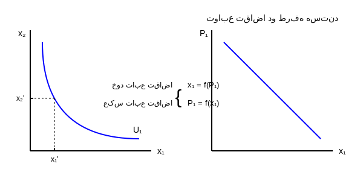

توابع تقاضا دو طرفه هستند:
$$
\begin{cases}
\text{خود تابع تقاضا} & x_1 = f(P_1) \\
\text{عکس تابع تقاضا} & P_1 = f(x_1)
\end{cases}
$$

این تابع ارزش بیشتری دارد چون قیمت های بازار را در خود دارد و درآمد را در خود دارد. متغیرهای آن وجود خارجی دارند $I$ و $P$ این تابع از تابع مطلوبیت مستقیم واقعی تر است. و ما را به کالاها ارتباط می دهد.

نکته: باید از تابع مطلوبیت مستقیم برسیم به تابع مطلوبیت غیر مستقیم و برعکس [دوگانگی] بین مطلوبیت مستقیم و غیر مستقیم.

$$
\begin{aligned}
\text{هدف} \rightarrow \text{Max} \quad & U = U(x_1, x_2, \dots, x_n) \quad \text{(مطلوبیت)} \\
\text{S.t} \quad & I = \sum P_i x_i \quad \text{(محدودیت)} \rightarrow \text{توابع تقاضای نرمال}
\end{aligned}
$$

مشتق مرتبه اول:
$$
X_i^{ND} = X_i^{ND} (P_1, P_2, \dots, P_n, I) \rightarrow U^I = UI(P_1, P_2, \dots, P_n, I)
$$

صفحه: 43

---

اگر جای مقادیر کالاها در تابع مطلوبیت مستقیم، تابع تقاضای نرمال کالاها را قرار دهیم تابعی بدست می آید که دیگر مقادیر در آن نیست (مقادیر کالاها) و قیمت کالاها و درآمد را نشان می دهد که بسیار کاربردی تر است این تابع $\rightarrow$ تابع مطلوبیت غیر مستقیم

$$
U = U \left[ \overbrace{x_1 (P_1, P_2, \dots, P_n, I)}^{\text{تقاضا}}, \dots, \overbrace{x_n (P_1, P_2, \dots, P_n, I)}^{\text{تقاضا}} \right]
$$

$$
UI = UI (P_1, P_2, \dots, P_n, I)
$$

تابعی از قیمت و درآمد / دوگانگی وجود دارد. / هدف مصرف کننده $\text{Min}$ است. با توجه به محدودیت درآمد.

تابع مطلوبیت غیر مستقیم:
$$
\begin{aligned}
& \text{Min} : \quad UI(P_1, P_2, \dots, P_n, I) \\
& \text{S.t} \quad I = \sum_{i=1}^{n} P_i x_i \rightarrow \text{تقاضا}
\end{aligned}
$$

$$
\text{عکس تقاضا} \leftarrow P_i = P_i(x_1, x_2, \dots, x_n) \quad , \quad \frac{\partial U^I}{\partial P_1} = MU_1 \text{ [قیمت]}
$$

$$
UI = UI \left[ P_1(x_1, x_2, \dots, x_n), \dots, P_n(x_1, x_2, \dots, x_n) \right]
$$

$$
\downarrow
$$

$$
U = U(x_1, x_2, \dots, x_n) \quad \text{تابع مطلوبیت مستقیم}
$$

[مصرف کالاها $\text{Max}$ هدف] $\rightarrow$ هدف در تابع مطلوبیت مستقیم

$$
\begin{aligned}
& P_1 = a - x_1 \rightarrow \text{شیب} \\
& x_1 = a - P_1 \rightarrow \text{کشش}
\end{aligned}
$$

صفحه: 44

---

توابع عکس تقاضا را در تابع مطلوبیت غیر مستقیم قرار می دهیم که به تابع مطلوبیت مستقیم می رسیم $\leftarrow$ دوگانگی بین مطلوبیت مستقیم و مطلوبیت غیر مستقیم.

سوال:
$$
\begin{aligned}
& \text{Max} \quad U = q_1 q_2 \\
& \text{S.t} \quad I = P_1 q_1 + P_2 q_2
\end{aligned}
$$

هدف از تابع مطلوبیت مستقیم بالا برسیم به تابع مطلوبیت غیر مستقیم و برعکس.

$$
MU_1 = \frac{\partial U}{\partial q_1} \quad , \quad MU_2 = \frac{\partial U}{\partial q_2}
$$

$$
\mathcal{L} = q_1 q_2 + \lambda (I - P_1 q_1 - P_2 q_2)
$$

تعادل:
$$
\frac{\partial \mathcal{L}}{\partial q_1} = 0 \Rightarrow q_2 - \lambda P_1 = 0
$$

$$
\frac{\partial \mathcal{L}}{\partial q_2} = 0 \Rightarrow q_1 - \lambda P_2 = 0
$$

$$
\frac{q_2}{q_1} = \frac{P_1}{P_2} \leadsto q_2 = \frac{P_1}{P_2} q_1 \quad \text{(در خط بودجه قرار می دهیم)}
$$

$$
\frac{\partial \mathcal{L}}{\partial \lambda} = 0 \Rightarrow I - P_1 q_1 - P_2 q_2 = 0 \leadsto I - P_1 q_1 - P_2 \left( \frac{P_1}{P_2} \right) q_1 = 0
$$

$$
\Rightarrow q_1^{ND} = \frac{I}{2 P_1} \quad , \quad q_2^{ND} = \frac{I}{2 P_2}
$$

این دو تا $q_1, q_2$ در تابع $U$ بالا، توابع تقاضای $q_1$ و $q_2$ را قرار می دهیم:

$$
U = q_1 q_2 \Rightarrow UI = \left( \frac{I}{2 P_1} \right) \left( \frac{I}{2 P_2} \right) \rightarrow UI = \frac{I^2}{4 P_1 P_2} \quad \text{مطلوبیت غیر مستقیم}
$$

صفحه: 45

---

مطلوبیت غیرمستقیم

مشتق از تابع مطلوبیت غیرمستقیم می گیریم $\rightarrow (\text{Min})$ با محدودیت همان درآمدمان [معکوس تقاضا به دست می آید $P = f(x)$] و بعد عکس تقاضاها را در مطلوبیت غیرمستقیم قرار می دهیم.

$$
\begin{cases}
\text{Min} \quad & UI = \frac{I^2}{4 P_1 P_2} \\
\text{S.t} \quad & I = P_1 q_1 + P_2 q_2
\end{cases}
$$

$$
Z = \frac{1}{4} I^2 P_1^{-1} P_2^{-1} + \mu (I - P_1 q_1 - P_2 q_2) \quad \text{[متغیرها قیمت است]}
$$

نقطه تعادل:

$$
\frac{\partial Z}{\partial P_1} = 0 \Rightarrow -\frac{1}{4} I^2 P_1^{-2} P_2^{-1} - \mu q_1 = 0
$$

$$
\frac{\partial Z}{\partial P_2} = 0 \Rightarrow -\frac{1}{4} I^2 P_1^{-1} P_2^{-2} - \mu q_2 = 0
$$

با تقسیم دو رابطه بر یکدیگر:
$$
\frac{P_2}{P_1} = \frac{q_1}{q_2} \Rightarrow P_2 = \frac{q_1}{q_2} P_1 \quad \text{(در خط بودجه قرار می دهیم)}
$$

$$
\frac{\partial Z}{\partial \mu} = 0 \Rightarrow I - P_1 q_1 - P_2 q_2 = 0
$$

مطلوبیت مماس می شود به خط بودجه / مفهوم نقطه تعادل در هر دو تابع معکوس تغییر نمی کند.

$$
I - P_1 q_1 - \frac{q_1}{q_2} (P_1) q_2 = 0 \Rightarrow I = 2 P_1 q_1
$$

معکوس تقاضا:
$$
P_1^* = \frac{I}{2 q_1} \quad , \quad P_2^* = \frac{I}{2 q_2}
$$

با جایگذاری سایر قیمت ها در مطلوبیت غیرمستقیم قرار می دهیم:

$$
UI = \frac{I^2}{4 P_1 P_2} \Rightarrow UI = \frac{I^2}{4 \left( \frac{I}{2 q_1} \right) \left( \frac{I}{2 q_2} \right)} \Rightarrow U = q_1 q_2
$$

چون تابع برحسب $q_1$ و $q_2$ است باید $P_1$ و $P_2$ را به دست آوریم.

از غ.م $\rightarrow$ م باید $\text{Min}$ کنیم مطلوبیت غیرمستقیم را با محدودیت (بودجه) درآمد $\leftarrow$ مجهول $P_1$ و $P_2$ ، $\mu$ (نسبت به مجهول ها مشتق می گیریم).

صفحه: 46

---

# انواع تابع مطلوبیت

## ۱- تابع مطلوبیت هموتتیک (متجانس)
تابعی است که شیب منحنی بی تفاوتی به دست آمده از این توابع در طول هر شعاعی که از مبدأ مختصات (مبدأ) به این منحنی ها رسم می شود ثابت است و هم چنین نرخ نهایی جانشینی مصرف در این توابع، تابعی است از نسبت کالاها $(x_1, x_2)$.

$$
\tan \alpha = \frac{AH}{OH} = \frac{x_2}{x_1}
$$

$$
\text{۲) } MRS = f\left(\frac{x_2}{x_1}\right)
$$

MRS: شیب نقاط روی منحنی است $\leftarrow$ شیب منحنی بی تفاوتی.
مقدار مطلق کالاها نیست مقادیر نسبی کالاهاست (MRS).
اگر تابعی هموتتیک باشد، قطعاً کشش درآمدی آن برابر یک است و یعنی درآمد مصرف آن حتماً خطی است.

## ۲- تابع مطلوبیت همگن
تابعی است که اگر مقادیر تابع را به میزان مشخص تغییر دهیم $(\lambda)$ برابر شود، کل تابع $\lambda^\alpha$ برابر می شود به توان $\alpha$ درجه همگنی گفته می شود.
یا اگر مصرف کالا را به یک میزان تغییر دهیم، مطلوبیت چه تغییری پیدا می کند.

$$
U = U(x_1, x_2)
$$

$$
\begin{aligned}
& x_1 = \lambda x_1 \\
& x_2 = \lambda x_2
\end{aligned} \leadsto U(\lambda x_1, \lambda x_2) = \lambda^\alpha U(x_1, x_2)
$$

- بازده صعودی: $\alpha > 1$
- بازده ثابت: $\alpha = 1$
- بازده نزولی: $\alpha < 1$

صفحه: 47

---

۱- اگر تابع مطلوبیتی همگن باشد (از هر درجه ای)، تابع مطلوبیت نهایی آن تابع همگن با درجه ی یکی کمتر است [چون مطلوبیت نهایی مشتق مطلوبیت است و یکی از توان کم می شود].

۲- اگر تابع مطلوبیت همگن از هر درجه ای باشد MRS آن همگن از درجه صفر است.

۳- اگر تابع مطلوبیتی همگن باشد (از هر درجه ای) حتماً هموتتیک هم می باشد (مهم) عکس مطلب صادق نیست.

## تابع مطلوبیت مجزا
$$
U = f \left[ \sum_{i=1}^{n} U(x_i) \right]
$$

مثال:
$$
U = \ln (x_1^\alpha + x_2^\beta + x_3^\gamma)
$$
هر سه داخل $\ln$ قرار گرفتند و یک تابع است. مطلوبیت نهایی کالاها به هم ارتباط پیدا می کنند.

## تابع دقیقاً مجزا
$$
U = f \left[ u_1(x_1) + u_2(x_2) + u_3(x_3) + \dots + u_n(x_n) \right]
$$

مثال:
$$
U = \ln x_1^\alpha + \ln x_2^\beta + \ln x_3^\gamma
$$
این کالاها در مطلوبیت نهایی شان با هم هیچ ارتباطی ندارند.

## تابع مطلوبیت جمع پذیر (مقادیر با هم جمع شدند)
$$
U = x_1^\alpha + x_2^\beta + x_3^\gamma
$$
هر تابع مجزا، یک تابع یکنواخت از تابعی جمع پذیر است.
هر نتیجه ای که برای تابع مطلوبیت مجزا می گیریم برای تابع مطلوبیت جمع پذیر هم صدق می کند.

صفحه: 48

---

# سیستم مخارج خطی

## تابع مطلوبیت مخارج خطی (LES) مهم
این تابع شکل خاصی دارد به آن تابع کلاین روبین یا استون جری هم گفته می شود.
این دو تابع تبدیل یکنواختی از هم هستند این تابع یک تابع جمع پذیر، هموتتیک است یعنی منحنی درآمد مصرف آن خطی است.

$$
U = \sum_{i=1}^{n} \beta_i \ln (q_i - \gamma_i) \quad \text{(کلاین روبین)} \rightarrow U = \beta_1 \ln (q_1 - \gamma_1) + \beta_2 \ln (q_2 - \gamma_2)
$$

$$
V = \prod_{i=1}^{n} (q_i - \gamma_i)^{\beta_i} \quad \text{(استون جری)} \rightarrow V = (q_1 - \gamma_1)^{\beta_1} (q_2 - \gamma_2)^{\beta_2}
$$
لگاریتمی از تابع کاب داگلاس.

مجموع نهایی مخارج روی کالاها برابر 1 است یعنی هر چه درآمد خرج می شود $\sum \beta_i = 1$

- بتا $\beta$ = سهم نهایی مخارج
- گاما $\gamma$ = حداقل معاش

$\beta$ یعنی اگر درآمد کل 100 واحد افزایش یابد، مخارج کل روی کالای x چه مقدار افزایش پیدا می کند؟

**نکات مهم:**
LES سیستم مخارج خطی / سیستمی است که می گوید کشش درآمدی برای کالا یک است. یعنی نمی تواند کالای پست را توضیح دهد.

صفحه: 49

---

برای رسم تبدیل یک جمع پذیر هموتتیک می کنیم (منحنی درآمد مصرف خطی است)
مبدأ بالاتر می آید چون حداقل معاش را در نظر می گیریم.

وقتی درآمد تغییر می کند با تابع مطلوبیت جدید نقطه تعادل جدید بدست می آید از وصل کردن نقاط تعادلی جدید درآمد و مطلوبیت $\rightarrow$ منحنی درآمد مصرف ICC به دست می آید. و نکته مهم: درآمد مصرف خطی است.

LES: این سیستمی است که می گوید کشش درآمدی برای کالا یک است یعنی این سیستم نمی تواند کالای پست را توضیح دهد.

- کالای نرمال $\rightarrow$ $1 = \text{کشش درآمدی}$
- کالای پست $\rightarrow$ $0 > \text{کشش درآمدی}$

[مهم] مصرف کننده ابتدا درآمدش را صرف حداقل معاش می کند و بعد مابقی درآمدش را به صرف ترجیحات اختصاص می دهد.

صفحه: 50

---

# طرز استخراج تابع تقاضا از سیستم مخارج خطی

تقاضای نرمال:
$$
\begin{cases}
\text{Max} \quad & U = \beta_1 \ln (q_1 - \gamma_1) + \beta_2 \ln (q_2 - \gamma_2) \\
\text{S.t} \quad & I = P_1 q_1 + P_2 q_2
\end{cases}
$$

$$
\mathcal{L} = \beta_1 \ln (q_1 - \gamma_1) + \beta_2 \ln (q_2 - \gamma_2) + \lambda [I - P_1 q_1 - P_2 q_2]
$$

$$
\frac{\partial \mathcal{L}}{\partial q_1} = 0 \Rightarrow \frac{\beta_1}{q_1 - \gamma_1} - \lambda P_1 = 0 \Rightarrow P_1 q_1 = \frac{\beta_1 + \lambda \cdot P_1 \cdot \gamma_1}{\lambda} \quad \text{①}
$$

$$
\frac{\partial \mathcal{L}}{\partial q_2} = 0 \Rightarrow \frac{\beta_2}{q_2 - \gamma_2} - \lambda P_2 = 0 \Rightarrow P_2 q_2 = \frac{\beta_2 + \lambda \cdot P_2 \cdot \gamma_2}{\lambda} \quad \text{②}
$$

$$
\frac{\partial \mathcal{L}}{\partial \lambda} = 0 \Rightarrow I - P_1 q_1 - P_2 q_2 = 0 \quad \text{③}
$$

۱ و ۲ را در ۳ قرار می دهیم:
۴ را به دست می آوریم بعد $\lambda$ را در ۱ و ۲ قرار می دهیم.

$$
I = \frac{\beta_1}{\lambda} + P_1 \cdot \gamma_1 + \frac{\beta_2}{\lambda} + P_2 \gamma_2 \leadsto I - P_1 \gamma_1 - P_2 \gamma_2 = \frac{\beta_1 + \beta_2}{\lambda}
$$

$$
\frac{1}{\lambda} = I - P_1 \gamma_1 - P_2 \gamma_2 \quad \text{④}
$$

صفحه: 51

---

سیستم مخارج خطی

با جایگذاری ④ در ①:
$$
P_1 q_1 = \beta_1 (I - P_1 \gamma_1 - P_2 \gamma_2) + P_1 \cdot \gamma_1 \quad \text{(مخارج کالای 1)}
$$

با جایگذاری ④ در ②:
$$
P_2 q_2 = \beta_2 (I - P_1 \gamma_1 - P_2 \gamma_2) + P_2 \gamma_2 \quad \text{(مخارج کالای 2)}
$$

- $P_1 \gamma_1$ و $P_2 \gamma_2$ $\rightarrow$ مخارج معیشتی
- $(I - P_1 \gamma_1 - P_2 \gamma_2)$ $\rightarrow$ درآمد فرامعیشتی

مخارج معیشتی: قیمت $\times$ حداقل معاش

اگر سیستم مخارج خطی را به $P_1$ و $P_2$ تقسیم کنیم به تابع تقاضا می رسیم.

$$
q_1^{ND} = \frac{\beta_1}{P_1} (I - P_1 \cdot \gamma_1 - P_2 \gamma_2) + \gamma_1
$$

$$
q_2^{ND} = \frac{\beta_2}{P_2} (I - P_1 \cdot \gamma_1 - P_2 \gamma_2) + \gamma_2
$$

برای کالاهایی که نمی توان میزان مصرف یا تقاضا را محاسبه کرد از توابع مخارج استفاده می کنیم.
مثل مصرف میزان دارو - مصرف برق - مسکن

توابع تقاضای به دست آمده غیر خطی است. ($\frac{\beta_1}{P}$) بنابراین در سیستم مخارج خطی تقاضا برای کالاها پیدا نمی کنیم بلکه مخارج صرف شده روی کالاها را پیدا می کنیم.

مخارج صرف شده روی کالای (1) = ضریبی از درآمد فرامعیشتی + مخارج معیشتی همان کالا

LES پویا است. می توان آن را پویا کرد. باید عادات مصرفی را وارد مدل جمعی کنیم.
و به این ترتیب $\gamma_t$ حداقل معاش در یک دوره، تابعی از مصرف دوره ی قبل می باشد.

$$
\gamma_t = \alpha \cdot q_{t-1} \quad \text{(عادات مصرفی)}
$$

صفحه: 52

---

# مزایای سیستم مخارج خطی
۱- با استفاده از این سیستم، تعداد پارامترهایی که می‌خواهیم برآورد کنیم کاهش می‌یابد.
۲- این سیستم نسبت به متغیرهای درآمد و قیمت خطی است.
۳- تفسیر ضرایب در این سیستم بسیار آسان است.
۴- بجای استخراج تابع تقاضا برای یک کالا، می‌توان تابع تقاضا را برای یک گروه کالا استخراج نمود. (کالاهای خوراکی)

# معایب سیستم مخارج خطی
۱- این سیستم در مورد کالاهای لوکس و پست قابل استفاده نیست.
۲- تابع مطلوبیت فوق یک تابع جمع‌پذیر هموتتیک است بنابراین در یک تابع جمع‌پذیر اثرات متقاطع (کشش‌های متقاطع کالاها) صفر است.
۳- در این سیستم، سهم نهایی مخارج برای کالاها یکسان در نظر گرفته می‌شود در حالی‌که این سهم می‌تواند در طول زمان تغییر کند.

صفحه: 53

---

جلسه ی پنجم

# نظریه رفتار تولید کننده

برای اینکه در چه دوره زمانی، فعالیت و تولید می‌کند تصمیم‌گیری‌های متفاوتی دارد.

**دوره آنی یا بسیار کوتاه مدت** یعنی عرضه عمودی (عرضه تولید شده)

**دوره کوتاه مدت / دوره ی بلند مدت**
در کوتاه مدت فقط یک عامل متغیر است و بقیه را ثابت در نظر می‌گیریم.
در دوره ی بلند مدت تمام عوامل تولید متغیر هستند.

تولید کل
$$Q = F(L)$$
$$Q = f(K)$$

تولید نهایی
$$\max TP_L \Rightarrow MP_L = 0$$

$$TP_L \rightarrow AP_L = \frac{TP}{L}$$
$$MP_L = \frac{dTP}{dL}$$

در ناحیه ی دوم اقتصادی مرحله ی مناسب تولید است.
$$TP_L \max \Rightarrow MP_L = 0$$
$$\max AP_L \text{ تا } MP_L = 0$$
$$MP_L = \max AP_L$$

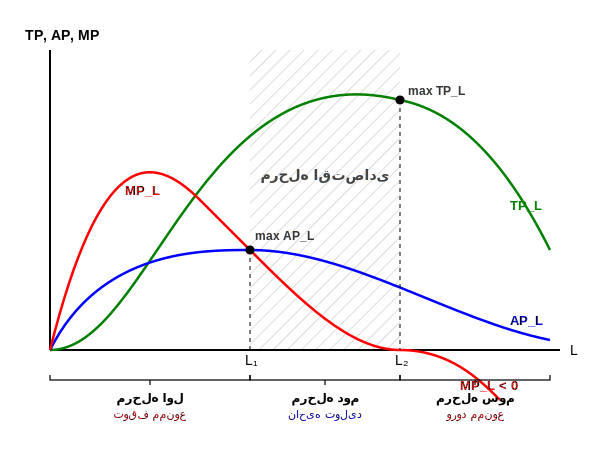

منحنی تولید تیپیکال به این شکل هستند.
نقطه Max در مرحله دوم شروع به کاهش می‌کنند.

* **مرحله اول:** تازه تولید شروع شده - توقف ممنوع - بازده صعودی تولید
* **مرحله دوم:** مرحله دوم اقتصادی
* **مرحله سوم:** ورود ممنوع - $MP_L < 0$

صفحه: 54

---

در دو حالت: ۱- هزینه Min با تولید ثابت ۲- تولید Max با هزینه ثابت
تولید کننده می‌خواهد ماکزیمم کند تولید را همراه با حداقل هزینه.

# حالت اول: تولید Max
$$\max Q = f(L, K)$$
حداقل هزینه (قید) $$S.t \quad \bar{C} = P_L \cdot L + P_K \cdot K$$

تابع لاگرانژ:
$$V = f(L, K) + \lambda [ \bar{C} - P_L \cdot L - P_K \cdot K ]$$

شرط مرتبه اول (FOC):
$$FOC \quad \frac{\partial V}{\partial L} = 0 \Rightarrow \frac{\partial f}{\partial L} - \lambda P_L = 0 \Rightarrow f_L = \lambda P_L \quad (1)$$
$$\frac{\partial V}{\partial K} = 0 \Rightarrow \frac{\partial f}{\partial K} - \lambda P_K = 0 \Rightarrow f_K = \lambda P_K \quad (2)$$
$$\frac{\partial V}{\partial \lambda} = 0 \Rightarrow \bar{C} - P_L \cdot L - P_K \cdot K = 0 \quad (3)$$

از رابطه ۱ و ۲ نتیجه می‌شود:
$$\frac{f_L}{f_K} = \frac{P_L}{P_K} \quad \text{شرط اول تعادل یا شرط لازم}$$
$$| \bar{H} | > 0 \quad \text{شرط دوم}$$

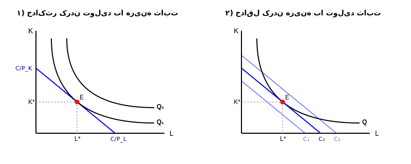

تعادل جایی است که منحنی تولید مماس بر خط هزینه در هر دو حالت پس فرقی ندارد نتیجه در هر دو حالت ۱ و ۲ یکسان است.

---

# حالت دوم: هزینه Min
$$\min C = P_L \cdot L + P_K \cdot K$$
$$S.t \quad \bar{Q} = f(L, K)$$

تابع لاگرانژ:
$$Z = P_L \cdot L + P_K \cdot K + \mu [ \bar{Q} - f(L, K) ]$$

شرط مرتبه اول:
$$\frac{\partial Z}{\partial L} = 0 \Rightarrow P_L = \mu f_L \Rightarrow f_L = \frac{P_L}{\mu} \quad (1)$$
$$\frac{\partial Z}{\partial K} = 0 \Rightarrow P_K = \mu f_K \Rightarrow f_K = \frac{P_K}{\mu} \quad (2)$$
$$\frac{\partial Z}{\partial \mu} = 0 \Rightarrow \bar{Q} - f(L, K) = 0 \quad (3)$$

از رابطه ۱ و ۲ نتیجه می‌شود:
$$\frac{f_L}{f_K} = \frac{P_L}{P_K} \quad \text{شرط اول}$$
$$| \bar{H} | < 0 \quad \text{شرط دوم}$$

صفحه: 55

---

# شرایط حداکثر سود برای تولید کننده

تولید کننده به دو طریق می‌تواند سود خود را Max کند:
۱- چه میزان از نهاده‌ها استفاده کند تا سودش حداکثر شود؟ (سرمایه و نیروی کار) -> **بازار نهاده**
۲- چه میزان کالا تولید کند تا سودش حداکثر شود؟ [بازار کالا]
- بازار رقابت کامل
- رقابت انحصاری
- بازار انحصار چند جانبه
- انحصار کامل

$$\pi = TR - TC$$

**شرط اول:**
$$\frac{\partial \pi}{\partial Q} = 0 \Rightarrow \frac{\partial TR}{\partial Q} - \frac{\partial TC}{\partial Q} = 0 \Rightarrow MR = MC$$

**شرط دوم:**
$$\frac{\partial^2 \pi}{\partial Q^2} \le 0 \Rightarrow \frac{\partial MR}{\partial Q} - \frac{\partial MC}{\partial Q} \le 0 \Rightarrow \frac{\partial MR}{\partial Q} \le \frac{\partial MC}{\partial Q}$$

در همه بازارها با $MR = MC$:
شرط دوم، مشتق دوم باید منفی باشد در ماکزیمم یعنی جایی که شیب $MR < MC$.

صفحه: 56

---

چه میزان نهاده تولید کننده استفاده کند تا سود حداکثر شود.
بازار کالا رقابتی است یا بازار کالا انحصاری است، بسیار مهم است و در تعادل تأثیر دارد.
یعنی باید بدانیم کالا در چه بازاری بفروش می‌رسد؟

**فرض:** تولید کننده رقابتی است و هر دو نهاده‌ی نیروی کار و سرمایه متغیر هستند [در شرایط بلندمدت]. سود ماکزیمم یعنی باید تابع سود را تشکیل دهیم.

تولید $$Q = f(L, K)$$
$$TR = P \cdot Q$$
$$TC = P_L \cdot L + P_K \cdot K + A \quad \text{(A هزینه ثابت)}$$

$$\max \pi = TR - TC$$
$$\max \pi = P \cdot f(L, K) - P_L \cdot L - P_K \cdot K - A$$

از تابع سود نسبت به $L$ و $K$ جداگانه مشتق می‌گیریم.
**شرط اول مشتق = ۰**

$$\frac{\partial \pi}{\partial L} = 0 \Rightarrow P \cdot \frac{\partial f}{\partial L} - P_L = 0 \Rightarrow P \cdot MP_L = P_L \Rightarrow V \cdot MP_L = P_L$$
(ارزش تولید نهایی برای نیروی کار = دستمزد $w$)

$$\frac{\partial \pi}{\partial K} = 0 \Rightarrow P \cdot \frac{\partial f}{\partial K} - P_K = 0 \Rightarrow P \cdot MP_K = P_K \Rightarrow V \cdot MP_K = P_K$$
(ارزش تولید نهایی برای سرمایه = نرخ بهره $r$)

$$K^* = K^*(P_L, P_K, P)$$
$$L^* = L^*(P_L, P_K, P)$$
(توابع تقاضا برای نهاده)
* $P$: قیمت کالا
* $P_K$: قیمت سرمایه
* $P_L$: قیمت نیروی کار

تعادل جایی است که:
نیروی کار تا جایی کار می‌کند که دستمزد دریافت می‌کند [ارزش کار = دستمزد] ($w$)
[ارزش سرمایه = نرخ بهره] ($r$)

**سود حداکثر (شرط دوم)**
$$S.O.C \quad |H| = \begin{vmatrix} P f_{LL} & P f_{LK} \\ P f_{KL} & P f_{KK} \end{vmatrix} = P^2 \begin{vmatrix} f_{LL} & f_{LK} \\ f_{KL} & f_{KK} \end{vmatrix} > 0$$
(هشین معمولی / مشتق دوم)

صفحه: 57

---

فرض می‌کنیم تابع تولید تابعی از دو نهاده است ($x_1$ و $x_2$) هر کدام این نهاده‌ها یک قیمت دارند ($r_1, r_2$).
به همان صورت تابع سود را تشکیل می‌دهیم.

$$\pi = TR - TC$$
$$TR = P \cdot Q$$

$$f_1 : \text{ارزش تولید نهایی نهاده اول = قیمت خودش}$$
$$P \cdot MP_1 = r_1 \quad \text{قیمت نهاده اول}$$

$$f_2 : \text{ارزش تولید نهایی نهاده دوم = قیمت خودش}$$
$$P \cdot MP_2 = r_2 \quad \text{قیمت نهاده دوم}$$

توابع تقاضای نهاده $x_1, x_2$ تابعی است از قیمت دو نهاده $r_1, r_2$ و قیمت محصول $P$.

سوال: تقاضا برای محصول و تقاضا برای نهاده با هم چه تفاوتی دارند؟

**هدف:**
* تولید کننده: کسب سود (Max)
* مصرف کننده: مطلوبیت (Max)

* شیب تقاضا منفی برای کالای معمولی و نرمال [شیب تقاضا + برای کالای پست] با صرف نظر از کالای پست، یعنی
تقاضا برای محصول هم شیب منفی دارد و هم + (اثر جانشینی < اثر درآمدی)
* شیب تقاضای نهاده همیشه منفی است.
* در منطقه ۲ اقتصادی تولید نهایی نزولی است.

صفحه: 58

---

# تقاضا برای نهاده‌ها

$$Q = f(x_1, x_2)$$
($x_1, x_2$ هر کدام یک نهاده هستند)

$$\max \pi = P \cdot f(x_1, x_2) - r_1 x_1 - r_2 x_2$$

① $$\frac{\partial \pi}{\partial x_1} = 0 \Rightarrow P \cdot \frac{\partial f}{\partial x_1} - r_1 = 0 \Rightarrow P \cdot f_1 = r_1 \quad (f_1: \text{تولید نهایی نهاده اول})$$
② $$\frac{\partial \pi}{\partial x_2} = 0 \Rightarrow P \cdot \frac{\partial f}{\partial x_2} - r_2 = 0 \Rightarrow P \cdot f_2 = r_2 \quad (f_2: \text{تولید نهایی نهاده دوم})$$

$$x^* = x^*(r_1, r_2, P)$$
($P$ قیمت محصول، $r$ قیمت نهاده)

* تابع تقاضای نهاده: تقاضا برای نهاده همیشه نزولی است [در بلندمدت و کوتاه مدت] سمت تولید کننده است.

۱) تقاضا برای نهاده در بلندمدت نزولی است.
(از شرط مرتبه اول و دوم دیفرانسیل کامل می‌گیریم و تمام مشتق اولی x دومی + مشتق دومی x اولی)

$$P f_{11} dx_1 + P f_{12} dx_2 + f_1 dP = dr_1 \Rightarrow P f_{11} dx_1 + P f_{12} dx_2 = dr_1 - f_1 dP$$
$$P f_{21} dx_1 + P f_{22} dx_2 + f_2 dP = dr_2 \Rightarrow P f_{21} dx_1 + P f_{22} dx_2 = dr_2 - f_2 dP$$

$$
\begin{bmatrix}
P f_{11} & P f_{12} \\
P f_{21} & P f_{22}
\end{bmatrix}
\begin{bmatrix}
dx_1 \\
dx_2
\end{bmatrix}
=
\begin{bmatrix}
dr_1 - f_1 dP \\
dr_2 - f_2 dP
\end{bmatrix}
$$

صفحه: 59

---

تعمیم دو متغیر مستقل = کرامر

$$
\begin{bmatrix}
P f_{11} & P f_{12} \\
P f_{21} & P f_{22}
\end{bmatrix}
\begin{bmatrix}
dx_1 \\
dx_2
\end{bmatrix}
=
\begin{bmatrix}
dr_1 - f_1 dP \\
dr_2 - f_2 dP
\end{bmatrix}
$$

$$
\begin{vmatrix}
P f_{11} & P f_{12} \\
P f_{21} & P f_{22}
\end{vmatrix}
= P^2 |H| \quad \text{کرامر}
$$

**بردار جواب:**
$$dx_1 = \frac{\begin{vmatrix} dr_1 - f_1 dP & P f_{12} \\ dr_2 - f_2 dP & P f_{22} \end{vmatrix}}{P^2 |H|}$$

$$dx_1 = \frac{P f_{22} dr_1 - P f_{22} f_1 dP - P f_{12} dr_2 + P f_{12} f_2 dP}{P^2 |H| > 0}$$

اگر $dr_2 = dP = 0$ آنگاه:
$$dx_1 = \frac{P f_{22} dr_1}{P^2 |H|} \quad \xrightarrow{\div dr_1}$$

$$\frac{dx_1}{dr_1} = \frac{f_{22}}{P|H|} < 0 \quad \text{شیب تقاضای نهاده ی اول}$$
$$\frac{dx_2}{dr_2} = \frac{f_{11}}{P|H|} < 0 \quad \text{نهاده ی دوم}$$

صفحه: 60

---

# تابع تقاضا برای نهاده [در کوتاه مدت]

**اصل لوشاتلیه:** تقاضا برای نهاده در بلندمدت با کشش‌تر از تقاضا برای نهاده در کوتاه مدت است. چون در بلندمدت تولیدکننده می‌تواند برای نهاده موردنظر جانشین پیدا کند. بنابراین در بلندمدت نسبت به قیمت نهاده حساسیت بیشتری وجود دارد. در کوتاه مدت یک نهاده ثابت است ($\bar{x}_2$) پس ۱ مشتق داریم.

$$Q = f(x_1, \bar{x}_2)$$
$$\max \pi = P \cdot f(x_1, \bar{x}_2) - r_1 x_1 - r_2 \bar{x}_2$$

$$\frac{\partial \pi}{\partial x_1} = 0 \Rightarrow P \cdot \frac{\partial f}{\partial x_1} - r_1 = 0 \Rightarrow f_1 \cdot P - r_1 = 0$$

دیفرانسیل کامل می‌گیریم:
$$P f_{11} \cdot dx_1 + f_1 dP - dr_1 = 0 \quad \xrightarrow{dP = 0}$$

$$P \cdot f_{11} dx_1 = dr_1 \Rightarrow \frac{dx_1}{dr_1} = \frac{1}{P \cdot f_{11}}$$

مقایسه شیب تقاضا در کوتاه مدت و بلند مدت (همواره منفی):
$$ \left[ \frac{f_{22}}{P|H|} \le \frac{1}{P \cdot f_{11}} \right] \cdot \frac{1}{f_{22}} $$

جهت علامت بزرگتر:
$$\Rightarrow \frac{1}{H} \ge \frac{1}{f_{22} \cdot f_{11}} \Rightarrow H \le f_{11} \cdot f_{22} \Rightarrow f_{11} \cdot f_{22} - f_{12}^2 \le f_{11} \cdot f_{22}$$

$$\Rightarrow -f_{12}^2 \le 0 \Rightarrow f_{12}^2 \ge 0$$

صفحه: 61

---

تقاضا برای نهاده در کوتاه مدت نزولی است.
تقاضا برای نهاده در بلندمدت نزولی است.
**چه ارتباطی بین این دو وجود دارد؟**

تقاضا برای نهاده در بلندمدت کم شیب تر از تقاضای نهاده در کوتاه مدت است. یعنی باکشش تر است. یعنی کاهش استفاده از نیروی کار در بلندمدت بیشتر از کاهش استفاده از نیروی کار در کوتاه مدت است. چون در بلند مدت می‌تواند عکس العمل نشان دهد. در بلندمدت تقاضا برای نهاده باکشش تر است.
تولید کننده می‌تواند بر اساس تولید یا شرایط جامعه از ۳ ماه به بالا بلندمدت محسوب می‌شود مثلاً وقتی دستمزد افزایش یابد، تولید کننده می‌تواند تعدیل کند یا تصمیم دیگری بگیرد.

**شیب تقاضای نهاده در کوتاه مدت > شیب تقاضا در بلند مدت**
می‌خواهیم از پاسخ برسیم به یک رابطه همیشه برقرار:

**بلند مدت:**
$$\frac{dx_1}{dr_1} = \frac{f_{22}}{P|H|}$$

**کوتاه مدت:**
$$\frac{dx_1}{dr_1} = \frac{1}{P \cdot f_{11}}$$

$$\left[ \frac{f_{22}}{P|H|} \le \frac{1}{P \cdot f_{11}} \right] \times \left( \frac{1}{f_{22}} \right)$$
(همواره منفی - جهت علامت عوض می‌شود)

$$\frac{1}{H} \ge \frac{1}{f_{22} \cdot f_{11}} \Rightarrow H \le f_{11} \cdot f_{22}$$
$$f_{11} \cdot f_{22} - f_{12}^2 \le f_{11} \cdot f_{22}$$
$$-f_{12}^2 \le 0 \Rightarrow f_{12}^2 \ge 0 \quad \text{(همیشه برقرار)}$$

صفحه: 62

---

$VMP_L = w \quad \text{بهره وری نهایی نیروی کار : } VMP_L$
$VMP_K = r \quad \text{بهره وری نهایی سرمایه : } VMP_K$

**شرط بهینه:** ارزش بهره وری نهایی هر عامل تولید با هزینه اش برابر باشد.

نوع ارتباط نهاده ها با هم مهم است.

۱) اگر استفاده از یک نهاده افزایش یابد و تولید نهایی نهاده ی دیگر کاهش یابد دو نهاده جانشین هستند.
$$w \uparrow \Rightarrow L \downarrow \Rightarrow VMP_K \uparrow \quad \left( \frac{\partial MP_i}{\partial x_j} < 0 \right)$$

۲) اگر استفاده از یک نهاده افزایش یابد و تولید نهایی نهاده ی دیگر افزایش یابد مکمل هستند.
$$w \uparrow \Rightarrow L \downarrow \Rightarrow VMP_K \downarrow$$

---

**حالت اول: دو نهاده جانشین هستند**
در دستمزد $w_0$ قرار داریم و برخورد با منحنی، میزان اشتغال $L_A$ را نشان می‌دهد. دستمزد از $w_0$ به $w_1$ می‌رسد، در کوتاه مدت با کاهش دستمزد نیروی کار $L$ افزایش می‌یابد ($L_A \rightarrow L_B$). نرخ بهره در کوتاه مدت ثابت (یک نهاده ی متغیر داریم $(r, K_1)$)، در کوتاه مدت سازمان نمی‌تواند با فرض جانشین بودن نهاده انتظار داریم منحنی جابجا نمی‌شود از ۱ به ۲ منتقل می‌شویم و در کوتاه مدت فقط بازدهی عامل $K$ کم شده است. (هزینه فرصت کم شده).

تغییر نقطه در بلند مدت $L$ که زیاد می‌شود وقتی دو نهاده جانشین هستند و $VMP_K$ جابجا می‌شود در همان نقطه میزان سرمایه کم می‌شود ($r$ ثابت). $VMP_K$ کاهش یافت و جابجایی به پایین $K$ کم شد $\rightarrow$ $VMP_L$ زیاد شد و به بالا منتقل می‌گردد. حال روند تکرار می‌شود.

$$w \downarrow \Rightarrow L_A \rightarrow L_B \uparrow \xrightarrow{\text{بلند مدت}} VMP_K \downarrow \xrightarrow{r_0} K \downarrow \xrightarrow{L \uparrow} VMP_L \uparrow \Rightarrow L_B \rightarrow L_C \uparrow$$
$$VMP_K \downarrow \xrightarrow{r} K \downarrow \xrightarrow{L} VMP_L \uparrow \xrightarrow{w} L_C \rightarrow L_D \uparrow \dots$$

منحنی $LRLD$ (Long Run Labor Demand) منحنی تقاضای بلندمدت نیروی کار است.

صفحه: 63

---

$$ \frac{\partial^2 Q}{\partial x_1 \partial x_2} = \begin{cases} > 0 & \text{مکمل} \\ < 0 & \text{جانشین} \\ = 0 & \text{مستقل} \end{cases} $$

**نتیجه گیری:** کار و سرمایه جانشین یکدیگرند.
بنگاه همیشه عامل ارزان‌تر را بیشتر استفاده می‌کند. تغییر قیمت یک عامل باعث تغییر مقدار مصرف دیگری می‌شود. خروجی این رفتار در بلند مدت شکل‌گیری منحنی تقاضای عوامل تولید است. مثلاً اگر $w$ زیاد شود، استفاده از نیروی کار، گران می‌شود بنگاه برای اینکه هزینه‌اش زیاد نشود به سمت سرمایه می‌رود پس کار با سرمایه جانشین می‌شود. اگر نرخ بازده سرمایه $r \uparrow$ سرمایه $\uparrow$ گران.

**دو کالا مکمل باشند:**
وقتی دو نهاده مکمل هستند یعنی اگر فقط یک نهاده افزایش یابد دومی تغییری کم بماند و افزایش پیدا نکند، تولید زیاد نمی‌شود. تولید فقط وقتی زیاد می‌شود که هر دو با هم افزایش پیدا کنند. (نزدیک کنج منحنی)

صفحه: 64

---

# طرز رسیدن از تابع تولید به تابع هزینه:

شکل‌گیری هزینه‌های تولید بستگی به فرآیند و شکل‌گیری تولید دارد. بین تولید و هزینه رابطه عکس وجود دارد.
$MC$ و $MP_L$ دقیقاً رابطه عکس دارند.

**در کوتاه مدت:**
$$TVC = w \cdot L$$
$$AVC = \frac{TVC}{Q}$$
$$AVC = \frac{w \cdot L}{Q} = \frac{w}{\frac{Q}{L}} \Rightarrow AVC = \frac{w}{AP_L} \quad (\text{رابطه عکس تولید و هزینه})$$

$$MC = \frac{\partial TC}{\partial Q} = \frac{\partial (wL)}{\partial Q} = w \cdot \frac{\partial L}{\partial Q} \Rightarrow MC = \frac{w}{MP_L}$$

وقتی تولید صعودی است و بازده فزاینده، با هزینه کاهنده مواجه هستیم.
زمانی که بازده نزولی می‌شود، هزینه‌ها صعودی می‌شود.
$$MC = \frac{w \cdot dL}{dQ} \Rightarrow MC = \frac{w}{MP_L} \quad (\text{رابطه عکس})$$

هرگاه بازده عامل متغیر در کوتاه مدت صعودی است ما در قسمت نزولی هزینه‌ها هستیم و برعکس.
پس بین تولید با هزینه ارتباط دارد.

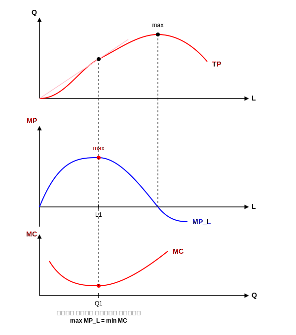

صفحه: 65

---

* می توانیم یک دوگانگی تعریف کنیم یعنی از روی تابع تولید باید بتوانیم تابع هزینه را استخراج کنیم. یعنی بین تولید و هزینه دوگانگی وجود دارد چون بین آن ها رابطه وجود دارد.
تابع تولید داده شده می خواهیم تابع هزینه را به دست آوریم:

$$ \frac{MP_{X_1}}{MP_{X_2}} = \frac{r_1}{r_2} $$

از معادله ی مسیر توسعه بنگاه استفاده می کنیم. ۱- تابع تولید را برای دو نهاده فرض می کنیم خط هزینه ما در برخورد با منحنی تولید، نقطه تعادل تولیدکننده پیدا می کنیم (نیروی کار و سرمایه). در بحث گسترش اگر بنگاه رشد کند اگر هزینه ها افزایش یابد، خط هزینه موازی به بالا منتقل می شود و با منحنی $Q'$ تلاقی می کند در نقطه $e'$ ، نقطه تعادل جدید به دست می آید. در تلاقی با منحنی تولید جدید.

از وصل کردن نقاط تعادل مسیر توسعه بنگاه به دست می آید. (در فضای تولید)
$$ C = wL + rK $$
برای گسترش از طریق مسیر توسعه می توانیم مقدار نهاده $L$ و کمیت آن $K$ را به دست آوریم
$\rightarrow$ تقاضای نهاده ها را به دست می آوریم و در خط هزینه قرار می دهیم و تابع هزینه بنگاه به دست می آید.

نقطه تعادل تولیدکننده:
$$ e = \frac{MP_L}{MP_K} = \frac{P_L}{P_K} $$

از وصل کردن نقاط تعادلی، مسیر توسعه بنگاه به دست می آید.
از رابطه اول $X_1$ و $X_2$ را به دست می آوریم و در تابع تولید قرار می دهیم و بعد مقدار نهاده ها را بر حسب قیمت آن ها به دست می آوریم $\rightarrow$ تقاضای نهاده $\rightarrow$ خط هزینه

روش رسیدن از تابع تولید به تابع هزینه با استفاده از مسیر توسعه بنگاه:
$$ TC = \sum_{i=1}^n r_i X_i $$

صفحه: 66

---

روند:
۱- مسیر توسعه
۲- تقاضای نهاده
۳- در تابع هزینه قرار می دهیم

مثال:
$$ q = x_1^{\frac{1}{2}} x_2^{\frac{1}{2}} $$
$$ C = ? $$

تولید نهایی نهاده:
$$ \frac{MP_{X_1}}{MP_{X_2}} = \frac{r_1}{r_2} $$
مسیر توسعه (از لاگرانژ هم برویم فرقی ندارد.)

$$ MP_{X_1} = \frac{1}{2} x_1^{-\frac{1}{2}} x_2^{\frac{1}{2}} $$
$$ MP_{X_2} = \frac{1}{2} x_1^{\frac{1}{2}} x_2^{-\frac{1}{2}} $$

$$ \frac{\frac{1}{2} x_1^{-\frac{1}{2}} x_2^{\frac{1}{2}}}{\frac{1}{2} x_1^{\frac{1}{2}} x_2^{-\frac{1}{2}}} = \frac{r_1}{r_2} \rightsquigarrow \frac{x_2}{x_1} = \frac{r_1}{r_2} \quad \text{معادله مسیر توسعه} $$

در تابع تولید یک بار $x_1$ و یک بار $x_2$ را جایگزین می کنیم تا توابع تقاضای نهاده به دست بیاید.
$$ X_2 = \frac{r_1 x_1}{r_2} \qquad X_1 = \frac{x_2 r_2}{r_1} $$

با جایگذاری در $q = x_1^{\frac{1}{2}} x_2^{\frac{1}{2}}$ :
$$ q = \left( \frac{x_2 r_2}{r_1} \right)^{\frac{1}{2}} \cdot x_2^{\frac{1}{2}} \rightsquigarrow q = \left( \frac{r_2}{r_1} \right)^{\frac{1}{2}} x_2 $$

$$ X_2^* = q \left( \frac{r_1}{r_2} \right)^{\frac{1}{2}} \quad \text{تقاضای نهاده دوم} $$
$$ X_1^* = q \left( \frac{r_2}{r_1} \right)^{\frac{1}{2}} \quad \text{تقاضای نهاده اول} $$

در تابع هزینه، تقاضای نهاده ها را قرار می دهیم:
$$ TC = r_1 X_1^* + r_2 X_2^* \rightsquigarrow TC = r_1 \left( q \left( \frac{r_2}{r_1} \right)^{\frac{1}{2}} \right) + r_2 \left( q \left( \frac{r_1}{r_2} \right)^{\frac{1}{2}} \right) $$

(فلش ها نشان می دهند که $X_1^*$ تقاضای نهاده $X_1$ و $X_2^*$ تقاضای نهاده $X_2$ است.)

تابع هزینه که قیمت نهاده ها در آن وجود دارد:
$$ C = 2 q r_1^{\frac{1}{2}} r_2^{\frac{1}{2}} $$

صفحه: 67

---

برای اینکه از تابع هزینه به تابع تولید برسیم از لم شپارد استفاده می کنیم.

۱) از تابع هزینه نسبت به قیمت نهاده ها مشتق گرفته و برابر نهاده ها قرار می دهیم. (تقاضای هیکسی)

$$ \frac{\partial TC}{\partial r_1} = X_1 \qquad (1) $$

$$ \frac{\partial TC}{\partial r_2} = X_2 \qquad (2) $$

۲) از روی معادلات ۱ و ۲، نسبت قیمت ها را محاسبه می کنیم $\frac{r_1}{r_2}$ یا $\frac{r_2}{r_1}$

۳) در نهایت قیمت ها را از روابط حذف می کنیم (چون در تابع تولید قیمت وجود ندارد) فقط خود نهاده ها ($x_1 , x_2$) در تابع تولید وجود دارد. (قیمت در تابع هزینه وجود دارد)

صفحه: 68

---

مثال:

$$ C = 2 q r_1^{\frac{1}{2}} r_2^{\frac{1}{2}} $$

طبق لم شپارد، مشتق جزئی می گیریم و برابر هر یک از نهاده ها قرار می دهیم.
(اینجا نسبت نمی گیریم)

$$ \frac{\partial C}{\partial r_1} = 2 (q) \frac{1}{2} r_1^{-\frac{1}{2}} r_2^{\frac{1}{2}} = X_1 $$

$$ \frac{\partial C}{\partial r_2} = 2 (q) \frac{1}{2} r_1^{\frac{1}{2}} r_2^{-\frac{1}{2}} = X_2 $$

از هر رابطه جداگانه نسبت قیمت نهاده ها را پیدا می کنیم و رابطه را ساده می کنیم.
فقط $\frac{r_1}{r_2}$ یا $\frac{r_2}{r_1}$ را پیدا می کنیم.

$$ \begin{cases} \left( \frac{r_2}{r_1} \right)^{\frac{1}{2}} = \frac{x_1}{q} \\ \left( \frac{r_1}{r_2} \right)^{\frac{1}{2}} = \frac{x_2}{q} \end{cases} \xrightarrow{\text{به توان ۲ می رسانیم}} $$

۳) تلاش می کنیم که نسبت قیمت ها از روابط حذف شود. طرفین را به توان ۲ می رسانیم.

$$ \begin{cases} \left( \frac{r_2}{r_1} \right) = \left( \frac{x_1}{q} \right)^2 \rightsquigarrow \frac{r_1}{r_2} = \left( \frac{q}{x_1} \right)^2 \\ \left( \frac{r_1}{r_2} \right) = \left( \frac{x_2}{q} \right)^2 \Rightarrow \frac{r_1}{r_2} = \left( \frac{x_2}{q} \right)^2 \end{cases} $$

با مساوی قرار دادن دو رابطه ی به دست آمده برای $\frac{r_1}{r_2}$ :

$$ \frac{q^2}{x_1^2} = \frac{x_2^2}{q^2} \rightsquigarrow q^4 = x_1^2 x_2^2 \rightsquigarrow q = x_1^{\frac{1}{2}} x_2^{\frac{1}{2}} $$

دوگانگی بین هزینه و تولید یعنی از تابع هزینه به تابع تولید رسیدیم.

صفحه: 69

---

تابع تولید یک نهاده $Q = Q(L)$
استفاده از نیروی کار یا سرمایه برای تولید یک نهاده $Q = Q(K)$

**تولیدات مشترک :**
یعنی از یک نهاده چندین محصول تولید می شود.
مثل کارخانه ی میهن - پگاه و ... (کارخانه محصولات لبنی)
شیر را می خرد و چندین محصول را تولید می کند [بستنی / دوغ / کره / ماست و ...]
یک نهاده شیر است.
بحث بر سر تخصیص عامل است. از میزان شیر موجود چه میزان کره تولید می شود چه قدر خامه - ماست و ... . بحث بر سر تخصیص عامل است.
[تخصیص عامل مشترک تولید] از شیر چقدر خامه / چه قدر بستنی / چه قدر ماست و ... تولید می شود.

می خواهیم از معکوس تابع تولید استفاده می کنیم.
فرض می کنیم دو محصول تولید می شود:
$$ X = h(q_1, q_2) $$
یا
$$ H(X, q_1, q_2) = 0 $$

این بنگاه مورد نظر با فرض ثبات سایر شرایط و میزان استفاده از نهاده ها برای تولید دو کالای $q_1$ و $q_2$ از منحنی امکانات تولید استفاده می کند.
ترکیباتی با یک نهاده مشخص، مکان هندسی از دو کالای $q_1$ و $q_2$ یا ترکیب $q_1$ و $q_2$ است که اگر تولید یک کالا را زیاد کنیم باید از تولید کالای دیگر کم کنیم. مگر اینکه نهاده افزایش یابد که باید مسیر بالاتر قرار بگیریم.

تخصیص عامل مشترک تولید $\rightarrow$ ($X$ نهاده) $Q = Q(X)$
۲ محصول ($q_1, q_2$)

شیب منحنی امکانات تولید، نرخ نهایی تبدیل است که قدر مطلق مثبت است.

$*$ چه میزان از تولید $q_1$ برای تولید یک واحد تولید بیشتر از $q_2$ باید صرف نظر شود.
$\bar{X}$ شرایط ثابت $\leftarrow$ اگر $X$ زیاد شود کل منحنی جابجا می شود.

صفحه: 70

---

پس برای اینکه محصولات مشترک را بحث کنیم باید از منحنی امکانات تولید استفاده کنیم (نسبت به مبدأ مقعر است)
*(نکته: در متن نوشته شده "محدب" اما از نظر اقتصادی و شکل رسم شده در صفحه قبل، منحنی امکانات تولید نسبت به مبدأ مقعر (Concave) است)*

این تولیدکننده یک نهاده خریداری کرده و دو محصول $q_1$ و $q_2$ را تولید می کند به نیت اینکه درآمدش چه قدر است، چه قدر درآمد کسب می کند:
$$ TR = P_1 q_1 + P_2 q_2 $$

در حالت برای رسیدن به درآمد (هدف): ۳ هدف همه ی اینها $\leftarrow$ سود Max است
۱) حداکثر درآمد با نهاده ثابت
$$ \begin{cases} Max\ TR \\ \bar{X} \end{cases} $$
۲) حداقل استفاده از نهاده با درآمد ثابت
$$ \begin{cases} Min\ X \\ \overline{TR} \end{cases} $$
۳) $Max\ \pi$

بررسی حالت اول (شیر):
$$ * \begin{cases} Max\ TR = P_1 q_1 + P_2 q_2 \\ s.t \quad \bar{X} = h(q_1, q_2) \end{cases} $$

$$ L = P_1 q_1 + P_2 q_2 + \mu [\bar{X} - h(q_1, q_2)] $$
(در این رابطه $\mu$ ضریب لاگرانژ و عبارت داخل کروشه محدودیت است.)

$*$ منحنی امکانات تولید مماس شود بر خطوط درآمدی $\leftarrow Max\ TR$

شرایط مرتبه اول (FOC):
$$ \begin{cases} \frac{\partial L}{\partial q_1} = 0 \rightsquigarrow P_1 - \mu \frac{\partial h}{\partial q_1} = 0 \qquad (1) \\ \\ \frac{\partial L}{\partial q_2} = 0 \rightsquigarrow P_2 - \mu \frac{\partial h}{\partial q_2} = 0 \qquad (2) \\ \\ \frac{\partial L}{\partial \mu} = 0 \rightsquigarrow \bar{X} - h(q_1, q_2) = 0 \qquad (3) \end{cases} $$

صفحه: 71

---

تقسیم رابطه ۱ بر ۲:
$$ 1 \div 2 \rightsquigarrow \frac{P_1}{P_2} = \frac{h_1}{h_2} $$
($\frac{h_1}{h_2}$ شیب P.P.C و $\frac{P_1}{P_2}$ شیب منحنی درآمدی است)

تغییر در میزان تولید $q_1$ چه اثری روی $X$ دارد ($h_1$):
$$ h_1 = \frac{1}{MP_{x_1}} $$
$$ h_2 = \frac{1}{MP_{x_2}} $$

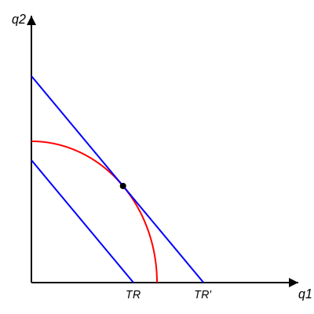
(دو خط درآمدی با یک منحنی امکانات تولید)

$$ \frac{h_1}{h_2} = \frac{P_1}{P_2} = \frac{MP_{x_2}}{MP_{x_1}} $$

(یادآوری: $MC = \frac{w}{MP_L} = \frac{r}{MP_K}$)

$$ \frac{P_1}{P_2} = \frac{MP_{x_2}}{MP_{x_1}} = \frac{MC_1}{MC_2} $$

شرط مرتبه دوم (S.O.C):
$$ |\bar{H}| = \begin{vmatrix} -\mu h_{11} & -\mu h_{12} & -h_1 \\ -\mu h_{21} & -\mu h_{22} & -h_2 \\ -h_1 & -h_2 & 0 \end{vmatrix} > 0 $$
شرط دوم: ماتریس هشین باید مثبت باشد.

$$ \mu = \frac{\partial TR}{\partial X} $$
(درآمد نهایی تولید نهاده $X$)

$*$ نسبت قیمت کالا برابر شد با عکس تولید نهایی آن نهاده ها $\quad \left( \frac{MC_1}{MC_2} \right)$

صفحه: 72

---

**حداقل استفاده از نهاده ها با درآمد ثابت**

حالت دوم:
$$ Min : X = h(q_1, q_2) $$
$$ s.t \quad \overline{TR} = P_1 q_1 + P_2 q_2 $$
$$ V = h(q_1, q_2) + \lambda [\overline{TR} - P_1 q_1 - P_2 q_2] $$

عکس قبلی: Min امکانات تولید با درآمد ثابت.
(۲ امکانات تولید، ۱ یک خط درآمدی)

شرایط مرتبه اول (FOC):
$$ \begin{cases} \frac{\partial V}{\partial q_1} = 0 \rightsquigarrow \frac{\partial h}{\partial q_1} - \lambda P_1 = 0 \qquad (1) \\ \\ \frac{\partial V}{\partial q_2} = 0 \rightsquigarrow \frac{\partial h}{\partial q_2} - \lambda P_2 = 0 \qquad (2) \\ \\ \frac{\partial V}{\partial \lambda} = 0 \rightsquigarrow \overline{TR} - P_1 q_1 - P_2 q_2 = 0 \qquad (3) \end{cases} $$

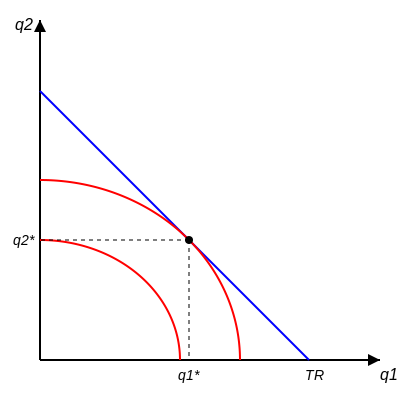

تقسیم رابطه ۱ بر ۲:
$$ 1 \div 2 \rightsquigarrow \text{شرط تعادل} \quad \frac{P_1}{P_2} = \frac{h_1}{h_2} $$
($\frac{P_1}{P_2}$ شیب منحنی درآمد و $\frac{h_1}{h_2}$ شیب P.P.C است. این رابطه نشان دهنده عکس تولید نهایی نهاده $X$ است.)
عین قبلی: شرط لازم هر دو رابطه یکی است.

شرط کافی (S.O.C):
$$ |\bar{H}| < 0 $$

$$ h_1 = \frac{\partial h}{\partial q_1} = \frac{1}{MP_{x_1}} \leftarrow \text{عکس تولید نهایی نهاده X برای کالای اول} $$
$$ h_2 = \frac{\partial h}{\partial q_2} = \frac{1}{MP_{x_2}} \leftarrow \text{عکس تولید نهایی نهاده X برای کالای دوم} $$

$$ \frac{h_1}{h_2} = \frac{P_1}{P_2} = \frac{MP_{x_2}}{MP_{x_1}} $$
$$ MP_L = \frac{w}{MC} \Rightarrow MC = \frac{w}{MP_L} \Rightarrow \frac{P_1}{P_2} = \frac{MP_{x_2}}{MP_{x_1}} = \frac{MC_1}{MC_2} $$

ماتریس هشین در این حالت:
$$ S.O.C \quad |\bar{H}| = \begin{vmatrix} h_{11} & h_{12} & -P_1 \\ h_{21} & h_{22} & -P_2 \\ -P_1 & -P_2 & 0 \end{vmatrix} < 0 $$

صفحه: 73

---

**حالت سوم:** تولیدکننده سود را Max می کند.

$$ Max\ \pi = TR - TC = TR - r X $$
$$ = P_1 q_1 + P_2 q_2 - r \cdot h(q_1, q_2) \qquad \text{(چون } X = h(q_1, q_2)\text{)} $$
(یک تابع داریم دوباره مشتق می گیریم چون محدودیت نداریم.)

شرایط مرتبه اول (FOC):
$$ \begin{cases} \frac{\partial \pi}{\partial q_1} = 0 \rightsquigarrow P_1 - r \frac{\partial h}{\partial q_1} = 0 \Rightarrow P_1 = r h_1 \qquad (1) \\ \\ \frac{\partial \pi}{\partial q_2} = 0 \rightsquigarrow P_2 - r \frac{\partial h}{\partial q_2} = 0 \Rightarrow P_2 = r h_2 \qquad (2) \end{cases} $$

$$ 1 \div 2 \rightsquigarrow \frac{P_1}{P_2} = \frac{h_1}{h_2} $$
حداکثر سود با بهینه نهاده برابر است.
در هر سه حالت نسبت قیمت ها برابر است با عکس تولید نهایی آن نهاده.

$$ \frac{P_1}{P_2} = \frac{MP_{x_2}}{MP_{x_1}} \Rightarrow P_1 \cdot MP_{x_1} = P_2 \cdot MP_{x_2} \Rightarrow $$
تقاضای نهاده $\quad VMP_{x_1} = VMP_{x_2} = r$

شرط کافی (S.O.C):
$$ |H| = \begin{vmatrix} -r h_{11} & -r h_{12} \\ -r h_{21} & -r h_{22} \end{vmatrix} > 0 $$

ما معکوس تابع تولید را فرض کردیم یعنی از یک نهاده برای تولید چندین محصول استفاده کردیم و این بستگی به این دارد که قیمت آن کالا در بازار چه قدر است. یعنی اینکه از هر محصول چه قدر تولید شود (یا بحث تخصیص) بستگی به قیمت آن کالاها دارد.

براساس نسبت قیمت کالا و نسبت تولید نهایی تقسیم بندی می شود که نهاده به سمت تولید کدام کالا اختصاص پیدا کند $\leftarrow$ مفهوم محصولات مشترک.

صفحه: 74

---

**انواع تابع تولید**

۱- تابع تولید همگن: همین تابع کاب داگلاس $\quad q = x_1^{\frac{1}{2}} x_2^{\frac{1}{2}}$
۲- تابع تولید CES (تابع تولید با کشش جانشینی ثابت) (سی اس)

**تابع تولید همگن**

قضیه ی اویلر: اگر از تابع تولید نسبت به نهاده ها مشتق جزئی بگیریم و در خود آن نهاده ضرب کنیم می رسیم به درجه ی جانشینی یا درجه ی همگن بودن آن.
نکته: مجموع کشش های تولید نسبت به دو نهاده برابر است با درجه ی همگنی.

$$ Q = f(x_1, x_2) $$

$$ \begin{cases} x_1 = \lambda x_1 \\ x_2 = \lambda x_2 \end{cases} \rightarrow Q = f(\lambda x_1, \lambda x_2) = \lambda^k f(x_1, x_2) $$

قضیه ی اویلر بیان می کند که هر یک از عوامل تولید، دقیقاً به اندازه ی تولید نهایی خود از تولید سهم می برند البته در شرایطی که تابع تولید همگن از درجه اول باشند.

$$ \frac{\partial Q}{\partial x_1} \cdot x_1 + \frac{\partial Q}{\partial x_2} \cdot x_2 = k Q \qquad (1) $$
$$ MP_{x_1} \cdot x_1 + MP_{x_2} \cdot x_2 $$

اگر $k=1 \rightsquigarrow MP_{x_1} \cdot x_1 + MP_{x_2} \cdot x_2 = Q$

$$ (1) \div Q \rightsquigarrow \frac{\partial Q}{\partial x_1} \cdot \frac{x_1}{Q} + \frac{\partial Q}{\partial x_2} \cdot \frac{x_2}{Q} = k $$
$$ \varepsilon_1 + \varepsilon_2 = k $$
مجموع کشش های تولید نسبت به نهاده ها با درجه ی همگنی تابع تولید برابر است.

صفحه: 75

---

**تابع تولید CES (تابع تولید با کشش جانشینی ثابت)**

$$ q = A [\gamma K^{-\rho} + (1-\gamma) L^{-\rho}]^{-\frac{1}{\rho}} $$
$A$: ضریب تکنولوژی
$\rho$ (پارامتر جانشینی): چه مقدار نیروی کار و سرمایه را در تابع تولید می توانیم جانشین کنیم (درصد جانشین)
$\gamma$: ضریب توزیعی

میزان جانشینی مقدار ثابتی است (کشش جانشینی) ثابت $\sigma$
$$ \sigma = \frac{1}{1+\rho} $$

در تابع کاب داگلاس که حالت خاصی از تابع CES کشش جانشینی برابر یک است.
$$ q = A K^\alpha L^\beta \qquad \sigma = 1 $$

$$ \sigma = \frac{\% \Delta (K/L) / (K/L)}{\% \Delta MRTS_{L,K} / MRTS_{L,K}} = \frac{\text{درصد تغییر ایجاد شده در نسبت نهاده ها}}{\text{درصد تغییر در شیب منحنی های تولید}} $$

**ویژگی های CES**
۱- کشش جانشینی بین نهاده ها در این تابع حتماً باید ثابت باشد.
۲- تابع CES حتماً باید همگن درجه (۱) باشد.

صفحه: 76

---

**مثال:** نشان دهید تابع کاب داگلاس یک تابع CES است.

$$ Q = A K^\alpha L^\beta \qquad , \alpha + \beta = 1 $$

$$ MRTS_{L,K} = \frac{MP_L}{MP_K} = \frac{A \beta K^\alpha L^{\beta-1}}{A \alpha K^{\alpha-1} L^\beta} = \left(\frac{\beta}{\alpha}\right) \cdot \left(\frac{K}{L}\right) $$

$$ \rightarrow Ln(MRTS_{L,K}) = Ln\left(\frac{\beta}{\alpha}\right) + Ln\left(\frac{K}{L}\right) $$

با مشتق گیری:
$$ \frac{\partial MRTS_{L,K}}{MRTS_{L,K}} = \frac{\partial \left(\frac{K}{L}\right)}{\left(\frac{K}{L}\right)} \Rightarrow \frac{\frac{\partial \left(\frac{K}{L}\right)}{\left(\frac{K}{L}\right)}}{\frac{\partial MRTS_{L,K}}{MRTS_{L,K}}} = 1 = \sigma $$

بازارها را از کتاب خرد (۲) دکتر شاکری (بخوانید)

صفحه: 77

---

**جلسه ی هفتم ۴۰/۲/۳**

**بازار رقابت کامل:**

۱- تحرک آزاد منابع: نیروی کار و عوامل به راحتی در بازار جابجا می شوند (محصولات کشاورزی) شبیه بازار رقابت کامل نه ۱۰۰٪
۲- اطلاعات کامل
۳- تعداد بنگاه ها زیاد است. Price $\rightarrow$ بنگاه ها قیمت گیر هستند.
۴- تعداد مصرف کنندگان زیاد است.
۵- کالاها همگن هستند (ویژگی و مشخصات آن ها یکسان است)
۶- قیمت ثابت است $P=MR$

منحنی تقاضا در این بازار افقی است و این خصوصیت مخصوص رقابت کامل است.
شیب تقاضا $= 0$
$\infty =$ کشش $\rightarrow$ بنگاه ها

کوچکترین تغییر در این بازار، مصرف کننده را از بازار دور می کند.
کشش بسیار بالا است و عکس العمل بسیار بالا است.
درآمد در بازار رقابت کامل به دلیل خصوصیت ثابت بودن $P$ یک خط صعودی است.

هزینه ی کل $\rightarrow$ هزینه ی پنهان و آشکار
سود اقتصادی $\leftarrow \uparrow$
حداکثر سود $= \text{درآمد کل} - \text{هزینه کل}$

$P \cdot Q = TR$
هدف بنگاه $\leftarrow \text{تولیدکننده} \rightarrow \text{بازار}$
$Max\ \pi \rightarrow \text{Max } \pi = TR - TC = \bar{P} \cdot Q - TC$

شرط تعادل کوتاه مدت در بازار رقابت کامل:
۱) $FOC = \frac{\partial \pi}{\partial Q} = 0 \Rightarrow P - \frac{\partial TC}{\partial Q} = 0 \Rightarrow P = MC$
مشتق تابع $= 0$
برای کوتاه مدت بنگاه

۲) $S.O.C: \frac{\partial^2 \pi}{\partial Q^2} < 0 \Rightarrow -\frac{\partial MC}{\partial Q} < 0 \Rightarrow \frac{\partial MC}{\partial Q} > 0$

$TC$ یا هزینه کل در بازار $\rightarrow P \geq Min\ AVC$ نقطه تعطیلی بنگاه

سود حسابداری شامل هزینه هایی که قابل مشاهده و ثبت و رؤیت است.
سود اقتصادی: هزینه هایی که ثبت نمی شوند می گویند (هزینه های پنهان و آشکار / اجتماعی و هزینه های ...)

صفحه: 78

---

وقتی قیمت مطرح می شود شرط مرتبه دوم ماتریسی است
در اینجا قید ندارم. $\leftarrow$ مشتق مرتبه دوم

جائی که $AR$ از زیر $MC$ را قطع کند.

$\bar{P}$ ثابت $TR$ یک خط صعودی است.

تعطیلی بنگاه : $\text{Min } AVC =$ نقطه سر به سر $= E$

نقطه تعطیلی بنگاه : در کوتاه مدت تولید کننده نتواند هزینه های ثابت را پوشش بدهد مثل اجاره آپارتمان ، آب و برق و گاز . موقتاً باید تولید را متوقف کند ولی اجازه ترک صنعت را ندارد .
شرط عمومی یا $\text{Min } AVC$ به بالا است . یعنی قیمت نباید پایین تر از این مقدار باشد اگر بود یعنی اصلا تولیدی اتفاق نمی افتد $\leadsto P \geq \text{Min } AVC \leadsto E$ به بالا

منحنی عرضه تولید کننده همان منحنی $MC$ یا هزینه نهایی است. دقیقاً منحنی عرضه روی هزینه نهایی است از $\text{Min } AVC$ به بالا.

درآمد بنگاه : $TR = (OP)(OQ_1) = OPEQ_1 \leadsto P \times Q$

هزینه بنگاه : $TC = OGFQ_1 \qquad AC = \frac{TC}{Q} \leadsto TC = AC \times Q$

ضرر تولید کردن $\leadsto \pi = TR - TC = - PGFE \quad (\text{هزینه ثابت} + \text{هزینه متغیر})$

ضرر تولید نکردن $\leadsto \pi = TR - TC = - PGFE$ هزینه ثابت
زیان $\leadsto$ در این ۲ هزینه

ضرر تولید کردن $=$ ضرر تولید نکردن $\leftarrow$ بنگاه در تولید یا عدم تولید بی تفاوت است.

صفحه: 79

---

شرایط بازدهی انواع کالا

تمام هزینه ها در بلند مدت متغیر است. تابع بنگاه رقابتی در بلند مدت بستگی به نوع بازدهی صنعت دارد [ بازدهی صنعت فزاینده $\leadsto$ منحنی عرضه بلند مدت صعودی ]

$TC = TFC + TVC$
$LTC = LTVC$

در کوتاه مدت داریم $\begin{cases} LMC \\ LAC \end{cases} \rightarrow \frac{LTC}{Q}$

شرط تعادل بلند مدت : $P = \text{Min } LAC , \pi = 0$

تفاوت در درآمد، تفاوت در بازارها را ایجاد می کند.

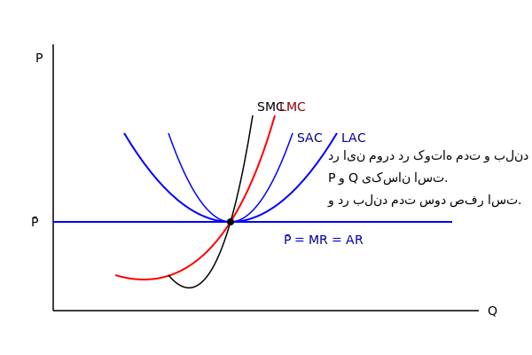

چون در بلند مدت بنگاه های زیان ده خارج می شوند و صنعت را ترک می کنند و اگر سودی وجود دارد محقق بازار رقابت کامل $P = MR = AR$ / بنگاه های دیگر وارد می شوند و فعالیت می کنند.

شرط تعادل:
$$
\begin{cases}
\bar{P} = LMC = SMC = \text{Min } LAC = \text{Min } SAC \\
\pi = 0 \quad \text{سود اقتصادی}
\end{cases}
$$

شرط کارایی در بازار :
این برابری فقط در بازار رقابت کامل اتفاق می افتد.
وقتی به سمت بازارهای انحصاری برویم دیگر بازار کارا نیست.
تمرکز بر روی مفهوم تعادل در بازار رقابت کامل [ در کارشناسی ارشد ]

تعادل یعنی در بازار (تقاضا نزولی - عرضه صعودی) اگر حداقل در یک نقطه همدیگر را قطع کنند $\leftarrow$ تعادل . این نقطه اگر در ربع اول اتفاق می افتد تعادل صورت می گرفت.
(نقطه برخورد $\leftarrow$ مقدار تعادلی $\leftarrow$ تولید)

صفحه: 80

---

سوال : آیا تعادل همیشه وجود دارد ؟ این بستگی به شیب عرضه و تقاضا دارد. در ظاهر منحنی های عرضه و تقاضا همدیگر را قطع می کنند و نقطه تعادل را می بینیم اما ممکن است تعادل وجود نداشته باشد.

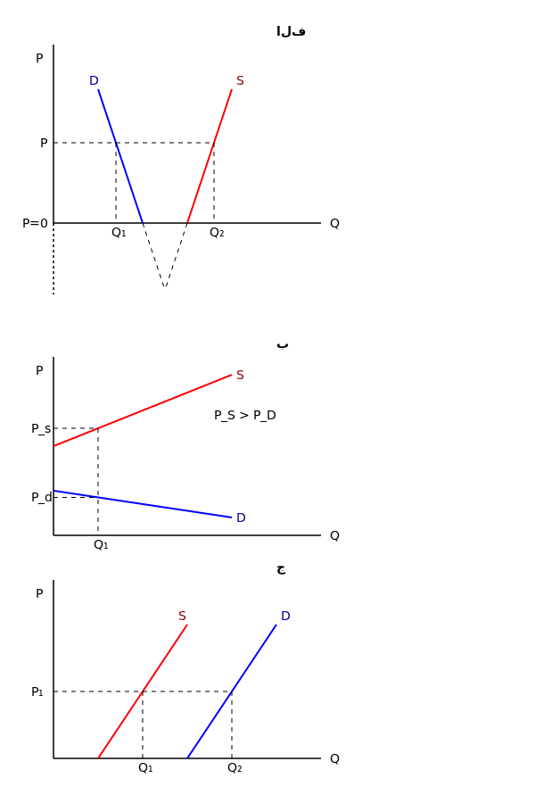

الف) در هر قیمتی مقدار عرضه بیشتر از تقاضا است حتی در قیمت صفر
کالاهای مجانی و رایگان مثل هوای پاک ، اکسیژن
کالا رایگان یا مجانی است $P=0 \leftarrow \text{عرضه} > \text{تقاضا}$ (رایگان)

ب) در هر مقداری قیمت عرضه بالاتر از قیمت تقاضاست. کالاهای بسیار لوکس مثل الماس / ظرف غذای کودک از طلا
می توان اسم کالاها را آورد چون می توان در اقتصاد یک کالا را تعمیم داده چون ممکن است برای گروهی لوکس نباشد نام کالای خاصی را مطرح نمی کنیم.
هزینه تولید بسیار بالاست و مصرف کننده حاضر به پرداخت آن نیست.
$P_S > P_D$

ج) در هر قیمت ، مقدار تقاضا بیشتر از مقدار عرضه است حتی در قیمت صفر.
خطای طراحی مدل می توان کالایی برایش معرفی کرد.
چون طراحی مدل برای یک کالا با کالای دیگری متفاوت است.
مقدار عرضه < مقدار تقاضا $\begin{cases} P=0 \leadsto \text{مجانی} \end{cases}$
در این حالت مابین عرضه و تقاضا برخوردی وجود ندارد.
و ما نقطه تعادل را نمی بینیم اما میشه کالا مثال زد.
تعادل $\leftarrow \emptyset$

صفحه: 81

---

آیا تعادل منحصر بفرد است ؟

تعادل همیشه منحصر بفرد نیست:
آیا همیشه عرضه و تقاضا در یک نقطه همدیگر را قطع می کنند ؟

با ثبات : تعادل زمانی با ثبات است که هر اخلالی در بازار سریعاً رفع و مجدداً بازار به تعادل برگردد.
بی ثبات : اگر اخلالی اتفاق بیفتد دیگر به تعادل نمی رسیم و از تعادل دور می شویم.

با ثبات / بازار / برخورد عرضه و تقاضا / نقطه ی تعادل / در نقاط بالای تعادل مازاد عرضه داریم و در نقاط پایین آن مازاد تقاضا داریم. یعنی شرایط بازار ما را به تعادل بر می گرداند حتی بدون هیچ دخالتی.

تعادل با ثبات : $0 >$ شیب عرضه - شیب تقاضا (با ثبات)
$\delta = D'(p) - S'(p) < 0$ دِلتا
هر زمانی که اختلاف شیب منفی باشد با ثبات است. (شیب تقاضا - شیب عرضه)

در نمودار وسط:
قیمت در یک رنجی وجود دارد
مقدار مشخص در قیمت های مختلف

$A$: عرضه $>$ تقاضا
در نقطه ی $B$: عرضه $<$ تقاضا
$\delta = D'(p) - S'(p) < 0$ با ثبات

تمام کالاها به نوعی تاریخ مصرف دارند. اگر مواد خوراکی باشند $\leftarrow$ تاریخ مصرف
غیر خوراکی ماشین $\leftarrow$ استهلاک و دیده شدن بعد از مدتی
$\leftarrow$ بالا مازاد عرضه
پایین مازاد تقاضا $\rightarrow$ تعادل با ثبات

صفحه: 82

---

دو نکته مهم : ۱- تعادل می تواند در ربع اول اتفاق نیفتد و حالت های مختلف تعادل
۲- بحث بی ثبات و با ثبات بودن

تعادل ایستا و پویا
ایستا : زمان وجود ندارد
تعادل پویا : زمان وارد بحث می شود

اولین نکته ای که در رسیدن یا نرسیدن به تعادل مهم است شیب توابع عرضه و تقاضا است.
نکته : تعادل زمانی پایدار است که در بالای نقطه تعادل مازاد عرضه و در پایین نقطه تعادل مازاد تقاضا داشته باشیم.

دو تعادل ایستا $\leftarrow$ تعادل مارشال (بازی با مقدار خیلی عرف نیست) والراس بحث نمی کردیم
به تعادل از دو نقطه متفاوت نگاه می کنند
تعادل والراس : تعادل $=$ عرضه $=$ تقاضا [برخورد عرضه و تقاضا]

والراس قیمت را عامل برگشت به تعادل می داند ولی مارشال مقدار را عامل بازگشت به تعادل می داند و از معکوس تقاضا استفاده می کند (شرط مقداری برای مارشال مهم است)
پایین و بالا رفتن قیمت ما را به تعادل می رساند مازاد تقاضا
$E(P) = D(P) - S(P)$

در مورد زمانی تعادل با ثبات است که $0 >$ شیب عرضه - شیب تقاضا باشد
در بحث والراس حالت های مختلفی داریم
۱- تعادل $\rightarrow \begin{cases} + \text{شیب عرضه} \\ - \text{شیب تقاضا} \end{cases}$
۲- شیب عرضه و تقاضا
$| \text{شیب تقاضا} | < | \text{شیب عرضه} | \leftarrow$ عرضه پرشیب تر باشد $\leftarrow \delta < 0$ به تعادل می رسیم
۳- عرضه و تقاضا دارای شیب + باشند اگر شیب منحنی عرضه کمتر باشد $\delta < 0$ به تعادل می رسیم

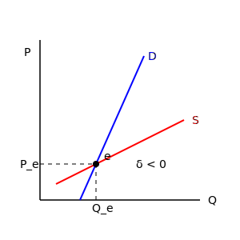

صفحه: 83

---

پویا : زمان وارد می شود
با وقفه / با تأخیر (تار عنکبوتی)
بی وقفه $\leftarrow$ بدون تأخیر (پیوسته)

با وقفه / یعنی قیمت ذره ذره تغییر می کند یعنی بین شروع یک دوره و دوره ی بعد فاصله وجود دارد (تفاضلی)
بی وقفه / تغییرات بی نهایت کوچک (بین شروع یک دوره و دوره ی بعد تأخیر زمانی وجود ندارد) (معادله دیفرانسیل)

بحث زمان که مطرح می شود دو نوع معادله مطرح می شود $\leftarrow$ معادلات تفاضلی / معادلات دیفرانسیل

شرایط رسیدن به تعادل های با وقفه ی تأخیری :
مثل بازار محصولات کشاورزی / تولید کننده بر اساس قیمت های سال گذشته تصمیم به تولید می گیرد ولی مصرف کننده به قیمت امسال توجه می کند.
تار عنکبوتی یعنی یکی بر اساس قیمت های سال گذشته (تولید کننده)
و مصرف کننده بر اساس قیمت های امسال

$$
\begin{cases}
D_t = aP_t + b \\
S_t = AP_t + B
\end{cases}
$$

تعادل $D_t = S_t \qquad P_e = \frac{b-B}{A-a}$

$D_t = aP_{t-1} + b \rightarrow$ مازاد تقاضا را تعیین می کنیم
$S_t = AP_{t-1} + B \rightarrow$ بر اساس قیمت سال گذشته (تولید کننده)

صفحه: 84

---

از رابطه ۱ و ۲ معادله ای بدست می آید بنام معادله تفاضلی مرتبه اول

توان بازار برای از بین بردن مازاد $k > 0$
$P_t - P_{t-1} = k \cdot E(P_{t-1})$
$E(P_{t-1})$ : مازاد تقاضا در دوره قبل
تعادل $\leftarrow$ مازاد عرضه و تقاضا (اختلاف آنها منفی) $E < 0$ از طرفی با ثبات

فرض: $P_t - P_{t-1} = k \cdot E(P_{t-1}) \quad$ (۱)
شرط تعادل: $E(P_{t-1}) = D_{t-1} - S_{t-1} = aP_{t-1} + b - AP_{t-1} - B \quad$ (۲)

در نقطه تعادل مازاد تقاضا صفر است. $E(P)$
از حل بین دو رابطه مسیر حرکت قیمت به دست می آید / یعنی در چه شرایطی تعادل با ثبات است

$a$ : عکس شیب تقاضا
$A$ : عکس شیب عرضه

چه زمان را وارد کنیم یا نه اینکه تعادل پایدار باشه یا نباشد به شیب عرضه و تقاضا بستگی دارد.
آنچه تعیین کننده ی تعادل پایدار در بازار است ، ارتباط عرضه و تقاضا است.
چه تعادل ایستا و چه پویا چه موقعی که زمان داریم ، نداریم در همه این ها تعادل پایدار و با ثبات مفهوم یکی است
یعنی هر حرکتی از تعادل ما را مجدداً به تعادل برگرداند یعنی (اختلاف شیب ها منفی باشد)
و اگر به هر دلیلی از تعادل دور شدیم، دوباره به تعادل برگردیم.

۲ در ۱ : 
$P_t - P_{t-1} = k [ (a-A)P_{t-1} + (b-B) ]$
$P_t = P_{t-1} + k(a-A)P_{t-1} + k(b-B)$
$P_t = [1 + k(a-A)]P_{t-1} + k(b-B)$

صفحه: 85

---

معادله تفاضلی مرتبه اول
$$P_t = [1+k(a-A)]^t P_0 + k(b-B) \cdot \frac{1-[1+k(a-A)]^t}{1-[1+k(a-A)]}$$

$$\rightarrow P_t = [1+k(a-A)]^t \cdot P_0 + \frac{k(b-B)(1-[1+k(a-A)]^t)}{-k(a-A)}$$

$$P_t = [1+k(a-A)]^t \cdot (P_0 - P_e) + P_e$$
معادله ی مسیر حرکت قیمت

$$t \to \infty \quad \text{if} \quad 0 < [1+k(a-A)] < 1 \implies P_t = P_e \quad (\text{تعادل پایدار})$$

۲-۱) نامساوی راست: 
$[1+k(a-A)] < 1 \implies k(a-A) < 0 \implies (a-A) < 0 \implies a < A$ (شیب عرضه و تقاضا)

۲-۲) نامساوی چپ: 
$$0 < [1+k(a-A)] \implies \frac{1}{a-A} + k < 0 \implies k < \frac{1}{(A-a)}$$

۳) داشتیم $(a-A) < 0$ و $k > 0$ عدد بزرگتر باشه اگر 
$1+k(a-A) < 0$ سطح قیمت نوسان می کند ،
تعادل به شیب منحنی های عرضه و تقاضا بستگی دارد.

صفحه: 86

---

شرایط رسیدن به تعادل های با وقفه پیوسته

$\begin{cases} D_t = aP_t + b \\ S_t = AP_t + B \end{cases} \implies \text{تعادل} \quad P_t = S_t \rightarrow P_e = \frac{b-B}{a-A}$

فرض: مازاد عرضه و تقاضا
$\frac{dP}{dt} = k \cdot E(P_t) = k(a-A)P_t + k(b-B)$

$P'_t - k(a-A)P_t = k(b-B)$

مرحله اول پیدا کردن عامل انتگرال ساز $I_t = e^{\int -k(a-A)dt} = e^{-k(a-A)t}$

$P'_t \cdot e^{-k(a-A)t} - k(a-A)P_t \cdot e^{-k(a-A)t} = k(b-B) e^{-k(a-A)t}$

$\frac{d(P_t \cdot e^{-k(a-A)t})}{dt} = k(b-B) \cdot e^{-k(a-A)t}$

از طرفین انتگرال می گیریم
$\int \frac{d(P_t \cdot e^{-k(a-A)t})}{dt} dt = \int e^{-k(a-A)t} \cdot k(b-B) dt$

$P_t \cdot e^{-k(a-A)t} = \frac{k(b-B)}{-k(a-A)} \cdot e^{-k(a-A)t} + C$

$P_t \cdot e^{-k(a-A)t} = P_e \cdot e^{-k(a-A)t} + C \rightarrow (P_t - P_e) e^{-k(a-A)t} = C$

$\rightarrow P_t - P_e = C \cdot e^{k(a-A)t} \implies P_t = P_e + C \cdot e^{k(a-A)t}$

$\text{if } t = 0 \to P_0 = P_e + C \implies C = P_0 - P_e$

صفحه: 87

---

معادله مسیر حرکت قیمت
$$P_t = P_e + (P_0 - P_e) \cdot e^{k(a-A)t}$$

۱) $t \to \infty \quad \text{if} \quad (a-A) < 0 \implies P_t = P_e \quad (\text{تعادل پایدار})$

تعادل فقط به شیب منحنی های عرضه و تقاضا بستگی داشته و $k$ (توان بازار برای از بین بردن مازاد) ندارد.

جلسه ی هشتم - ۵ خرداد
رقابت انحصاری
بازار رقابت کامل $\leftarrow$ (حدی) دارای خصوصیات منحصر به فرد که در بازارهای دیگر دیده نمی شود. $\rightarrow$ (حدی) بازار انحصار کامل
انحصار چند جانبه

خصوصیات بازار انحصار کامل :
- انواع انحصارگر
- کنترل انحصارگر [...]
- انحصار خرید نباشد

خصوصیات :
- انحصارگر تنها تولید کننده (فروشنده) بازار است
- تعداد زیادی خریداری در مقابل کالای این بازار است.
- تمام منحنی تقاضا در مقابل این تولید کننده قرار دارد و دیگر قیمت ثابت نیست و قیمت تابعی از مقدار تولید است.
در بازار رقابت کامل قیمت ثابت بود
$$P = MR = AR$$
در انحصار کامل $P \neq MR$
درآمد کل دیگر خطی نیست $P = f(Q)$ تابع تقاضا
تابع تقاضا نزولی و تابعی از مقدار و با تابع خطی سروکار نداریم
قیمت تابع مقدار تولید است.

صفحه: 88

---

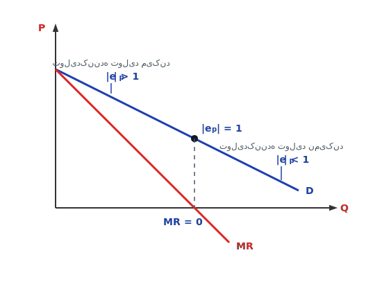

تولید کننده تولید می کند:
۱- قیمت تابع مقدار تولید است
$$P = a - Q$$
$$TR = P \cdot Q$$
$$TR = aQ - Q^2$$
$$MR = a - 2Q$$
$$\frac{\partial TR}{\partial Q} = MR$$

۲- یک تولید کننده وجود دارد.

$$P = F(Q)$$
$$TR = P \cdot Q = F(Q) \cdot Q$$
$$MR = \frac{\partial TR}{\partial Q} = F'(Q) \cdot Q + F(Q)$$
$$\rightarrow MR - P = F'(Q) \cdot Q < 0 \rightarrow MR < P$$

نکته : انحصارگر در کوتاه مدت منحنی عرضه ندارد.

بالای منحنی تقاضا $|e_p| > 1$ و با توجه به درآمدهای ، تولید کننده جایی تولید می کند که کشش بزرگتر است از یک $|e_p| > 1$ یعنی انحصارگر در قسمت با کشش منحنی تقاضا (تولید اتفاق می افتد) / در قسمت پایین منحنی تقاضا درآمد نهایی منفی می شود حداکثر تا $MR=0$ تولید می کند / تولید کننده تولید نمی کند منطقی نیست

$MR = P(1 - \frac{1}{|e_p|})$ :

$$
\begin{cases}
|e_p| = 1 \implies MR = 0 \\
|e_p| > 1 \implies MR > 0 \\
|e_p| < 1 \implies MR < 0
\end{cases}
$$

صفحه: 89

---

در بازار انحصار هم هدف تولید کننده حداکثر کردن سود است
$Max \pi = TR - TC$

$$\frac{\partial \pi}{\partial Q} = 0 \implies MR = MC \Rightarrow \text{شرط تعادل}$$

$(Q) \qquad (E)$
نقطه تعادل و مقدار تعادل نقطه برخورد $MR$ و $MC$
از قسمت روی منحنی تقاضا تعیین می شود. $\to (P)$
انحصارگر در کوتاه مدت منحنی عرضه ندارد . و فقط نقطه ی عرضه داریم
چون فقط یک تولید کننده است چون $MR$ در هر جایی
و ممکن است با $MC$ برخورد کند
شیب درآمد نهایی ۲ برابر شیب تقاضا است.

* عرضه در رقابت کامل با توجه به هزینه ها تعیین می کردیم و ضابطیت هزینه ی ثابت را پوشش می داد.

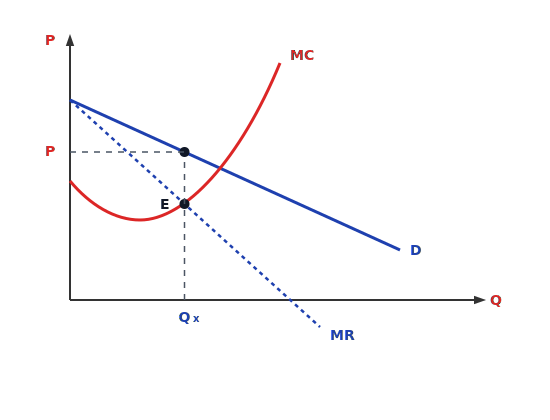

شرط دوم $\rightarrow \frac{\partial^2 \pi}{\partial Q^2} < 0 \implies \frac{\partial MR}{\partial Q} - \frac{\partial MC}{\partial Q} < 0 \implies \frac{\partial MR}{\partial Q} < \frac{\partial MC}{\partial Q}$

بلند مدت : درآمد $TR$ تغییر می کند.
هزینه نهایی بلند مدت $LMC$
$$\pi = TR - LTC \to \frac{\partial \pi}{\partial Q} = 0 \implies MR = LMC$$

* انحصارگر در بلند مدت هم می تواند سود داشته باشد چون فقط یک تولید کننده است [ در صورتی که در رقابت کامل در بلند مدت سود = صفر بود ]
$MR$ باید از پایین $MC$ را قطع کند [ نقطه تعادل ]

صفحه: 90

---

# تبعیض قیمت / متفاوت بودن قیمت
**هدف:** پیدا کردن تعادل و نقطه تعادل

## انواع انحصارگر
۱- انحصارگر تبعیض قیمت
الف) تبعیض قیمت درجه (۱) یا تبعیض قیمت کامل
ب) تبعیض قیمت درجه (۲) تبعیض قیمت مقداری
ج) تبعیض قیمت چند بازاری (درجه ۳)

۲- انحصارگر چند کارخانه‌ای $\leftarrow$ یک محصول تولید می‌کند
یک تولید کننده با چندین کارخانه $\leftarrow$ چند محصول تولید می‌کند

در هر دو شرایط فوق به دنبال شرایط و نقطه‌ی تعادل هستیم و اینکه در هر دو حالت‌های فوق نقطه‌ی تعادل چه تغییراتی پیدا می‌کند. دو شرط برای تبعیض قیمت:
۱- مصرف‌کنندگان را بتوان از هم جدا کرد
۲- بازار انحصاری باشد یعنی فقط در بازار انحصاری تبعیض قیمت داریم.

### حالت تبعیض قیمت کامل:
حالت ۱: تولید کننده دقیقاً می‌داند هر مصرف کننده برای کالایی که می‌خرد چه مقدار پرداخت می‌کند (انحصارگر از هر مصرف کننده یک قیمت می‌گیرد بنابراین در این وضعیت اضافه رفاه مصرف کننده برابر صفر است).
$$P = f(q) \quad \quad CS = 0$$

(قیمت‌های مختلف برای مصرف‌کنندگان مختلف) یعنی تولید کننده تمام سطح زیر منحنی تقاضا که همان رفاه مصرف کننده است را دریافت می‌کند. درآمد انتگرال منحنی تقاضا است.
$$TR = \int_0^q f(q) dq$$
$$\pi = \int_0^q f(q) dq - TC(q)$$
(تمام سطح منحنی تقاضا)

$$\frac{\partial \pi}{\partial q} = 0 \Rightarrow f(q) - MC = 0 \Rightarrow P = f(q) = MC$$

مقدار داخل انتگرال = مشتق انتگرال

سطح زیر منحنی تقاضا = درآمد
هزینه - تابع تقاضا =

صفحه: 91

---

$$TC = 20Q + 50 \quad \quad MC = 20$$
$$P = 100 - 4Q \times Q = TR \Rightarrow 100Q - 4Q^2 \Rightarrow MR = 100 - 8Q$$

۱) تبعیض نباشد (تعادل)
$$MR = MC \Rightarrow 100 - 8Q = 20 \Rightarrow 80 = 8Q \Rightarrow Q = 10$$
$$P = 100 - 4(10) = 60$$
$$\pi = TR - TC \Rightarrow (100 \times 10) - 4(100) = 600$$
$$TC = (20 \times 10) + 50 \Rightarrow 250$$
$$\pi = 600 - 250 = 350$$

۲) تبعیض قیمت کامل
$$TR = \int_0^{20} (100 - 4Q) dQ$$
$$P = MC \Rightarrow P = 20$$
$$100 - 4Q = 20 \Rightarrow 80 = 4Q \Rightarrow Q = 20$$
$$\pi = 750$$

---
### مصرف‌کنندگان برای (تبعیض قیمت درجه ۲)
در این حالت برای مقدار مشخصی از کالا ($OQ_1$) قیمت $P_1$ و برای مقدار دیگر همان کالا ($OQ_2$) قیمت $P_2$ وضع می‌شود.
$$OQ_1 < OQ_2$$

خیلی از مصرف کنندگان با واحدهای کم قیمت‌های زیاد و برای واحدهای زیاد قیمت کم می‌پردازند.
$$(P=15 \leftarrow Q=6) \leftarrow (P=10 \leftarrow Q=18)$$

تعیین قیمت پله‌ای : تقاضا چند پله می‌شود.
گروه مصرف کنندگان پله‌ای: برای مقدار بیشتری کالا پول کمتری می‌پردازند.

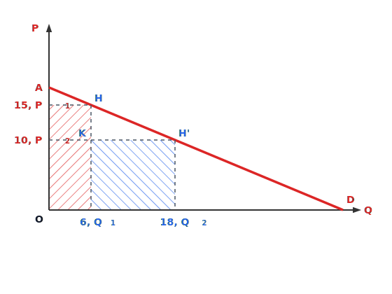

$$TR = OP_1HQ_1 + KQ_1Q_2H'$$
$$TR = (6 \times 15) + (12 \times 10) = 210$$

صفحه: 92

---

# تبعیض قیمت چند بازاری
قیمت برق برای مصرف کننده‌ی خانگی و بنگاه یا صنعت متفاوت است.
در این حالت چون بازارهای فروش از هم جدا هستند می‌توان این تبعیض را اجرا کرد.
۱- حتماً باید بازار انحصار کامل باشد.
۲- کشش‌های قیمتی متفاوت باشد.
۳- باید مصرف کنندگان قابل تفکیک باشند (بلیط هواپیما برای کودک و بزرگسال متفاوت)

(هزینه تولید برق برای مصرف کنندگان مختلف یکی است اما درامدها متفاوت است در مقابل یک هزینه)

$$q = q_1 + q_2 \quad \quad Max \pi = TR_1 + TR_2 - TC$$

$$FOC \begin{cases} \frac{\partial \pi}{\partial q_1} = 0 \Rightarrow \frac{\partial TR_1}{\partial q_1} - \frac{\partial TC}{\partial q} \cdot \frac{\partial q}{\partial q_1} = 0 \Rightarrow MR_1 = MC \\ \\ \frac{\partial \pi}{\partial q_2} = 0 \Rightarrow \frac{\partial TR_2}{\partial q_2} - \frac{\partial TC}{\partial q} \cdot \frac{\partial q}{\partial q_2} = 0 \Rightarrow MR_2 = MC \end{cases}$$

$$\Rightarrow MR_1 = MR_2 = MC$$

$$S.O.C: |H| = \begin{vmatrix} MR'_1 - MC' & -MC' \\ -MC' & MR'_2 - MC' \end{vmatrix} > 0$$

$$MR_1 = P_1(1 - \frac{1}{e_1}) \quad , \quad MR_2 = P_2(1 - \frac{1}{e_2}) \quad (۲)$$
(شرط قسم درجه ۳)

**نکته:** در بازاری که کشش بیشتر است قیمت کمتر است / درآمد نهایی در دو بازار با هم مساوی است و برابر با هزینه نهایی است و نمی‌توان کالا را در یک بازار خرید و در بازار دیگر فروخت پس در بازاری که قیمت کمتر، کشش بیشتر است.

$$\Rightarrow \begin{cases} e_1 > e_2 \\ P_1 < P_2 \end{cases}$$

صفحه: 93

---

$$(1), (2) \Rightarrow P_1(1 - \frac{1}{e_1}) = P_2(1 - \frac{1}{e_2}) \Rightarrow \frac{P_1}{P_2} = \frac{1 - \frac{1}{e_2}}{1 - \frac{1}{e_1}}$$

$$\text{فرض } P_1 < P_2 \Rightarrow \frac{P_1}{P_2} < 1 \Rightarrow \frac{1 - \frac{1}{e_2}}{1 - \frac{1}{e_1}} < 1 \Rightarrow \frac{1}{e_2} > \frac{1}{e_1}$$

$$e_2 < e_1$$

---
# انحصارگر چند کارخانه‌ای
(تولید در دو کارخانه و فروش در یک بازار)
مثلاً ایران خودرو، خودروی پرشیا را هم در کارخانه‌ی تهران و هم در کارخانه‌ی مشهد تولید می‌کند اما از فروش این ها یک درامد کسب می‌کند و قیمت ایران خودرو در بازار یک قیمت مشخص دارد.
اما هزینه‌های این تولید در این دو شهر می‌تواند متفاوت باشد و همین می‌تواند برای انحصارگر شرایط خاص ایجاد کند.

یک درآمد $\leftarrow TR$
۲ هزینه $\leftarrow MC_1, MC_2$

$$q = q_1 + q_2 \quad , \quad Max \pi = TR(q_1, q_2) - TC_1(q_1) - TC_2(q_2)$$

$$FOC \begin{cases} \frac{\partial \pi}{\partial q_1} = 0 \rightarrow \frac{\partial TR_1}{\partial q_1} + \frac{\partial TR_2}{\partial q_1} - \frac{\partial TC_1}{\partial q_1} = 0 \\ \rightarrow MR_1 + \frac{\partial TR_2}{\partial q_1} = MC_1 \\ \\ \frac{\partial \pi}{\partial q_2} = 0 \rightarrow \frac{\partial TR_1}{\partial q_2} + \frac{\partial TR_2}{\partial q_2} - \frac{\partial TC_2}{\partial q_2} = 0 \\ \rightarrow MR_2 + \frac{\partial TR_1}{\partial q_2} = MC_2 \end{cases}$$

صفحه: 94

---

# تغییر قیمت یک کالا بر سطح تولید کالای دیگر اثر دارد
[بحث جانشینی و مکمل بودن اتفاق می‌افتد]
با افزایش فروش $q_1$، درآمد $TR_2$ هم زیاد می‌شود $\leftarrow$ مکمل

وابستگی بین تقاضای دو کالا:
خودکار و جوهر $\leftarrow$ اگر $q_1, q_2$ مکمل باشند: $\frac{\partial TR_1}{\partial q_2} > 0$
مثل نوشابه‌ها $\leftarrow$ اگر $q_1, q_2$ جانشین باشند: $\frac{\partial TR_1}{\partial q_2} < 0$
پپسی و کوکاکولا و ... با افزایش فروش $q_1$، درآمد $TR_2$ کم می‌شود.

$$S.O.C : |H| = \begin{vmatrix} \pi_{11} & \pi_{12} \\ \pi_{21} & \pi_{22} \end{vmatrix} > 0$$

حالت تولید در دو کارخانه و فروش در دو بازار $\leftarrow$ خودکار و جوهر
۱- دو کالا با هم متفاوت است.
۲- هزینه تولید دو کالا هم با هم متفاوت است.

تعادل

---
دولت از دو طریق می‌تواند انحصارگر را کنترل نماید:
۱- سیاست سقف قیمتی
۲- سیاست مالیات برای انحصارگر

انحصارگر نمی‌تواند قیمت را بیش از حد بالا ببرد چون مشتری‌هایش را از دست می‌دهد.
مثلاً اگر قیمت برق بیش از حد افزایش یابد ما مصرف کننده‌ها می‌رویم سراغ انرژی خورشیدی - ... کارا.
در واقع انحصارگر می‌تواند قیمت را بالا ببرد اما اندازه دارد و دولت باید از طریقی بر انحصارگر کنترل داشته باشد.

صفحه: 95

---

# مالیات
مالیات ۲ اثر دارد:
۱- اثر روی مقدار تولید $\leftarrow$ اثر تخصیصی
۲- اثر روی درآمد $\leftarrow$ اثر درآمدی توزیعی

از دیدگاه بخش عمومی، مالیاتی بهتر است که توزیع درآمد را بهتر کند و اثر تخصیصی آن کمتر باشد.

### انواع مالیات:
۱- مالیات ثابت: عدد ثابتی از سود کم می‌شود.
۲- مالیات بر واحد کالا: مالیات بر قیمت
۳- مالیات بر فروش: مالیات بر درآمد
۴- مالیات بر سود

تاثیری که این ۴ نوع مالیات روی سود انحصارگر می‌گذارند با هم متفاوت است.
در مالیات ثابت اصلاً اثر تخصیصی ندارد (چون مقدار تغییر نکرد) و اثر توزیعی هم دارد (چون P تغییر نکرد)
فقط سود انحصارگر کاهش می‌یابد ($T$ عدد ثابت است).
مقدار تعادلی، قیمت و ... بعد از مالیات یکسان است.

$$Max \pi = TR - TC - T \quad (\text{ثابت})$$
$$\frac{\partial \pi}{\partial q} = 0 \Rightarrow MR = MC$$

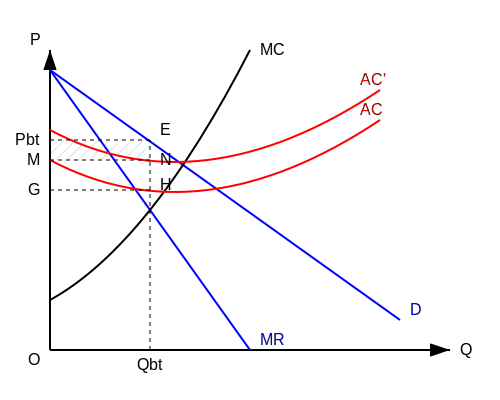

**قبل از مالیات:**
$$TR = O P_{bt} E Q_{bt}$$
$$TC = O G H Q_{bt}$$
$$\pi_{bt} = G P_{bt} E H \quad (\text{سود قبل از مالیات})$$

**بعد از مالیات:**
$$TR = O P_{bt} E Q_{bt}$$
$$TC = O M N Q_{bt}$$
$$\pi_{at} = M P_{bt} E N$$

$$\pi_{bt} > \pi_{at}$$

صفحه: 96

---

در اینجا اگر MR, MC جابجا شوند، تعادل جابجا می‌شود.
۲- مالیات بر واحد $\leftarrow$ روی قیمت تاثیر می‌گذارد.

$$\pi = TR - TC$$
$$\pi_t = TR - TC - tq \quad (\text{نرخ مالیات } t)$$

$$\frac{\partial \pi}{\partial q} = 0 \Rightarrow MR - MC - t = 0 \Rightarrow MR = MC + t$$
شرط تعادل می‌شود $\uparrow$ یعنی درآمد نهایی برابر است با هزینه نهایی + مالیات

هزینه نهایی بعلاوه t $\leftarrow$ یعنی MC جابجا می‌شود (قیمت و مقدار تغییر کرد)
یعنی اثر تخصیصی داریم $\leftarrow$ اثر توزیعی داریم و سود هم کم می‌شود، چون مالیات باعث شده نقطه تعادل تغییر کند.

**قبل از مالیات:**
$$TR = O P_{bt} E Q_{bt}$$
$$TC = O G H Q_{bt}$$
$$\rightarrow \pi_{bt} = G P_{bt} E H \quad (\text{سود قبل از مالیات})$$

**بعد از مالیات:**
$$TR = O P_{at} F Q_{at}$$
$$TC = O M N Q_{at}$$
$$\rightarrow \pi_{at} = M P_{at} F N \quad (\text{سود بعد از مالیات})$$

$$\pi_{bt} > \pi_{at}$$

صفحه: 97

---

# مالیات بر فروش (مالیات بر درآمد)
درآمد نهایی تغییر می‌کند. شرط تعادل عوض می‌شود. $MR(1-t) = MC$
اثر تخصیصی داریم، اثر توزیعی هم داریم.

$$Max \pi = TR - TC - t \cdot TR \Rightarrow \pi = TR(1-t) - TC$$

$$F.O.C: \frac{\partial \pi}{\partial Q} = 0 \quad \Rightarrow MR(1-t) - MC = 0 \Rightarrow MR(1-t) = MC \Rightarrow MR - t \cdot MR = MC$$

با توجه به اینکه مقدار Q قبل از مالیات از $MR=MC$ بدست می‌آمد، در نتیجه رابطه فوق می‌بینیم که این نوع مالیات دارای اثر تخصیصی است.

$$S.O.C: \frac{\partial^2 \pi}{\partial Q^2} \le 0 \quad \Rightarrow MR'(1-t) - MC' \le 0$$

$$MR - t \cdot MR = MC \rightarrow MR' dQ - t \cdot MR' dQ - MR dt - MC' dQ = 0$$
$$\rightarrow MR' dQ - t \cdot MR' dQ - MC' dQ = MR dt$$
$$\rightarrow (MR' - t \cdot MR' - MC') dQ = MR dt$$
$$\rightarrow \frac{dQ}{dt} = \frac{MR}{MR'(1-t) - MC'}$$

از آنجا که مخرج کسر بنا بر شرط مرتبه دوم منفی است و صورت $MR > 0$ می‌باشد:
$$\frac{dQ}{dt} < 0$$

از شرط تعادل دیفرانسیل کامل می‌گیریم. $\frac{dQ}{dt}$ را حساب می‌کنیم.
شرط دوم حداکثر سود که باید منفی باشد.
تولید کننده جایی تولید می‌کند که MR مثبت باشد $\rightarrow MR > 0$.

صفحه: 98

---

اثر تغییر نرخ مالیات بر تولید ؟ جواب صفحه قبل.

# مالیات بر سود
یعنی یک مقداری از کل سود کاهش پیدا می‌کند.
اثر تخصیصی نداریم و اثر توزیعی هم نداریم.

$$Max \pi = TR - TC - t(TR - TC)$$
$$F.O.C: \frac{\partial \pi}{\partial Q} = 0 \Rightarrow MR - MC - t(MR - MC) = 0$$
$$(MR - MC)(1 - t) = 0 \Rightarrow MR = MC \quad (1 - t \ne 0)$$
$$S.O.C: \frac{\partial^2 \pi}{\partial Q^2} \le 0 \Rightarrow (MR' - MC')(1 - t) \le 0$$

مالیات بر سود و مالیات ثابت اثر تخصیصی ندارند.
مالیات بر واحد کالا و مالیات بر درآمد (فروش) اثر تخصیصی دارند.
در مالیات بر سود، تولید کننده بعد از مالیات تولید را کاهش نمی‌دهد.

این نوع مالیات نسبت به مالیات‌های دیگر بهتر است لیکن در اجرای آن دو مشکل عمده وجود دارد:
۱- نرخ این مالیات را نمی‌توان به سادگی تعیین نمود (در مورد تعیین نرخ مالیات...).

صفحه: 99

---

# انحصار خرید

**کالا:**
* رقابت $\leftarrow \bar{P}$
* انحصاری $\leftarrow MR$ (بازار فروش انحصاری)

**نهاده (نیروی کار):**
* رقابت $\leftarrow \bar{P}$
* انحصاری $\leftarrow MR$

انحصارگر در بازار رقابتی بفروشد / در بازار انحصاری بفروشد.
انحصار در خرید نهاده وجود دارد اما کالا دو حالت دارد $\leftarrow$ رقابت / انحصار

### حالت اول: محصول را در بازار رقابتی بفروش برساند $\leftarrow$ نهاده انحصاری

قیمت ثابت است $\leftarrow \bar{P}$
$q = q(x)$ : تابع تولید خریدار $x$
$r = g(x)$ (قیمت نهاده) : تابع عرضه فروشندگان $x$ و $g' > 0$

$$\pi = TR - TC = P \cdot q(x) - r \cdot x = P \cdot q(x) - g(x) \cdot x$$

در اینجا $P \cdot q(x)$ فروش کالا است و $g(x) \cdot x$ قیمت نهاده تابعی از عرضه است.

$$\frac{\partial \pi}{\partial x} = 0 \Rightarrow P \cdot \frac{\partial q}{\partial x} - [g(x) + g'(x) \cdot x] = 0$$

$$\frac{\partial TC}{\partial x} = MFC_x$$

صفحه: 100

---

$$P \cdot MP_x = MFC_x \Rightarrow VMP_x = MFC_x \quad (\text{شرط اول})$$

$$\frac{\partial^2 \pi}{\partial x^2} \le 0 \Rightarrow \frac{\partial VMP_x}{\partial x} \le \frac{\partial MFC_x}{\partial x} \quad (\text{شرط دوم})$$

شرط اول: ارزش کار برابر است با هزینه نهایی
برخورد $VMP$ با $MFC$ مقدار $x$ را به ما می‌دهد (تقاضای نیروی کار).

$$MFC_x = \frac{\partial (g(x) \cdot x)}{\partial x} = g'(x) \cdot x + g(x)$$

مشتق آن:
$$\frac{\partial MFC_x}{\partial x} = g'(x) + g''(x) \cdot x + g'(x) = 2g'(x) + g''(x) \cdot x$$

در صورتی که تابع عرضه خطی باشد ($g''(x) = 0$):
شیب $MFC_x = 2 g'(x)$ (دو برابر شیب عرضه)

### حالت دوم: انحصار انحصار $\leftarrow$ بدترین حالت برای عامل تولید
هم انحصار در فروش کالا وجود دارد و هم در خرید نهاده.
تعادل جایی است که درآمد نهایی = هزینه نهایی عامل تولید.

$$MRP_x = MFC_x$$

درآمد نهایی فروش کالا $\leftarrow MRP_x$
هزینه نهایی عامل تولید $\leftarrow MFC_x$

صفحه: 101

---

$$Max \pi = TR - TC = TR(q(x)) - r \cdot x = TR(q(x)) - g(x) \cdot x$$

$$\frac{\partial \pi}{\partial x} = 0 \Rightarrow \frac{\partial TR}{\partial q} \cdot \frac{\partial q}{\partial x} - [g'(x) \cdot x + g(x)] = 0$$

$$MRP_x = MFC_x \quad (\text{شرط اول})$$

$$\frac{\partial^2 \pi}{\partial x^2} \le 0 \Rightarrow \frac{\partial MRP_x}{\partial x} \le \frac{\partial MFC_x}{\partial x} \quad (\text{شرط دوم})$$

اگر انحصارگر خرید، کالایی را که تولید کرده در بازار انحصاری بفروشد، هم مقدار نهاده کمتری می‌خرد و هم دستمزد کمتری به آن نهاده می‌دهد (نسبت به حالتی که کالای تولید شده را در بازار رقابتی بفروشد).

---

## جلسه نهم
### بازار رقابت انحصاری:

بازار رقابت کامل $\longleftarrow$ بازار رقابت انحصاری $\longleftarrow$ بازار انحصار چند جانبه $\longleftarrow$ بازار انحصار کامل

**تعداد تولیدکننده:**
بی‌شمار تولید کننده $\longleftarrow$ بی‌شمار تولید کننده $\dots \longleftarrow$ ۱ تولید کننده

**هدف:**
هدف تولید کننده $\longrightarrow$ Max سود

صفحه: 102

---

بازار رقابت انحصاری

از بعضی جهات شبیه بازار رقابت کامل و از بعضی جهات شبیه بازار انحصار کامل است.
۱- تعداد تولیدکنندگان به اندازه کافی زیاد است (نه به اندازه رقابت کامل) و در رقابت انحصاری گروه تولیدکنندگان داریم.
۲- فعالیت یک فروشنده به تنهایی تأثیر زیادی به روی سایر تولیدکنندگان ندارد.
۳- از این جهت شبیه بازار انحصار است که هر فروشنده دارای یک منحنی تقاضا با شیب نزولی است. این خصوصیت باعث می‌شود که ما در این بازار دو نوع منحنی تقاضا داشته باشیم:
۱- تقاضای مورد انتظار (مورد نظر - صوری)
۲- تقاضای موثر (تقاضای متناسب با بازار)

۱) تقاضای مورد انتظار: تولیدکنندگان در این بازار تصور می‌کنند با کاهش قیمت و افزایش مقدار، سهم خود را در بازار افزایش می‌دهند اما این کاهش قیمت توسط سایر رقبا رصد نمی‌شود. $dd$

۲) تقاضای موثر: کاهش قیمت نه تنها مقدار را (افزایش) می‌دهد بلکه با رصد این رفتار توسط سایر تولیدکنندگان روی یک منحنی پرشیب‌تر حرکت می‌کنیم. به این منحنی که مشابه رفتار رقبا را نشان می‌دهد تقاضای متناسب با بازار می‌گوییم و با $D$ نشان می‌دهیم.

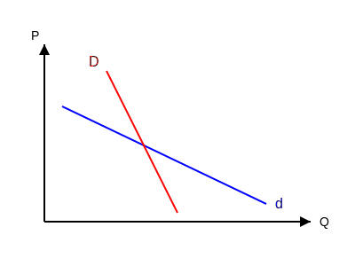

هرکدام از این منحنی‌های تقاضا یک شرطی دارند.

صفحه: 103

---

عرض از مبدا | بنگاه k ام | عکس العمل بنگاه دیگر

$$ P_k = A_k - a_k \cdot q_k - \sum_{i=1, i \neq k}^{n} b_{ki} q_i $$

$k$: بنگاه $k$ خودمان است
$i$: بقیه ی بنگاه ها

اگر تمام بنگاه‌ها شرایط یکسان داشته باشند (تابع تقاضا عکس مقدار و تقاضا) [اندیس‌ها را برمی‌داریم]
فروض:
$A_k = A \quad , \quad a_k = a \quad , \quad b_{ki} = b$

۱) تابع تقاضای مورد انتظار: 
$$ P_k = A - a q_k - b \sum q_i $$
$\leftarrow$ تابع تقاضای خود بنگاه

[از رفتار هم تبعیت می‌کنند روی آن تابع تقاضا هستیم $\rightarrow$ تابع تقاضای موثر]
[در بلندمدت شرایط همه بنگاه‌ها یکسان است $\rightarrow$ اگر $q_i = q_k$]

$$ \rightarrow P_k = A - a q_k - b \sum^{n-1} q_k \rightarrow P_k = A - a q_k - (n-1) b q_k $$
$(n-1)$ یعنی بنگاه $k$ شمرده نشده و از کل بنگاه‌ها کم می‌شود.

$$ \rightarrow P_k = A - [a + (n-1)b] q_k $$
$\uparrow$ تابع تقاضای موثر

۱) $D$ , $d$ در تابع تقاضا همدیگر را قطع می‌کنند.
۲) شرط تعادل کوتاه مدت $\rightarrow [MR = MC]$

نکته: در کوتاه مدت و تعادل کوتاه مدت از تابع تقاضای مورد انتظار استفاده می‌کنیم.

در بلندمدت و برای تعادل بلندمدت از تابع تقاضای موثر استفاده می‌کنیم.
شرط تعادل بلندمدت $\rightarrow P = Min LAC$

$$ \pi = TR - TC \xrightarrow{\text{بلندمدت}} \pi = TR - LTC $$

$$ \pi = (P) \cdot q - LTC $$
فلش از $P$: تابع تقاضای موثر $\rightarrow P = A - [a + (n-1)b] q_k$

صفحه: 104

---

$$ TR = P \cdot Q \quad \text{[قیمت } \times \text{ مقدار]} $$

تقاضای موثر: در بلندمدت تابع تقاضا رفتار همه را (بنگاه‌ها) را نشان می‌دهد اما در کوتاه مدت فقط تابع تقاضای بنگاه $k$ دیده می‌شود (مورد انتظار).

در رقابت انحصاری:
تعادل کوتاه مدت بر اساس تقاضای مورد انتظار

$$ A - 2a q_k - b \sum q_i = MC $$
شیب $MR$ دو برابر تقاضاست.

در تعادل بلندمدت بر اساس تقاضای موثر که باید مماس بر $LAC$ باشد (۱)
(۲) $P = Min LAC$ 

$$ A - 2a q_k - b(n-1)q_k = LMC $$

درآمد نهایی حاصل از تقاضای موثر باید با $LMC$ برخورد کند.

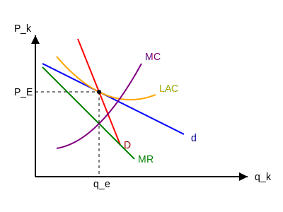

صفحه: 105

---

تعداد بنگاه $100 = 101 - 1$
$(n-1)$ منهای این پایگاه

**مثال:** ۱۰۱ بنگاه با ساختار رقابت انحصاری در یک گروه تولیدی حضور دارند. منحنی تقاضای همگی یکسان است.
قیمت، مقدار تعادلی و سود هر بنگاه را محاسبه نمایید.

درآمد نهایی و هزینه نهایی را نیاز داریم:
$$ P_i = 150 - q_i - 0.02 \sum_{j=1, j \neq i}^{101} q_j $$
یعنی تولید کننده یک بار خودش را نمی‌شمارد.

$$ C_i = 0.5 q_i^3 - 20 q_i^2 + 270 q_i \quad \quad i=1, \dots, 101 $$

تقاضای همگی یکسان یعنی تابع تقاضا را باز کنیم، شیب درآمد نهایی دو برابر تقاضاست.

$$ MR_i = 150 - 2 q_i - 0.02 \sum_{j=1}^{101} q_j \rightarrow MR_i = 150 - 2 q_i - 0.02 (100 q_i) $$

$$ MR_i = 150 - 4 q_i $$

$$ MC_i = 1.5 q_i^2 - 40 q_i + 270 $$

هزینه نهایی = درآمد نهایی
$$ MR_i = MC_i $$
$$ 150 - 4 q_i = 1.5 q_i^2 - 40 q_i + 270 $$

با حل معادله فوق:
$$ q_i = 20 $$
$$ P_i = 90 $$
$$ \pi = 400 $$

صفحه: 106

---

بازار انحصار چند جانبه: خصوصیاتش نزدیک به انحصار کامل است.

اگر بازار با دو فروشنده یا تولیدکننده وجود داشته باشد دو جانبه (دوآپولی)
اگر تعداد فروشندگان محدودی بیشتر از دو تا باشد انحصار چند جانبه و الیگاپولی نامیده می‌شود.

وقتی تعداد تولید کننده کم باشد هر تصمیمی توسط تولید کننده گرفته شود، واکنش رقبا را به دنبال خواهد داشت.
به عبارتی: رابطه بین قیمت و مقدار برای یک فروشنده به تنهایی در یک چنین بازاری امکان پذیر نیست و از طرفی هم در انحصار چند جانبه، دانستن سود پیش از حد هم دور از انتظار است.

یکی از راههای تشخیص نوع بازار:

$$ \frac{\text{تغییرات سود یک تولید کننده}}{\text{تغییرات تولید بقیه}} \quad \frac{\Delta \pi_i}{\Delta q_j} $$

اگر تاثیر تولید روی سود آن قدر زیاد نباشد $\rightarrow$ انحصار کامل یا رقابت کامل

اگر تصمیم یک فروشنده (در زمینه مقدار تولید) روی سود تولید کننده دیگر تغییرش غیرمحسوس باشد، شرایط به سمت بازار انحصار کامل یا رقابت کامل است.
اگر تاثیر روی سود تولید کننده آن قدر زیاد باشد و محسوس $\rightarrow$ انحصار دو یا چند جانبه است.

صفحه: 107

---

**کالای همگن:** برای همه‌ی تولیدکنندگان یک تابع تقاضا داریم.

**کالای غیر همگن:** در شرایط کالاهای غیر همگن، هرکدام یک تابع تقاضا دارند. هر تولیدکننده یک تابع تقاضا دارد.

**راه‌حل‌های بازار انحصار چندجانبه**

۱- راه حل شبه رقابتی
۲- راه حل تبانی (سازش)
۳- راه حل کورنو
۴- راه حل برتراند
(واستاکلبرگ همگن)
*این راه‌حل‌ها (۱، ۲، ۳ و ۴) همگن هستند $\leftarrow$ یک تابع تقاضا داریم.*
*یعنی $P$ تابعی از $q$ و $q$ شامل $q_1 , q_2$ است.*

۵- راه حل سهمیه‌بندی بازار
۶- راه حل استاکلبرگ
۷- راه حل تقاضای شکسته
*این راه‌حل‌ها (۵، ۶ و ۷) غیرهمگن هستند.*

* ۸- راه حل اجورث $\leftarrow$ حذف

**هدف همه‌ی راه‌حل‌ها:** پیدا کردن $Max \pi$ برای تولیدکننده از طریق تعیین قیمت و مقدار $\leftarrow$ دو تولیدکننده داریم.

در دو دسته می‌شوند:
۱- گروهی که تابع تقاضا برای تولیدکننده‌ها یکسان است.
۲- راه‌حل‌هایی که تابع تقاضا برای تولیدکننده‌ها متفاوت است.

باید در همه‌ی راه‌حل‌ها سود را پیدا کنیم.

صفحه: 108

---

**راه‌حل شبه رقابتی:** با توجه به شرط تعادل $P = MC$ بازار رقابت کامل و تقاضای همگن.

۲ تولیدکننده داریم. شرط تعادل $P = MC$
هر تولیدکننده هزینه‌ی خودش را دارد (دو هزینه) $q = q_1 + q_2$ تقاضا همگن.
اما چون کالا همگن است یک تابع تقاضا داریم.

[باید هر تولیدکننده‌ای قیمت را برابر هزینه نهایی خودش قرار دهد $P = MC$]

$$ P = MC_1 \rightarrow 100 - q_1 - q_2 = \frac{1}{2} q_1 + 2 $$
$$ P = MC_2 \rightarrow 100 - q_1 - q_2 = q_2 $$
(دو معادله، دو مجهول)

**سوال:** در کدام بازار $P$ بیشتره؟ در کدام بازار $q$ (مقدار) بیشتره؟ در کدام بازار سود بیشتر است؟ مقایسه بین حالت‌های مختلف.

$$ P = 100 - q $$
$$ q = q_1 + q_2 $$

$$
\begin{cases}
TC_1 = \frac{1}{4} q_1^2 + 2q_1 & MC_1 = \frac{\partial TC}{\partial q} \rightarrow MC_1 = \frac{1}{2} q_1 + 2 \\
TC_2 = \frac{1}{2} q_2^2 + 2 & MC_2 = \frac{\partial TC}{\partial q} \rightarrow MC_2 = q_2
\end{cases}
$$

$$ \pi_1 = TR_1 - TC_1 $$
$$ \pi_2 = TR_2 - TC_2 $$

صفحه: 109

---

**راه حل تبانی (سازش)**
دو تولیدکننده با اطلاع از منافع مشترک یکدیگر با هم سازش می‌کنند.
سودها را با هم جمع می‌کنند و بعد بین خود تقسیم می‌کنند.

$$ \pi = \pi_1 + \pi_2 = P q_1 + P q_2 - C_1(q_1) - C_2(q_2) $$
تابع تقاضا یکسان است.
تابع هزینه‌ها متفاوت است.

یک بار از سود نسبت به فروش تولیدکننده اول مشتق می‌گیریم.
یک بار از سود نسبت به فروش تولیدکننده دوم مشتق می‌گیریم.

$$ \frac{\partial \pi}{\partial q_1} = 0 \Rightarrow P + (q_1 + q_2) \cdot \frac{\partial P}{\partial q_1} - C'(q_1) = 0 \Rightarrow MR = MC_1 $$

$$ \frac{\partial \pi}{\partial q_2} = 0 \Rightarrow P + (q_1 + q_2) \cdot \frac{\partial P}{\partial q_2} - C'(q_2) = 0 \Rightarrow MR = MC_2 $$

شرط کلی تعادل در مدل تبانی:
$$ P + (q_1 + q_2) \cdot \frac{\partial P}{\partial q_i} = MC_i $$

در اینجا قیمت و مقدار و سودها با هم متفاوت خواهد بود و تولیدکننده ترجیح می‌دهد که کدام راه‌حل‌ها به نفع تولیدکننده است.

$$ MR = MC $$
$$ P = 100 - Q $$
$$ TR = P \cdot Q = (100 - Q)Q \Rightarrow 100Q - Q^2 $$
$$ MR = \frac{\partial TR}{\partial Q} = 100 - 2Q $$

$$ \Rightarrow MC_1 = MC_2 \Rightarrow \frac{1}{2} q_1 + 2 = q_2 $$
$$ \Rightarrow MR = MC \Rightarrow 100 - 2Q = q_2 \quad (Q = q_1 + q_2) $$
$$ 100 - 2(q_1 + q_2) = q_2 \rightarrow 100 - 2q_1 - 3q_2 = 0 \rightarrow \text{جاگذاری برای } q_2 $$

صفحه: 110

---

$$ 100 - 2q_1 - 3(0.5 q_1 + 2) = 0 $$
$$
\begin{cases}
q_1 = 26.86 \\
q_2 = 15.43
\end{cases}
$$

$$ Q \text{ کل} = q_1 + q_2 = 26.86 + 15.43 = 42.29 $$

$$ P \text{ بازار} = 100 - Q $$
$$ 100 - 42.29 = 57.71 $$

$$ TR_1 = 57.71 (26.86) = 1550.1 $$
$$ TC_1 = \frac{1}{4} (26.86)^2 + 2(26.86) $$

$$ \pi_1 = 1550.1 - 233.99 \quad \rightarrow \quad \pi_1 = 1316.1 $$

$$ TR_2 = 57.71 (15.43) = 890.5 $$
$$ TC_2 = \frac{1}{2} (15.43)^2 + 2 \rightarrow TC_2 = 121.04 $$
$$ \pi_2 = 769.5 $$

صفحه: 111

---

$$ \pi_1 = 100q_1 - q_1^2 - q_1 q_2 - \frac{1}{4} q_1^2 - 2q_1 $$

**راه حل کورنو**

هر تولیدکننده با این فرض که تصمیمش در مورد مقدار تولید تاثیری بر تولید رقیب ندارد، سود خودش را حداکثر می‌کند (تولید بنگاه دیگر ثابت می‌ماند - فرض)
$TR - TC = \pi$

بنگاه اول:
$$ P \cdot q_1 - C_1(q_1) = \pi_1^{Max} \rightarrow \frac{\partial \pi_1}{\partial q_1} = P + q_1 \frac{\partial P}{\partial q_1} - C'(q_1) = 0 $$
$$ \Rightarrow C'(q_1) = MC_1 $$

بنگاه دوم:
$$ P \cdot q_2 - C_2(q_2) = \pi_2^{Max} \rightarrow \frac{\partial \pi_2}{\partial q_2} = P + q_2 \frac{\partial P}{\partial q_2} - C'(q_2) = 0 $$
$$ \Rightarrow C'(q_2) = MC_2 $$

$$
\begin{cases}
q_1 = f(\overline{q}_2) \\
q_2 = f(\overline{q}_1)
\end{cases}
\quad \text{توابع عکس‌العمل}
$$

شرط تعادل در مدل کورنو:
$$ P + q_i \frac{\partial P}{\partial q_i} = MC_i \quad i=1,2,\dots,n $$

تولیدکننده اول تابع سود خودش را Max می‌کند، درآمد شامل هر دو تا $q$ و هزینه هر تولیدکننده جدا است. در درآمد تولیدکننده اول، تولید ($q_2$) تولیدکننده دوم وجود دارد. رفتار رقیب در تابع سود دیده می‌شود.
توابع عکس‌العمل $\rightarrow$ رابطه بین $q_1$ و $q_2$ بدست می‌آید [موقعی که عکس‌العمل تولیدکننده اول وقتی تولید تولیدکننده‌ی دوم ثابت است]

۱- رابطه‌ی کورنو مقداری غیرواقعی است یعنی نمی‌توان در دنیای واقعی و رقابت، رفتار رقبا تحت نظارت و تاثیرگذار است. فرض غیرواقعی داریم در راه حل کورنو $\rightarrow$ این فرض ایراد دارد.
۲- وقتی که تعداد بنگاه‌ها زیاد بشود، $n \rightarrow \infty$
و
$$
\begin{cases}
MR_1 = MC_1 \\
MR_2 = MC_2
\end{cases}
$$

صفحه: 112

---

راه حل کورنو به سمت راه حل شبه رقابتی حرکت می‌کند یعنی $P=MC$

**راه حل استاکلبرگ**
به راه حل رهبر-پیرو معروف است.
فرض ایران خودرو و سایپا $\rightarrow$ ۴ حالت داریم:
۱- بنگاه اول رهبر، بنگاه دوم پیرو
۲- بنگاه اول پیرو، بنگاه دوم رهبر
۳- هر دو بنگاه پیرو $\rightarrow$ راه حل کورنو
۴- هر دو بنگاه رهبر $\rightarrow$ (عدم تعادل) تعادل اتفاق نمی‌افتد (عدم تعادل استاکلبرگ $\rightarrow$ هر بنگاه می‌گوید من $\leftarrow$)

بنگاه رهبر تابع عکس‌العمل نداشته و بنگاه پیرو تابع عکس‌العمل دارد.

در این روش برای رسیدن به مقادیر تعادلی (حل بازار) کافی است که تابع عکس‌العمل بنگاه پیرو را به دست آورده و در تابع سود بنگاه رهبر قرار دهیم.

برای پیدا کردن تابع عکس‌العمل هر بنگاه، کافی است که از تابع سود آن بنگاه نسبت به تولید همان بنگاه مشتق گرفته و برابر صفر قرار دهیم.

صفحه: 113

---

در این حالت بنگاه رهبر سود خودش را بر می‌دارد و هر چه ماند به بنگاه پیرو تعلق می‌گیرد.

**راه حل برتراند:** کلا جدا از راه‌حل‌های پیشین (۴ مورد)

$$ P = 50 - Q \Rightarrow TR = P \cdot Q $$
$$ TR = (50 - Q)Q $$
$$ TC = 5Q $$

$$
\begin{cases}
\pi = \pi(Q) \\
\frac{\partial \pi}{\partial Q} = 0
\end{cases}
$$

برتراند بحث تولیدکننده را بر اساس **قیمت** مطرح می‌کند و نه مقدار.
$$ TR(P) , \quad TC(P) , \quad \pi(P) $$

تولیدکننده قیمت بنگاه رقیب را ثابت فرض می‌کند و سود خود را حداکثر می‌کند.
$$
\begin{cases}
P_1 = f(\overline{P}_2) \\
P_2 = f(\overline{P}_1)
\end{cases}
\quad \text{توابع عکس‌العمل}
$$

در اینجا توابع عکس‌العمل قیمتی داریم.
$$ \frac{\partial \pi}{\partial P_i} = 0 $$

صفحه: 114

---

راه حل سهمیه‌بندی بازار (غیر همگن)

هر تولید کننده تابع تقاضای خودش را دارد (همگن نیست). راه حل بلند مدت است نه کوتاه‌مدت. (یعنی تولید کننده دنبال سود بلند مدت است)

تولید کنندگان تغییر مقدار تولید از طرف تولید کننده‌ی دوم را با یک نسبت دنبال می‌کنند. (تغییر نسبی)

$$q = q_1 + q_2$$

$$\frac{q_2}{q \ (q_1+q_2)} = k \rightarrow q_2 = k q = k(q_1+q_2) \rightarrow$$

$$q_2 (1-k) = q_1 k$$

$$
\begin{cases} 
q_2 = \frac{k}{(1-k)} q_1 \\
\\
q_1 = \frac{1-k}{k} q_2 
\end{cases}
$$

صفحه: 115

---

* راه حل تقاضای شکسته (مهم و معتبر) غیر همگن

اساس این راه حل برمی‌گردد به منحنی تقاضای رقابت انحصاری:
۱- تقاضای مورد انتظار
۲- تقاضای موثر

اساس این نظریه حساسیت یا عدم حساسیت یک بنگاه نسبت به تصمیمات بنگاه دیگر است.
- افزایش قیمت از طرف یک تولید کننده از طرف سایرین دنبال نمی‌شود.
- اما کاهش قیمت از طرف یک تولید کننده تبعیت می‌شود.

شیب $MR$ دو برابر تقاضا است [در بازار انحصار] در اینجا هر تولید کننده $MR$ خودش را دارد.

$$
\begin{cases}
D \text{ تقاضای تصوری یا مورد انتظار} \rightarrow MR \\
D' \text{ تقاضای واقعی} \rightarrow MR'
\end{cases} \implies \text{در درآمدهای نهایی شکستگی دارد}
$$

در بازه‌ی شکستگی $MR$ باید دنبال تعادل بگردیم در تقاضای شکسته دنبال این تعادل هستیم.

صفحه: 116

---

$$P_1 = 100 - 2q_1 - q_2 \rightarrow TC_1 = 2.5 q_1^2 \rightarrow \begin{cases} MC_1 = 5q_1 \\ MC_1 = 50 \end{cases}$$

$$P_2 = 95 - q_1 - 3q_2 \rightarrow TC_2 = 1.25 q_2^2$$

محدوده‌ای از حرکت $MC$ (هزینه نهایی) را پیدا کنید که بنگاه‌ها با تغییر قیمت بنگاه دیگر عکس‌العملی از خود نشان نمی‌دهند.
مفهوم تعادل یک ثبات است. یعنی بازه‌ای که میلی به تغییر در آن نباشد.

۱- اول باید نقطه‌ی برخورد و پختی منحنی‌های تقاضا را پیدا کنیم.
(تقاضای تولید کننده‌ی اول و بالایی و پایینی پیدا شود)
بعد بازه‌ی هزینه را پیدا کنیم.

$$TR_1 = P_1 Q_1 - TC$$

$$
\begin{cases}
\pi_1 = 100 q_1 - 2q_1^2 - q_1 q_2 - 2.5 q_1^2 \\
\pi_2 = 95 q_2 - q_1 q_2 - 3q_2^2 - 1.25 q_2^2
\end{cases}
\rightarrow
\begin{cases}
\frac{\partial \pi_1}{\partial q_1} = 0 \\
\\
\frac{\partial \pi_2}{\partial q_2} = 0
\end{cases}
$$

$$
\begin{cases}
100 - 4q_1 - q_2 - 5q_1 = 0 \\
95 - q_1 - 6q_2 - 2.5 q_2 = 0
\end{cases}
\rightarrow
\begin{cases}
q_1 = \frac{100 - q_2}{9} \\
\\
q_2 = \frac{95 - q_1}{8.5}
\end{cases}
\leftarrow \text{توابع عکس العمل}
$$

$$q_1 = q_2 = 10$$

$$
\begin{cases}
P_1 = 70 \rightarrow P \uparrow \rightarrow \text{پیروی نمی‌شود} \\
P_2 = 55 \rightarrow P \downarrow \rightarrow \text{پیروی می‌شود}
\end{cases}
$$

صفحه: 117

---

در اینجا برای قیمت‌های بالاتر از ۷۰ مقادیر کمتر از ۱۰ روی تقاضای فرد اول هستیم و فرد دوم قیمت ۵۵ برای خودش را حفظ می‌کند.

$$P_2 = 95 - q_1 - 3q_2 \rightarrow 55 = 95 - q_1 - 3q_2 \rightarrow 3q_2 = 40 - q_1 \rightarrow q_2 = \frac{40 - q_1}{3}$$
$\leftarrow$ تابع تقاضای بخش اول که قیمت بالای منحنی

$$
\begin{cases}
P_1 = 100 - 2q_1 - q_2 \rightarrow P_1 = 100 - 2q_1 - \left( \frac{40 - q_1}{3} \right) \\
P_1 = \frac{260 - 5q_1}{3} \\
P > 70 \\
q < 10
\end{cases}
$$

$$MR_1 = \frac{260 - 10q_1}{3} \xrightarrow{q_1 = 10} MR_1 = 53.3$$

برای قیمت کمتر از ۷۰ و مقادیر بیشتر از ۱۰ روی منحنی تقاضای فرد دوم حرکت می‌کنیم $\rightarrow$ تلاش می‌کند سهم خودش را حفظ کند.
$q_1 = q_2$ پس $\rightarrow$ به جای $q_2$ می‌گذاریم $q_1$

$$
\begin{cases}
P_1 = 100 - 2q_1 - q_2 \\
P_1 = 100 - 2q_1 - q_1 \rightarrow P_1 = 100 - 3q_1 \\
P < 70 \\
q > 10
\end{cases}
$$

$$MR_1 = 100 - 6q_1 \xrightarrow{q_1 = 10} MR_1 = 100 - 6(10) = 40$$

$$50$$
$$40 < MC_1 < 53.3$$
$\downarrow \quad \quad \quad \quad \quad \downarrow$
$MR_1 \quad \quad \quad \quad MR_1$

صفحه: 118

---

جلسه ۲۶ / ۳ / ۴۰۵

$$
\text{بازار کالا}
\begin{cases}
\text{رقابتی } \bar{P} \\
\text{انحصاری } MR
\end{cases}
$$

$$
\text{بازار نهاده کار}
\begin{cases}
\text{رقابتی } \bar{w} \text{ یا } \bar{r} \\
\text{انحصار}
\end{cases}
$$

بازار انحصار مضاعف دوجانبه:
حالتی است که، فقط یک خریدار برای کالا و یک فروشنده برای کالا وجود دارد.
یک تولید کننده‌ی انحصاری، تابع عرضه ندارد (در بحث بازار انحصاری گفتیم، نقطه عرضه داشتیم) در نتیجه یک نقطه روی تابع تقاضای خریدار را انتخاب می‌کند $\leftarrow$ هدف تولید کننده $Max \ \pi$

خریدار انحصاری، تابع تقاضا ندارد در نتیجه یک نقطه روی تابع عرضه فروشنده انتخاب می‌کند $\leftarrow$ هدف $Max \ \pi$

فروشنده نمی‌تواند براساس تابع عرضه‌ای که وجود ندارد عمل کند و خریدار هم نمی‌تواند بر اساس تابع تقاضایی که وجود ندارد، استفاده کند و بهره‌برداری کند.

$Max \ \pi \leftarrow$ ۳ راه حل
۱- راه حل مرجع
۲- تبانی و چانه‌زنی (توافق درباره‌ی قیمت و مقدار $\rightarrow$ تعیین قیمت)
۳- بازار منحل شود و معامله‌ای صورت نگیرد.

صفحه: 119

---

راه حل مرجع $\leftarrow$
۱- انحصار فروش (فروشنده رهبر / خریدار پیرو)
۲- انحصار خرید (خریدار رهبر / فروشنده پیرو)
۳- شبه رقابتی

در تمام این حالات می‌خواهیم بدانیم قیمت و مقدار تعادلی در چه شرایطی قرار می‌گیرد و کجا سود ماکزیمم می‌شود؟

فروض:
۱- فقط یک کالا تولید می‌شود (کالای $q_2$)
خریدار کالای $q_2$، از $q_2$ به عنوان عامل تولید، برای تولید $q_1$ استفاده می‌کند.
$q_1 = h(q_2)$ $\leftarrow$ تابع تولید خریدار $q_2$

۲- خریدار $q_2$ بعد از تولید $q_1$، آن را در بازار رقابتی و به قیمت $P_1$ می‌فروشد.
$\pi_B = TR - TC \Rightarrow \pi_B = P_1 q_1 - \underbrace{P_2 q_2}_{\text{هزینه}}$ (سود خریدار $\pi_B$)
$$\pi_B = P_1 h(q_2) - P_2 q_2$$

۳- فروشنده $q_2$ برای تولید $q_2$ از نهاده‌ای مثل $x$ استفاده می‌کند که این نهاده $x$ را از بازار رقابتی و با قیمت $r$ خریداری می‌نماید.
تابع معکوس تولید فروشنده $q_2$: $x = H(q_2)$
$$\pi_S = TR - TC \Rightarrow \pi_S = P_2 q_2 - r x$$
$$\pi_S = P_2 q_2 - r H(q_2)$$

صفحه: 120

---

سه حالت داریم:
۱- فروشنده بر بازار مسلط شود (انحصار فروش) تابع سود فروشنده داشته باشیم - تابع عکس‌العمل خریدار در این تابع سود قرار داده شود.
۲- خریدار بر بازار مسلط شود (انحصار خرید) تابع عکس‌العمل فروشنده باید در تابع سود خریدار قرار داده شود.
۳- راه حل شبه رقابتی $P=MC$

تابع عکس العمل

۱) انحصار فروش

سود خریدار $q_2$
$$\pi_R = P_1 q_1 - P_2 q_2 = P_1 \cdot h(q_2) - P_2 q_2$$

صفحه: 121

---

راه حل مرجع $\leftarrow$
۱- انحصار فروش (فروشنده رهبر / خریدار پیرو)
۲- انحصار خرید (خریدار رهبر / فروشنده پیرو)
۳- شبه رقابتی

در تمام این حالات می‌خواهیم بدانیم قیمت و مقدار تعادلی در چه شرایطی قرار می‌گیرد و کجا سود ماکزیمم می‌شود؟

فروض:
۱- فقط یک کالا تولید می‌شود (کالای $q_2$)
خریدار کالای $q_2$، از $q_2$ به عنوان عامل تولید، برای تولید $q_1$ استفاده می‌کند.
$q_1 = h(q_2)$ $\leftarrow$ تابع تولید خریدار $q_2$

۲- خریدار $q_2$ بعد از تولید $q_1$، آن را در بازار رقابتی و به قیمت $P_1$ می‌فروشد.
$\pi_B = TR - TC \Rightarrow \pi_B = P_1 q_1 - \underbrace{P_2 q_2}_{\text{هزینه}}$ (سود خریدار $\pi_B$)
$$\pi_B = P_1 h(q_2) - P_2 q_2$$

۳- فروشنده $q_2$ برای تولید $q_2$ از نهاده‌ای مثل $x$ استفاده می‌کند که این نهاده $x$ را از بازار رقابتی و با قیمت $r$ خریداری می‌نماید.
تابع معکوس تولید فروشنده $q_2$: $x = H(q_2)$
$$\pi_S = TR - TC \Rightarrow \pi_S = P_2 q_2 - r x$$
$$\pi_S = P_2 q_2 - r H(q_2)$$

صفحه: 122

---

فروشنده رهبر / خریدار پیرو
سه حالت داریم:
۱- فروشنده بر بازار مسلط شود (انحصار فروش) باید تابع سود فروشنده داشته باشیم - تابع عکس‌العمل خریدار در این تابع سود قرار داده شود.
۲- خریدار بر بازار مسلط شود (انحصار خرید) تابع عکس‌العمل فروشنده باید در تابع سود خریدار قرار داده شود.
۳- راه حل شبه رقابتی $P=MC$

تابع عکس العمل (از تابع سود هر فروشنده/خریدار) نسبت به مقدار مشتق می‌گیریم و برابر صفر قرار می‌دهیم. عکس‌العمل را بدست می‌آوریم و در تابع سود آن یکی قرار می‌دهیم.
$q_2 = f(q_1)$
$q_1 = f(q_2)$

۱) انحصار فروش
فروشنده مسلط / انحصار فروش / تابع سود فروشنده را داریم
سود خریدار $q_2$
نسبت به $q_2$ مشتق می‌گیریم $\leftarrow$ عکس العمل خریدار
$$\pi_B = P_1 q_1 - P_2 q_2 = P_1 \cdot h(q_2) - P_2 q_2$$

یعنی خریدار آن مقدار از $q_2$ را خریداری می‌کند که ارزش تولید نهایی‌اش برابر با قیمت تعیین شده از سوی فروشنده باشد. (ارزش تولید نهایی $VMP_{q_2}$)

$$\frac{\partial \pi_B}{\partial q_2} = P_1 \cdot h'(q_2) - P_2 = 0 \Rightarrow P_1 h'(q_2) = P_2$$
معکوس تابع تقاضای خریدار $q_2$ $\rightarrow$ $P_2$
(در اینجا $P_1 h'(q_2)$ برابر با $VMP_{q_2}$ است و $P_2$ قیمت فروشنده است)

جای $P_2$، عکس العمل خریدار را قرار می‌دهیم.
سود فروشنده $q_2$:
$$\pi_S = P_2 \cdot q_2 - r X = P_2 q_2 - r H(q_2) = P_1 h'(q_2) \cdot q_2 - r H(q_2)$$
$$\frac{\partial \pi_S}{\partial q_2} = 0 \Rightarrow P_1(h'(q_2)) + P_1 h''(q_2) \cdot q_2 = r H'(q_2)$$

صفحه: 123

---

فروشنده رهبر / خریدار پیرو

فروشنده آن مقدار کالایی از $q_2$ را می‌فروشد که درآمدهای آن با هزینه نهایی آن برای فروشنده برابر باشد.
$MR = MC$

حالت دوم: خریدار مسلط شود / انحصار خرید
(خریدار $\leftarrow$ رهبر / فروشنده $\leftarrow$ پیرو)
۱- تابع عکس‌العمل فروشنده را به دست می‌آوریم در سود خریدار قرار می‌دهیم.

سود فروشنده:
$$\pi_S = P_2 q_2 - r H(q_2)$$
$$\frac{\partial \pi_S}{\partial q_2} = 0 \Rightarrow P_2 = r \cdot H'(q_2)$$
معکوس تابع عرضه فروشنده $q_2$ $\leftarrow$ عکس العمل فروشنده

جای $P_2$ عکس‌العمل قرار می‌دهیم.
سود خریدار $q_2$:
$$\pi_B = P_1 q_1 - P_2 q_2 = P_1 \cdot h(q_2) - r \cdot H'(q_2) q_2$$
$$\frac{\partial \pi_B}{\partial q_2} = 0 \Rightarrow P_1 h'(q_2) = r \cdot H'(q_2) + r \cdot H''(q_2) q_2 \rightarrow max \ \pi$$

عکس العمل فروشنده: فروشنده آن مقدار $q_2$ را تولید می‌کند برای فروش که هزینه نهایی‌اش معادل قیمت تعیین شده از سوی خریدار باشد. (نهاده ارزش)
$MC = P_2$

یعنی زمانی که خریدار بر بازار مسلط باشد تا جایی $q_2$ می‌خرد که ارزش تولید نهایی $q_2$ با هزینه نهایی عامل تولید با هم برابر باشد.
$$VMP = MFC$$

صفحه: 124

---

راه حل شبه رقابتی: هم خریدار و هم فروشنده دریافت کننده قیمت هستند و تاثیری بر قیمت ندارند.
$$P = MC$$

$$P_2 = P_1 \cdot h'(q_2) = r \cdot H'(q_2)$$
(در اینجا $P_1 \cdot h'(q_2)$ ارزش تولید نهایی خریدار و $r \cdot H'(q_2)$ هزینه نهایی فروشنده است)

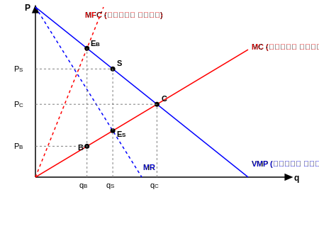

۳ تا راه حل:
- انحصار فروش: $MR = MC$ (نقطه S)
- انحصار خرید: $VMP = MFC$ (نقطه B)
- شبه رقابتی: $VMP = MC$ (نقطه C)

مقادیر و قیمت‌ها:
- $q_{2C}$ مقدار در شبه رقابتی، $P_C$ قیمت در شبه رقابتی
- مقدار $q_{2S}$ و قیمت $P_S$ $\leftarrow$ انحصار فروش
- مقدار $q_{2B}$ و قیمت $P_B$ $\leftarrow$ انحصار خرید

درآمدهای نهایی ($MR$) شیب دو برابر تقاضا دارد.

نتیجه: مقدار شبه رقابتی همیشه از مقدار انحصار خرید و فروش بیشتر است.
$$q_{2C} > q_{2S} \text{ و } q_{2B}$$

در مورد تقاضا بستگی به شیب منحنی‌ها دارد و شیب $MR$ و شیب $MC$.
قیمت شبه رقابتی بین قیمت خرید و فروش قرار می‌گیرد.

صفحه: 125

---

راه حل چانه‌زنی:
خریدار و فروشنده سودهایشان را با هم جمع می‌کنند.

ارزش تولید نهایی و هزینه نهایی می‌ماند $\leftarrow$ مشتق بگیریم $\rightarrow$ شبه رقابتی می‌شود.
در این حالت برای تعیین قیمت توافق می‌کنند.
۱- فروشنده تمایل دارد به بالاترین قیمت بفروشد.
۲- خریدار تمایل دارد به کمترین قیمت بخرد.
سودها $= 0$ دو تا قیمت به دست می‌آید.

$$\pi_T = \pi_B + \pi_S = P_1 q_1 - P_2 q_2 + P_2 q_2 - r \cdot H(q_2) = P_1 h(q_2) - r \cdot H(q_2)$$

$$\frac{\partial \pi_T}{\partial q_2} = 0 \Rightarrow P_1 \cdot h'(q_2) = r \cdot H'(q_2) \quad \text{دقیقاً شبه رقابتی}$$

حد بالای قیمت:
$$\pi_B = P_1 \cdot h(q_2) - P_2 \cdot q_2 = 0 \Rightarrow P_2 = \frac{P_1 \cdot h(q_2)}{q_2}$$

حد پایین قیمت:
$$\pi_S = P_2 \cdot q_2 - r \cdot H(q_2) = 0 \Rightarrow P_2 = \frac{r \cdot H(q_2)}{q_2}$$

$$\frac{r \cdot H(q_2)}{q_2} \le P_2 \le \frac{P_1 \cdot h(q_2)}{q_2}$$

صفحه: 126

---

