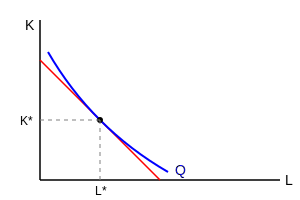

نقطه تعادل تولید و هزینه در بلند مدت جائی است که خط هزینه مماس شود بر منحنی تولید. جایی که شیب تولید و شیب خط هزینه به هم مماس شود یعنی جایی که نسبت تولید نهایی نیروی کار به تولید نهایی سرمایه برابر باشد با نسبت کار به قیمت سرمایه.

شیب خط هزینه $\frac{P_L}{P_K} = \frac{MP_L}{MP_K}$ شیب منحنی تولید $MRTS_{L,K}$

$MRTS_{L,K} = \frac{MP_L}{MP_K} = - \frac{\Delta K}{\Delta L}$
$\frac{MP_K}{MP_L} = \frac{P_K}{P_L}$

تولید کننده امکان تصمیم‌گیری دارد $Min\ C$ یا $Max\ Q$
مصرف کننده فقط یک حالت دارد که خواسته‌اش را بدست بیاورد با توجه به خط بودجه (مطلوبیت) (حداکثر مطلوبیت)
$\begin{cases} Max\ U \\ I = P_x \cdot x + P_y \cdot y \end{cases}$
