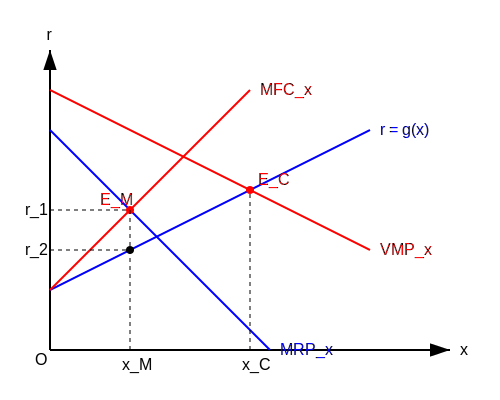

$$P \cdot MP_x = MFC_x \Rightarrow VMP_x = MFC_x \quad (\text{شرط اول})$$

$$\frac{\partial^2 \pi}{\partial x^2} \le 0 \Rightarrow \frac{\partial VMP_x}{\partial x} \le \frac{\partial MFC_x}{\partial x} \quad (\text{شرط دوم})$$

شرط اول: ارزش کار برابر است با هزینه نهایی
برخورد $VMP$ با $MFC$ مقدار $x$ را به ما می‌دهد (تقاضای نیروی کار).

$$MFC_x = \frac{\partial (g(x) \cdot x)}{\partial x} = g'(x) \cdot x + g(x)$$

مشتق آن:
$$\frac{\partial MFC_x}{\partial x} = g'(x) + g''(x) \cdot x + g'(x) = 2g'(x) + g''(x) \cdot x$$

در صورتی که تابع عرضه خطی باشد ($g''(x) = 0$):
شیب $MFC_x = 2 g'(x)$ (دو برابر شیب عرضه)

### حالت دوم: انحصار انحصار $\leftarrow$ بدترین حالت برای عامل تولید
هم انحصار در فروش کالا وجود دارد و هم در خرید نهاده.
تعادل جایی است که درآمد نهایی = هزینه نهایی عامل تولید.

$$MRP_x = MFC_x$$

درآمد نهایی فروش کالا $\leftarrow MRP_x$
هزینه نهایی عامل تولید $\leftarrow MFC_x$
