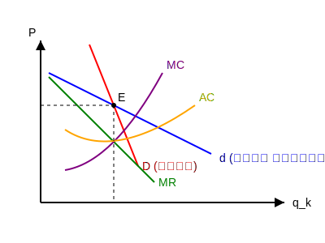

$$ TR = P \cdot Q \quad \text{[قیمت } \times \text{ مقدار]} $$

تقاضای موثر: در بلندمدت تابع تقاضا رفتار همه را (بنگاه‌ها) را نشان می‌دهد اما در کوتاه مدت فقط تابع تقاضای بنگاه $k$ دیده می‌شود (مورد انتظار).

در رقابت انحصاری:
تعادل کوتاه مدت بر اساس تقاضای مورد انتظار

$$ A - 2a q_k - b \sum q_i = MC $$
شیب $MR$ دو برابر تقاضاست.

در تعادل بلندمدت بر اساس تقاضای موثر که باید مماس بر $LAC$ باشد (۱)
(۲) $P = Min LAC$ 

$$ A - 2a q_k - b(n-1)q_k = LMC $$

درآمد نهایی حاصل از تقاضای موثر باید با $LMC$ برخورد کند.

