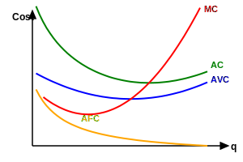

هزینه :
هزینه کل $TC = TFC + TVC$
هزینه‌های ثابت :
هزینه‌های متغیر :

$AC = AFC + AVC$
هزینه نهایی $MC = \frac{\Delta TC}{\Delta Q}$

$AC$ ، $AVC$ ، $MC \leftarrow$ منحنی‌های U شکل
$AP$ ، $MP \leftarrow$ تپه‌ای شکل

به سمت بلند مدت که می‌رویم $AFC$ وجود ندارد $AC$ به $AVC$ منطبق می‌شود.

هزینه نهایی ($MC$) از Min $AC$ و $AVC$ عبور می‌کند.
هزینه و تولید نقطه‌ی مقابل همدیگر هستند یعنی جائیکه هزینه نهایی $MC$ در Min است جایی است که تولید نهایی $MP_L$ در حداکثر است.
$Max\ MP_L = Min\ MC$
و جائیکه هزینه متوسط به حداقل می‌رسد دقیقاً جائی است که تولید متوسط به حداکثر می‌رسد.
$Max\ AP_L = Min\ AC$
