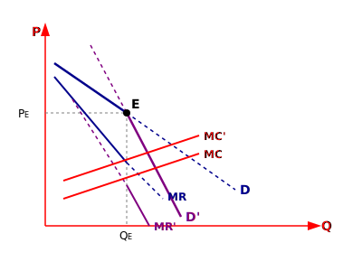

* راه حل تقاضای شکسته (مهم و معتبر) غیر همگن

اساس این راه حل برمی‌گردد به منحنی تقاضای رقابت انحصاری:
۱- تقاضای مورد انتظار
۲- تقاضای موثر

اساس این نظریه حساسیت یا عدم حساسیت یک بنگاه نسبت به تصمیمات بنگاه دیگر است.
- افزایش قیمت از طرف یک تولید کننده از طرف سایرین دنبال نمی‌شود.
- اما کاهش قیمت از طرف یک تولید کننده تبعیت می‌شود.

شیب $MR$ دو برابر تقاضا است [در بازار انحصار] در اینجا هر تولید کننده $MR$ خودش را دارد.

$$
\begin{cases}
D \text{ تقاضای تصوری یا مورد انتظار} \rightarrow MR \\
D' \text{ تقاضای واقعی} \rightarrow MR'
\end{cases} \implies \text{در درآمدهای نهایی شکستگی دارد}
$$

در بازه‌ی شکستگی $MR$ باید دنبال تعادل بگردیم در تقاضای شکسته دنبال این تعادل هستیم.
