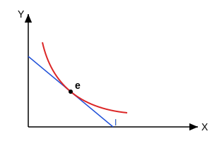

$A$ را به $B$ ترجیح دهد یا $B$ را به $A$ ترجیح دهد یا بین انتخاب دو سبد $B$ و $A$ بی‌تفاوت است.

۳- اصل انتقال پذیری : Transperency Principle
$\frac{A P B}{B P C} \Rightarrow A P C$
مصرف‌کننده سبد $A$ را به $B$ ترجیح می‌دهد و سبد $B$ را به $C$ ترجیح می‌دهد پس حتماً سبد $A$ را به $C$ ترجیح می‌دهد.
$A I B$
$B I C \Rightarrow A I C$
(بی‌تفاوتی هم شامل می‌شود)

۴- اصل قانع نشدن : مصرف‌کننده همیشه بیشتر را به کمتر ترجیح می‌دهد (سبد بیشتر)
[ فرض عاقلانه ]
اگر رفتار مصرف‌کننده عاقلانه نباشد به هیچ عنوان در مورد نقطه تعادل مصرف‌کننده ($e$) نمی‌توانیم اظهار نظر کنیم.

شیب خط بودجه $\frac{P_x}{P_y} = \frac{MU_x}{MU_y}$ شیب منحنی بی‌تفاوتی

۵- اصل پیوستگی : روی منحنی بی‌تفاوتی بی‌نهایت سبد کالا وجود دارد که مصرف‌کننده می‌تواند آن‌ها را انتخاب کند و بین آن‌ها بی‌تفاوت باشد.

مصرف‌کننده از تمام این فروض استفاده می‌کند برای رسیدن به بحث تعادل.
