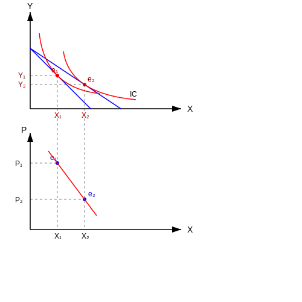

# تابع تقاضای نرمال (مارشالی) Normal Demand

خط بودجه به ۲ دلیل می‌تواند تغییر کند:
۱- به دلیل تغییر قیمت کالاها ($X$ یا $Y$)
۲- به دلیل تغییر درآمد

اگر خط بودجه تغییر کند، با خط بودجه‌ی جدید، نقطه‌ی تعادل جدید و مقداری از کالاها خواهیم داشت.

تغییر قیمت کالای $X$ $\leftarrow$ $P_x \downarrow$ $\leftarrow$ انتقال خط بودجه به صورت غیر موازی و مطابق شکل به سمت راست $\uparrow \frac{I}{P_x}$ ، تقاضا از $x_1$ به $x_2$ زیاد شده $\leftarrow$ تقاضای مارشالی یا نرمال $\leftarrow$ یعنی با کاهش قیمت کالای $X$ میزان تقاضا برای کالای $X$ زیاد شد $\leftarrow$ رابطه‌ی تقاضا برقرار است.

از وصل کردن نقاط $e_1$ و $e_2$ در فضای قیمت و کالا $\leftarrow$ همان تابع تقاضا به دست آمد. (حالت عادی)

**سوال:** اگر منحنی بی تفاوتی، حالت خاصی داشته باشد [ غیر از مبدا محدب ] یا از بالا اگر نگاه کنیم مقعر است $\leftarrow$ منحنی $L$ یا ترجیح خطی یا مقعر به مبدا، منحنی تقاضای عمومی را رسم کنید.
