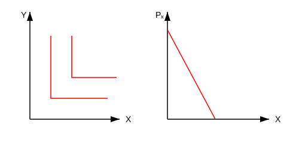

۱- حالت عادی (کالای نرمال)
منحنی بی تفاوتی : محدب نسبت به مبدا
منحنی تقاضا : نزولی با شیب منفی
با کاهش قیمت کالا ، مقدار تقاضا افزایش می یابد (تقاضای نرمال)

۲- حالت دوم: کالاها جانشین کامل باشند.
منحنی بی تفاوتی : خطوط مستقیم و موازی با شیب ثابت
منحنی تقاضا :
$P_x > P^*$ $\leftarrow$ تقاضا صفر است [ قیمت کالای $X$ از حد منحنی بیشتر است ]
$P_x = P^*$ $\leftarrow$ مصرف کننده بی تفاوت است . هر مقدار تقاضا ممکن است.
$P_x < P^*$ $\leftarrow$ تمام درآمد صرف خرید این کالا می شود و مقدار تقاضا به شدت افزایش می یابد پس تقاضا شکسته (راه حل گوشه ای) است . [ مصرف کننده کالای ارزان تر را انتخاب می کند ]

۳- حالت سوم : کالاها مکمل های کامل باشند.
منحنی بی تفاوتی : به شکل $L$ یا زاویه ۹۰
منحنی تقاضا : شیب منفی دارد اما از حالت عادی پر شیب تر است چون کالا ها باید با نسبت ثابت مصرف شوند و جانشینی بین آن ها وجود ندارد.
با کاهش قیمت ، مقدار تقاضای هر دو کالا به یک نسبت ثابت افزایش می یابد و جانشین وجود ندارد.

