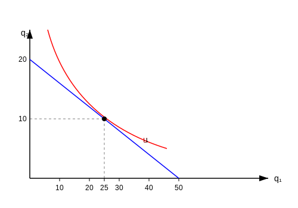

**مثال:** حداکثر مطلوبیت از مصرف دو کالا $q_1$ و $q_2$ را حساب کنید.

$U = q_1 q_2$
$P_1 = 2$
$P_2 = 5$
$I = 100$

$I = P_1 q_1 + P_2 q_2 \Rightarrow 2 q_1 + 5 q_2 = 100$

$\mathcal{L} = q_1 q_2 + \lambda ( 100 - 2 q_1 - 5 q_2 )$

$\frac{\partial \mathcal{L}}{\partial q_1} = q_2 - 2 \lambda = 0 \Rightarrow q_2 = 2 \lambda$
$\frac{\partial \mathcal{L}}{\partial q_2} = q_1 - 5 \lambda = 0 \Rightarrow q_1 = 5 \lambda$

$\frac{q_2}{q_1} = \frac{2 \lambda}{5 \lambda} \Rightarrow \frac{q_2}{q_1} = \frac{2}{5} \Rightarrow 5 q_2 = 2 q_1 \Rightarrow q_2 = \frac{2 q_1}{5}$
همچنین:
$\frac{U_1}{U_2} = \frac{P_1}{P_2} \Rightarrow \frac{q_2}{q_1} = \frac{2}{5}$

$\frac{\partial \mathcal{L}}{\partial \lambda} = 100 - 2 q_1 - 5 q_2 = 0 \Rightarrow 100 - 2 q_1 - 5 \left( \frac{2 q_1}{5} \right) = 0$
$100 - 2 q_1 - 2 q_1 = 0 \Rightarrow 4 q_1 = 100 \Rightarrow q_1 = 25$

$q_1 = 25$
$q_2 = 10$
$\lambda = \frac{10}{2} = 5$

خط بودجه ترکیباتی از $q_1$ و $q_2$ را نشان می دهد که مصرف کننده قادر به خرید آن است.

شیب خط بودجه $= \frac{\Delta q_2}{\Delta q_1} = -\frac{P_1}{P_2} = -\frac{20}{50} = -\frac{2}{5}$

شیب منحنی $= -\frac{q_2}{q_1} = -\frac{10}{25} = -\frac{2}{5}$
