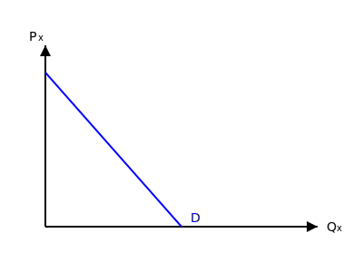

# درآمد و رفتار خانوار و بنگاه

**خانوار:** مصرف کننده کالا، متقاضی کالا
$$Q_x^d = f(P_x, I, P_y, A, \dots)$$
* $I$: درآمد
* $A$: تبلیغات

تابع تقاضا نزولی است (مگر در مواقع خاص).

$$Q_x^d = a - bP_x \leadsto P_x = \frac{a}{b} - \frac{1}{b}Q_x^d$$
*(در جزوه فرمول به صورت $P = a - bQ^d$ نوشته شده که از نظر ریاضیاتی اگر ضرایب را متمایز در نظر نگیریم دقیق نیست. فرم صحیح تابع تقاضای معکوس $P_x = \frac{a}{b} - \frac{1}{b}Q_x^d$ است که نشانگر رابطه خطی قیمت و مقدار تقاضا است).*

*رابطه قیمت خود کالا با تقاضا $\leftarrow$ قانون تقاضا*
* $a$: عرض از مبدأ
* $b$: شیب منفی

---

**بنگاه:** تولید کننده، عرضه کالا
$$Q_x^s = f(P_x, C, T, W, \dots)$$
* $S$: یارانه تولید
* $T$: تکنولوژی
* $E$: انتظارات

$$Q_x^s = f(P_x) \uparrow$$
$P_x = a + bQ_x \implies Q_x^s = -\frac{a}{b} + \frac{1}{b}P_x$ *(در جزوه نوشته شده $Q_x^s = a + bP_x$ که به عنوان یک فرم کلی تابع خطی با ضرایب مثبت قابل قبول است).*

* $a$: عرض از مبدأ
* $b$: شیب مثبت

---

**تعادل بازار:**

* $e$: نقطه وضعیت تعادلی
* عرضه کننده (بنگاه) و متقاضی (مصرف کننده) بازار را تشکیل می‌دهند.
