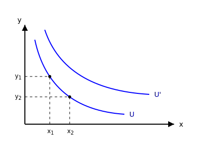

# رفتار مصرف کننده

**مصرف کننده**
* **هدف:** رسیدن به حداکثر خواسته‌ها (حداکثرسازی مطلوبیت)
* **محدودیت:** درآمد $\implies I = xP_x + yP_y$

در فضای دو کالا / دو قیمت، در سبد مصرفی، منحنی‌های بی‌تفاوتی، ارتباط بین دو کالا را در فضای محدودیت به ما می‌دهد.

$$U = (x, y, z, \dots)$$
$$U = (x, y)$$

**ویژگی‌های منحنی بی‌تفاوتی:**
۱. نسبت به مبدأ مختصات **محدب** است.
۲. هر چه منحنی بالاتر باشد، یعنی میزان مطلوبیت فرد افزایش می‌یابد.
۳. در هر نقطه در فضای کالا می‌توان یک منحنی بی‌تفاوتی رسم کرد. یعنی بالاخره یک نقطه در فضای دو کالا وجود دارد که نیازهای ما را رفع کند از مصرف دو کالا.
۴. این منحنی‌ها هیچ‌گاه همدیگر را قطع نمی‌کنند.
۵. دارای شیب نزولی هستند. روی منحنی بی‌تفاوتی مطلوبیت ثابت است.

**شیب منحنی بی‌تفاوتی = نرخ نهایی جانشینی (MRS):**
$$MRS_{xy} = -\frac{\Delta y}{\Delta x}$$

**مفهوم $MRS_{xy}$:**
اگر بخواهیم یک واحد به کالای $x$ اضافه کنیم، چه میزان از کالای $y$ کم کنیم تا مطلوبیت ما ثابت باقی بماند (یعنی روی نقاط منحنی $U$ مطلوبیت یکسان است). روی $U'$ هم همینطور روی تمام نقاط منحنی $U'$ مطلوبیت ثابت است.

$$U' > U$$
مطلوبیت $U'$ بالاتر است چون بالاتر قرار دارد.
مصرف کننده کورکورانه انتخاب نمی‌کند (عقلانیت مصرف‌کننده).
