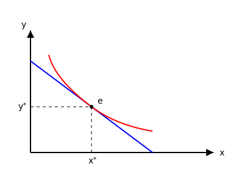

# تعادل مصرف‌کننده

شیب منحنی بی‌تفاوتی:
$$MRS_{xy} = -\frac{\Delta y}{\Delta x}$$

**خط بودجه:**
$$I = xP_x + yP_y \implies \text{شیب خط بودجه} = -\frac{P_x}{P_y}$$

* نقاط بالای خط بودجه، نقاط دست‌نیافتنی هستند.
* نقاط زیر خط بودجه را اصلاً کاری نداریم چون پس‌انداز نداریم (فرض بر مصرف کامل درآمد است).
* نقاطی که برای مصرف‌کننده مهم است دقیقاً نقاط روی خط بودجه است.

$$\text{شیب خط بودجه} = \tan \alpha = -\frac{P_x}{P_y}$$

چون هدف رسیدن به حداکثر است، دو تا شیب‌ها را کنار هم قرار می‌دهیم. یعنی هدف ما ماکزیمم کردن مطلوبیت است با محدودیت درآمد ثابت.
$$\max U \leadsto L = U(x,y) + \lambda(I - xP_x - yP_y)$$
$$\text{s.t.: } I$$

یک خط بودجه داریم و بی‌شمار منحنی بی‌تفاوتی. چون نقاط روی خط بودجه قابل دسترس است، پس منحنی بی‌تفاوتی که مماس بر خط بودجه است را انتخاب می‌کنیم.

**تعادل مصرف کننده = شیب منحنی بی‌تفاوتی = شیب خط بودجه**

$$-\frac{\Delta y}{\Delta x} = -\frac{P_x}{P_y}$$

به عبارتی در نقطه تعادل $e$:
$$\frac{MU_x}{MU_y} = \frac{P_x}{P_y}$$
یعنی نسبت مطلوبیت نهایی دو کالا برابر است با نسبت قیمت‌ها.

> **بررسی و تأیید علمی:**
> روابط استخراج شده کاملاً با اصول اقتصاد خرد همخوانی دارد. در نقطه تعادل (بهینه مصرف‌کننده)، شرط مماس شدن منحنی بی‌تفاوتی با خط بودجه برقرار است که به لحاظ ریاضی یعنی برابری نرخ نهایی جانشینی (MRS) با نسبت قیمت‌ها. همچنین از آنجا که $MRS_{xy} = \frac{MU_x}{MU_y}$، نتیجه‌گیری نهایی مبنی بر $\frac{MU_x}{MU_y} = \frac{P_x}{P_y}$ کاملاً صحیح است.
