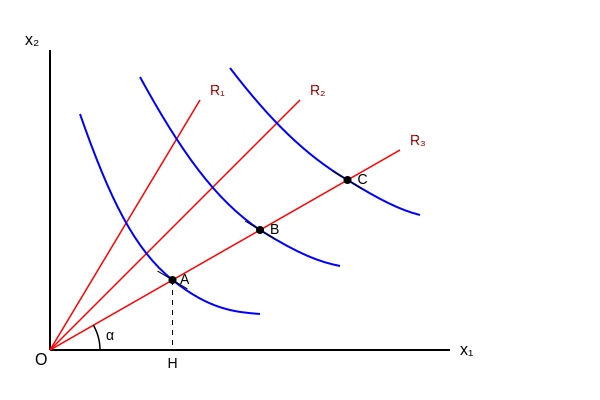

# انواع تابع مطلوبیت

## ۱- تابع مطلوبیت هموتتیک (متجانس)
تابعی است که شیب منحنی بی تفاوتی به دست آمده از این توابع در طول هر شعاعی که از مبدأ مختصات (مبدأ) به این منحنی ها رسم می شود ثابت است و هم چنین نرخ نهایی جانشینی مصرف در این توابع، تابعی است از نسبت کالاها $(x_1, x_2)$.

$$
\tan \alpha = \frac{AH}{OH} = \frac{x_2}{x_1}
$$

$$
\text{۲) } MRS = f\left(\frac{x_2}{x_1}\right)
$$

MRS: شیب نقاط روی منحنی است $\leftarrow$ شیب منحنی بی تفاوتی.
مقدار مطلق کالاها نیست مقادیر نسبی کالاهاست (MRS).
اگر تابعی هموتتیک باشد، قطعاً کشش درآمدی آن برابر یک است و یعنی درآمد مصرف آن حتماً خطی است.

## ۲- تابع مطلوبیت همگن
تابعی است که اگر مقادیر تابع را به میزان مشخص تغییر دهیم $(\lambda)$ برابر شود، کل تابع $\lambda^\alpha$ برابر می شود به توان $\alpha$ درجه همگنی گفته می شود.
یا اگر مصرف کالا را به یک میزان تغییر دهیم، مطلوبیت چه تغییری پیدا می کند.

$$
U = U(x_1, x_2)
$$

$$
\begin{aligned}
& x_1 = \lambda x_1 \\
& x_2 = \lambda x_2
\end{aligned} \leadsto U(\lambda x_1, \lambda x_2) = \lambda^\alpha U(x_1, x_2)
$$

- بازده صعودی: $\alpha > 1$
- بازده ثابت: $\alpha = 1$
- بازده نزولی: $\alpha < 1$
