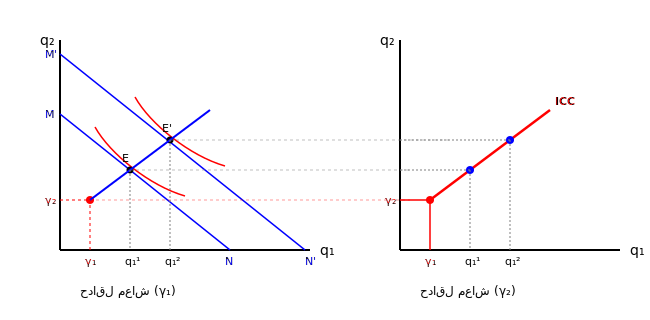

برای رسم تبدیل یک جمع پذیر هموتتیک می کنیم (منحنی درآمد مصرف خطی است)
مبدأ بالاتر می آید چون حداقل معاش را در نظر می گیریم.

وقتی درآمد تغییر می کند با تابع مطلوبیت جدید نقطه تعادل جدید بدست می آید از وصل کردن نقاط تعادلی جدید درآمد و مطلوبیت $\rightarrow$ منحنی درآمد مصرف ICC به دست می آید. و نکته مهم: درآمد مصرف خطی است.

LES: این سیستمی است که می گوید کشش درآمدی برای کالا یک است یعنی این سیستم نمی تواند کالای پست را توضیح دهد.

- کالای نرمال $\rightarrow$ $1 = \text{کشش درآمدی}$
- کالای پست $\rightarrow$ $0 > \text{کشش درآمدی}$

[مهم] مصرف کننده ابتدا درآمدش را صرف حداقل معاش می کند و بعد مابقی درآمدش را به صرف ترجیحات اختصاص می دهد.
