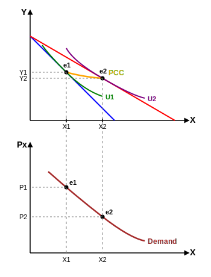
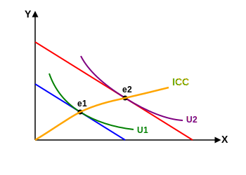

حالت اول : $P_x \uparrow \rightarrow \frac{I}{P_x} \downarrow \leftarrow$ انتقال منحنی به سمت چپ (داخل)
$P_x \downarrow \rightarrow \frac{I}{P_x} \uparrow \rightarrow$ منحنی به سمت بیرون منتقل می‌شود.

تغییر $P_x$ ( $I$ ثابت $P_x$ متغیر )

$P_x \downarrow \rightarrow X \uparrow \rightarrow X_1 \leftarrow X_2$ قانون تقاضا
از وصل کردن $e_1$ به $e_2$ ، منحنی تقاضا بدست می‌آید در واقع یکی از کاربردهای منحنی‌های قیمت - مصرف رسیدن به همان تابع و منحنی تقاضای اولیه است.

حالت سوم $I \uparrow \rightarrow$
خط بودجه موازی به سمت راست جابجا می‌شود

منحنی درآمد مصرف $\leftarrow$ I.C.C
- نرمال $\leftarrow$ ضروری ، لوکس
- پست
