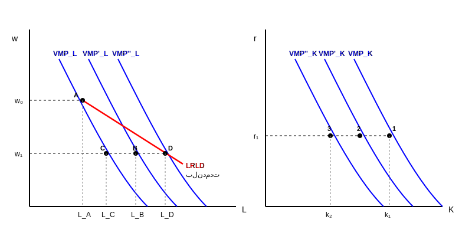

$VMP_L = w \quad \text{بهره وری نهایی نیروی کار : } VMP_L$
$VMP_K = r \quad \text{بهره وری نهایی سرمایه : } VMP_K$

**شرط بهینه:** ارزش بهره وری نهایی هر عامل تولید با هزینه اش برابر باشد.

نوع ارتباط نهاده ها با هم مهم است.

۱) اگر استفاده از یک نهاده افزایش یابد و تولید نهایی نهاده ی دیگر کاهش یابد دو نهاده جانشین هستند.
$$w \uparrow \Rightarrow L \downarrow \Rightarrow VMP_K \uparrow \quad \left( \frac{\partial MP_i}{\partial x_j} < 0 \right)$$

۲) اگر استفاده از یک نهاده افزایش یابد و تولید نهایی نهاده ی دیگر افزایش یابد مکمل هستند.
$$w \uparrow \Rightarrow L \downarrow \Rightarrow VMP_K \downarrow$$

---

**حالت اول: دو نهاده جانشین هستند**
در دستمزد $w_0$ قرار داریم و برخورد با منحنی، میزان اشتغال $L_A$ را نشان می‌دهد. دستمزد از $w_0$ به $w_1$ می‌رسد، در کوتاه مدت با کاهش دستمزد نیروی کار $L$ افزایش می‌یابد ($L_A \rightarrow L_B$). نرخ بهره در کوتاه مدت ثابت (یک نهاده ی متغیر داریم $(r, K_1)$)، در کوتاه مدت سازمان نمی‌تواند با فرض جانشین بودن نهاده انتظار داریم منحنی جابجا نمی‌شود از ۱ به ۲ منتقل می‌شویم و در کوتاه مدت فقط بازدهی عامل $K$ کم شده است. (هزینه فرصت کم شده).

تغییر نقطه در بلند مدت $L$ که زیاد می‌شود وقتی دو نهاده جانشین هستند و $VMP_K$ جابجا می‌شود در همان نقطه میزان سرمایه کم می‌شود ($r$ ثابت). $VMP_K$ کاهش یافت و جابجایی به پایین $K$ کم شد $\rightarrow$ $VMP_L$ زیاد شد و به بالا منتقل می‌گردد. حال روند تکرار می‌شود.

$$w \downarrow \Rightarrow L_A \rightarrow L_B \uparrow \xrightarrow{\text{بلند مدت}} VMP_K \downarrow \xrightarrow{r_0} K \downarrow \xrightarrow{L \uparrow} VMP_L \uparrow \Rightarrow L_B \rightarrow L_C \uparrow$$
$$VMP_K \downarrow \xrightarrow{r} K \downarrow \xrightarrow{L} VMP_L \uparrow \xrightarrow{w} L_C \rightarrow L_D \uparrow \dots$$

منحنی $LRLD$ (Long Run Labor Demand) منحنی تقاضای بلندمدت نیروی کار است.
