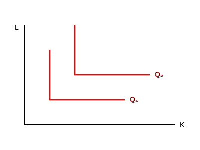

$$ \frac{\partial^2 Q}{\partial x_1 \partial x_2} = \begin{cases} > 0 & \text{مکمل} \\ < 0 & \text{جانشین} \\ = 0 & \text{مستقل} \end{cases} $$

**نتیجه گیری:** کار و سرمایه جانشین یکدیگرند.
بنگاه همیشه عامل ارزان‌تر را بیشتر استفاده می‌کند. تغییر قیمت یک عامل باعث تغییر مقدار مصرف دیگری می‌شود. خروجی این رفتار در بلند مدت شکل‌گیری منحنی تقاضای عوامل تولید است. مثلاً اگر $w$ زیاد شود، استفاده از نیروی کار، گران می‌شود بنگاه برای اینکه هزینه‌اش زیاد نشود به سمت سرمایه می‌رود پس کار با سرمایه جانشین می‌شود. اگر نرخ بازده سرمایه $r \uparrow$ سرمایه $\uparrow$ گران.

**دو کالا مکمل باشند:**
وقتی دو نهاده مکمل هستند یعنی اگر فقط یک نهاده افزایش یابد دومی تغییری کم بماند و افزایش پیدا نکند، تولید زیاد نمی‌شود. تولید فقط وقتی زیاد می‌شود که هر دو با هم افزایش پیدا کنند. (نزدیک کنج منحنی)

