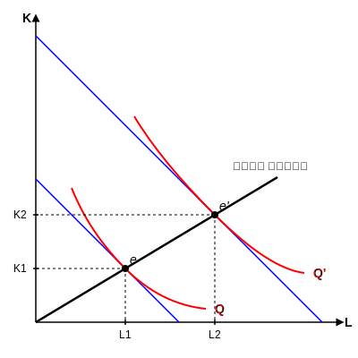

* می توانیم یک دوگانگی تعریف کنیم یعنی از روی تابع تولید باید بتوانیم تابع هزینه را استخراج کنیم. یعنی بین تولید و هزینه دوگانگی وجود دارد چون بین آن ها رابطه وجود دارد.
تابع تولید داده شده می خواهیم تابع هزینه را به دست آوریم:

$$ \frac{MP_{X_1}}{MP_{X_2}} = \frac{r_1}{r_2} $$

از معادله ی مسیر توسعه بنگاه استفاده می کنیم. ۱- تابع تولید را برای دو نهاده فرض می کنیم خط هزینه ما در برخورد با منحنی تولید، نقطه تعادل تولیدکننده پیدا می کنیم (نیروی کار و سرمایه). در بحث گسترش اگر بنگاه رشد کند اگر هزینه ها افزایش یابد، خط هزینه موازی به بالا منتقل می شود و با منحنی $Q'$ تلاقی می کند در نقطه $e'$ ، نقطه تعادل جدید به دست می آید. در تلاقی با منحنی تولید جدید.

از وصل کردن نقاط تعادل مسیر توسعه بنگاه به دست می آید. (در فضای تولید)
$$ C = wL + rK $$
برای گسترش از طریق مسیر توسعه می توانیم مقدار نهاده $L$ و کمیت آن $K$ را به دست آوریم
$\rightarrow$ تقاضای نهاده ها را به دست می آوریم و در خط هزینه قرار می دهیم و تابع هزینه بنگاه به دست می آید.

نقطه تعادل تولیدکننده:
$$ e = \frac{MP_L}{MP_K} = \frac{P_L}{P_K} $$

از وصل کردن نقاط تعادلی، مسیر توسعه بنگاه به دست می آید.
از رابطه اول $X_1$ و $X_2$ را به دست می آوریم و در تابع تولید قرار می دهیم و بعد مقدار نهاده ها را بر حسب قیمت آن ها به دست می آوریم $\rightarrow$ تقاضای نهاده $\rightarrow$ خط هزینه

روش رسیدن از تابع تولید به تابع هزینه با استفاده از مسیر توسعه بنگاه:
$$ TC = \sum_{i=1}^n r_i X_i $$

