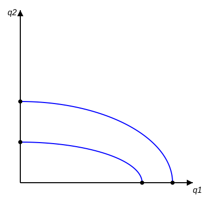

تابع تولید یک نهاده $Q = Q(L)$
استفاده از نیروی کار یا سرمایه برای تولید یک نهاده $Q = Q(K)$

**تولیدات مشترک :**
یعنی از یک نهاده چندین محصول تولید می شود.
مثل کارخانه ی میهن - پگاه و ... (کارخانه محصولات لبنی)
شیر را می خرد و چندین محصول را تولید می کند [بستنی / دوغ / کره / ماست و ...]
یک نهاده شیر است.
بحث بر سر تخصیص عامل است. از میزان شیر موجود چه میزان کره تولید می شود چه قدر خامه - ماست و ... . بحث بر سر تخصیص عامل است.
[تخصیص عامل مشترک تولید] از شیر چقدر خامه / چه قدر بستنی / چه قدر ماست و ... تولید می شود.

می خواهیم از معکوس تابع تولید استفاده می کنیم.
فرض می کنیم دو محصول تولید می شود:
$$ X = h(q_1, q_2) $$
یا
$$ H(X, q_1, q_2) = 0 $$

این بنگاه مورد نظر با فرض ثبات سایر شرایط و میزان استفاده از نهاده ها برای تولید دو کالای $q_1$ و $q_2$ از منحنی امکانات تولید استفاده می کند.
ترکیباتی با یک نهاده مشخص، مکان هندسی از دو کالای $q_1$ و $q_2$ یا ترکیب $q_1$ و $q_2$ است که اگر تولید یک کالا را زیاد کنیم باید از تولید کالای دیگر کم کنیم. مگر اینکه نهاده افزایش یابد که باید مسیر بالاتر قرار بگیریم.

تخصیص عامل مشترک تولید $\rightarrow$ ($X$ نهاده) $Q = Q(X)$
۲ محصول ($q_1, q_2$)

شیب منحنی امکانات تولید، نرخ نهایی تبدیل است که قدر مطلق مثبت است.

$*$ چه میزان از تولید $q_1$ برای تولید یک واحد تولید بیشتر از $q_2$ باید صرف نظر شود.
$\bar{X}$ شرایط ثابت $\leftarrow$ اگر $X$ زیاد شود کل منحنی جابجا می شود.

