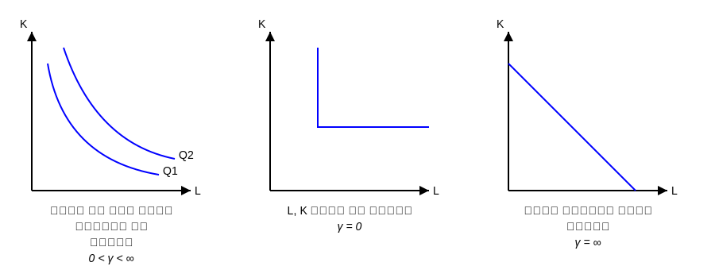

**تابع تولید CES (تابع تولید با کشش جانشینی ثابت)**

$$ q = A [\gamma K^{-\rho} + (1-\gamma) L^{-\rho}]^{-\frac{1}{\rho}} $$
$A$: ضریب تکنولوژی
$\rho$ (پارامتر جانشینی): چه مقدار نیروی کار و سرمایه را در تابع تولید می توانیم جانشین کنیم (درصد جانشین)
$\gamma$: ضریب توزیعی

میزان جانشینی مقدار ثابتی است (کشش جانشینی) ثابت $\sigma$
$$ \sigma = \frac{1}{1+\rho} $$

در تابع کاب داگلاس که حالت خاصی از تابع CES کشش جانشینی برابر یک است.
$$ q = A K^\alpha L^\beta \qquad \sigma = 1 $$

$$ \sigma = \frac{\% \Delta (K/L) / (K/L)}{\% \Delta MRTS_{L,K} / MRTS_{L,K}} = \frac{\text{درصد تغییر ایجاد شده در نسبت نهاده ها}}{\text{درصد تغییر در شیب منحنی های تولید}} $$

**ویژگی های CES**
۱- کشش جانشینی بین نهاده ها در این تابع حتماً باید ثابت باشد.
۲- تابع CES حتماً باید همگن درجه (۱) باشد.

