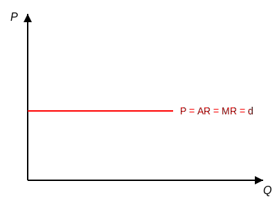

**جلسه ی هفتم ۴۰/۲/۳**

**بازار رقابت کامل:**

۱- تحرک آزاد منابع: نیروی کار و عوامل به راحتی در بازار جابجا می شوند (محصولات کشاورزی) شبیه بازار رقابت کامل نه ۱۰۰٪
۲- اطلاعات کامل
۳- تعداد بنگاه ها زیاد است. Price $\rightarrow$ بنگاه ها قیمت گیر هستند.
۴- تعداد مصرف کنندگان زیاد است.
۵- کالاها همگن هستند (ویژگی و مشخصات آن ها یکسان است)
۶- قیمت ثابت است $P=MR$

منحنی تقاضا در این بازار افقی است و این خصوصیت مخصوص رقابت کامل است.
شیب تقاضا $= 0$
$\infty =$ کشش $\rightarrow$ بنگاه ها

کوچکترین تغییر در این بازار، مصرف کننده را از بازار دور می کند.
کشش بسیار بالا است و عکس العمل بسیار بالا است.
درآمد در بازار رقابت کامل به دلیل خصوصیت ثابت بودن $P$ یک خط صعودی است.

هزینه ی کل $\rightarrow$ هزینه ی پنهان و آشکار
سود اقتصادی $\leftarrow \uparrow$
حداکثر سود $= \text{درآمد کل} - \text{هزینه کل}$

$P \cdot Q = TR$
هدف بنگاه $\leftarrow \text{تولیدکننده} \rightarrow \text{بازار}$
$Max\ \pi \rightarrow \text{Max } \pi = TR - TC = \bar{P} \cdot Q - TC$

شرط تعادل کوتاه مدت در بازار رقابت کامل:
۱) $FOC = \frac{\partial \pi}{\partial Q} = 0 \Rightarrow P - \frac{\partial TC}{\partial Q} = 0 \Rightarrow P = MC$
مشتق تابع $= 0$
برای کوتاه مدت بنگاه

۲) $S.O.C: \frac{\partial^2 \pi}{\partial Q^2} < 0 \Rightarrow -\frac{\partial MC}{\partial Q} < 0 \Rightarrow \frac{\partial MC}{\partial Q} > 0$

$TC$ یا هزینه کل در بازار $\rightarrow P \geq Min\ AVC$ نقطه تعطیلی بنگاه

سود حسابداری شامل هزینه هایی که قابل مشاهده و ثبت و رؤیت است.
سود اقتصادی: هزینه هایی که ثبت نمی شوند می گویند (هزینه های پنهان و آشکار / اجتماعی و هزینه های ...)
