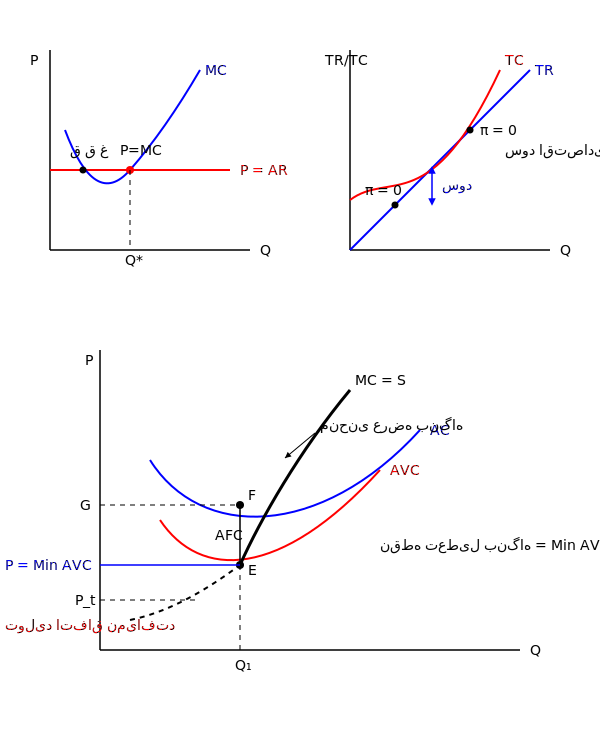

وقتی قیمت مطرح می شود شرط مرتبه دوم ماتریسی است
در اینجا قید ندارم. $\leftarrow$ مشتق مرتبه دوم

جائی که $AR$ از زیر $MC$ را قطع کند.

$\bar{P}$ ثابت $TR$ یک خط صعودی است.

تعطیلی بنگاه : $\text{Min } AVC =$ نقطه سر به سر $= E$

نقطه تعطیلی بنگاه : در کوتاه مدت تولید کننده نتواند هزینه های ثابت را پوشش بدهد مثل اجاره آپارتمان ، آب و برق و گاز . موقتاً باید تولید را متوقف کند ولی اجازه ترک صنعت را ندارد .
شرط عمومی یا $\text{Min } AVC$ به بالا است . یعنی قیمت نباید پایین تر از این مقدار باشد اگر بود یعنی اصلا تولیدی اتفاق نمی افتد $\leadsto P \geq \text{Min } AVC \leadsto E$ به بالا

منحنی عرضه تولید کننده همان منحنی $MC$ یا هزینه نهایی است. دقیقاً منحنی عرضه روی هزینه نهایی است از $\text{Min } AVC$ به بالا.

درآمد بنگاه : $TR = (OP)(OQ_1) = OPEQ_1 \leadsto P \times Q$

هزینه بنگاه : $TC = OGFQ_1 \qquad AC = \frac{TC}{Q} \leadsto TC = AC \times Q$

ضرر تولید کردن $\leadsto \pi = TR - TC = - PGFE \quad (\text{هزینه ثابت} + \text{هزینه متغیر})$

ضرر تولید نکردن $\leadsto \pi = TR - TC = - PGFE$ هزینه ثابت
زیان $\leadsto$ در این ۲ هزینه

ضرر تولید کردن $=$ ضرر تولید نکردن $\leftarrow$ بنگاه در تولید یا عدم تولید بی تفاوت است.
