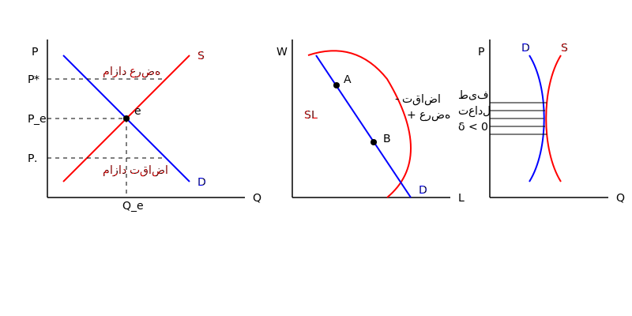

آیا تعادل منحصر بفرد است ؟

تعادل همیشه منحصر بفرد نیست:
آیا همیشه عرضه و تقاضا در یک نقطه همدیگر را قطع می کنند ؟

با ثبات : تعادل زمانی با ثبات است که هر اخلالی در بازار سریعاً رفع و مجدداً بازار به تعادل برگردد.
بی ثبات : اگر اخلالی اتفاق بیفتد دیگر به تعادل نمی رسیم و از تعادل دور می شویم.

با ثبات / بازار / برخورد عرضه و تقاضا / نقطه ی تعادل / در نقاط بالای تعادل مازاد عرضه داریم و در نقاط پایین آن مازاد تقاضا داریم. یعنی شرایط بازار ما را به تعادل بر می گرداند حتی بدون هیچ دخالتی.

تعادل با ثبات : $0 >$ شیب عرضه - شیب تقاضا (با ثبات)
$\delta = D'(p) - S'(p) < 0$ دِلتا
هر زمانی که اختلاف شیب منفی باشد با ثبات است. (شیب تقاضا - شیب عرضه)

در نمودار وسط:
قیمت در یک رنجی وجود دارد
مقدار مشخص در قیمت های مختلف

$A$: عرضه $>$ تقاضا
در نقطه ی $B$: عرضه $<$ تقاضا
$\delta = D'(p) - S'(p) < 0$ با ثبات

تمام کالاها به نوعی تاریخ مصرف دارند. اگر مواد خوراکی باشند $\leftarrow$ تاریخ مصرف
غیر خوراکی ماشین $\leftarrow$ استهلاک و دیده شدن بعد از مدتی
$\leftarrow$ بالا مازاد عرضه
پایین مازاد تقاضا $\rightarrow$ تعادل با ثبات
