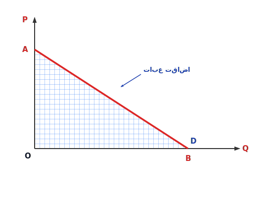

# تبعیض قیمت / متفاوت بودن قیمت
**هدف:** پیدا کردن تعادل و نقطه تعادل

## انواع انحصارگر
۱- انحصارگر تبعیض قیمت
الف) تبعیض قیمت درجه (۱) یا تبعیض قیمت کامل
ب) تبعیض قیمت درجه (۲) تبعیض قیمت مقداری
ج) تبعیض قیمت چند بازاری (درجه ۳)

۲- انحصارگر چند کارخانه‌ای $\leftarrow$ یک محصول تولید می‌کند
یک تولید کننده با چندین کارخانه $\leftarrow$ چند محصول تولید می‌کند

در هر دو شرایط فوق به دنبال شرایط و نقطه‌ی تعادل هستیم و اینکه در هر دو حالت‌های فوق نقطه‌ی تعادل چه تغییراتی پیدا می‌کند. دو شرط برای تبعیض قیمت:
۱- مصرف‌کنندگان را بتوان از هم جدا کرد
۲- بازار انحصاری باشد یعنی فقط در بازار انحصاری تبعیض قیمت داریم.

### حالت تبعیض قیمت کامل:
حالت ۱: تولید کننده دقیقاً می‌داند هر مصرف کننده برای کالایی که می‌خرد چه مقدار پرداخت می‌کند (انحصارگر از هر مصرف کننده یک قیمت می‌گیرد بنابراین در این وضعیت اضافه رفاه مصرف کننده برابر صفر است).
$$P = f(q) \quad \quad CS = 0$$

(قیمت‌های مختلف برای مصرف‌کنندگان مختلف) یعنی تولید کننده تمام سطح زیر منحنی تقاضا که همان رفاه مصرف کننده است را دریافت می‌کند. درآمد انتگرال منحنی تقاضا است.
$$TR = \int_0^q f(q) dq$$
$$\pi = \int_0^q f(q) dq - TC(q)$$
(تمام سطح منحنی تقاضا)

$$\frac{\partial \pi}{\partial q} = 0 \Rightarrow f(q) - MC = 0 \Rightarrow P = f(q) = MC$$

مقدار داخل انتگرال = مشتق انتگرال

سطح زیر منحنی تقاضا = درآمد
هزینه - تابع تقاضا = 
