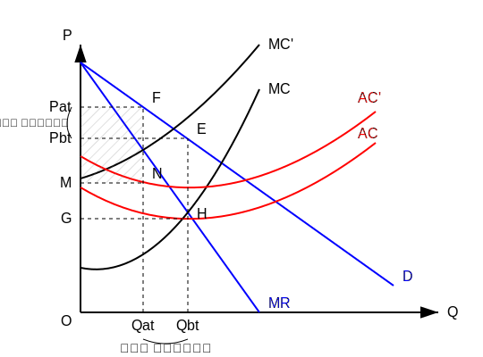

در اینجا اگر MR, MC جابجا شوند، تعادل جابجا می‌شود.
۲- مالیات بر واحد $\leftarrow$ روی قیمت تاثیر می‌گذارد.

$$\pi = TR - TC$$
$$\pi_t = TR - TC - tq \quad (\text{نرخ مالیات } t)$$

$$\frac{\partial \pi}{\partial q} = 0 \Rightarrow MR - MC - t = 0 \Rightarrow MR = MC + t$$
شرط تعادل می‌شود $\uparrow$ یعنی درآمد نهایی برابر است با هزینه نهایی + مالیات

هزینه نهایی بعلاوه t $\leftarrow$ یعنی MC جابجا می‌شود (قیمت و مقدار تغییر کرد)
یعنی اثر تخصیصی داریم $\leftarrow$ اثر توزیعی داریم و سود هم کم می‌شود، چون مالیات باعث شده نقطه تعادل تغییر کند.

**قبل از مالیات:**
$$TR = O P_{bt} E Q_{bt}$$
$$TC = O G H Q_{bt}$$
$$\rightarrow \pi_{bt} = G P_{bt} E H \quad (\text{سود قبل از مالیات})$$

**بعد از مالیات:**
$$TR = O P_{at} F Q_{at}$$
$$TC = O M N Q_{at}$$
$$\rightarrow \pi_{at} = M P_{at} F N \quad (\text{سود بعد از مالیات})$$

$$\pi_{bt} > \pi_{at}$$
